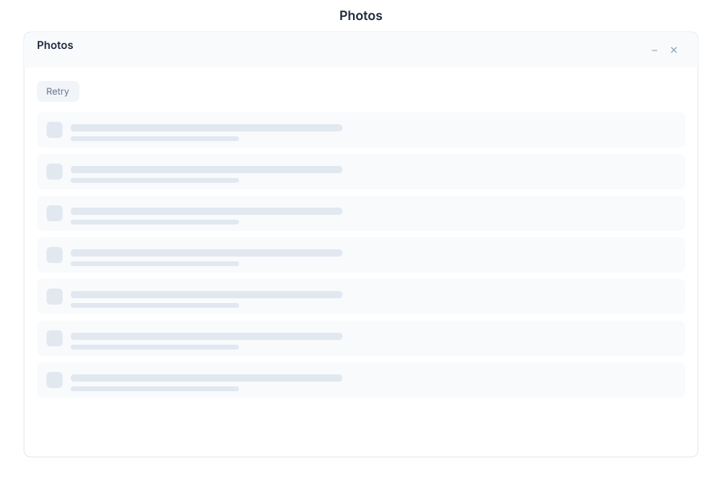

# Photos 🟡 PREVIEW

> **Preview application.** Usable today, not yet part of the supported surface.

Photos is a gallery over the images already in your [Drive](./drive.md), with a lightbox for viewing and a simple editor for small corrections.

## What it does

| Capability | Detail |
|---|---|
| **Gallery** | Thumbnails of the images in your Drive, with a lightbox for full-size viewing |
| **Open from Drive** | Works on images that live in Drive paths you already have |
| **Edit** | A lightweight editor for crops and adjustments |
| **Save** | Save changes in place, or **save a copy** to a Drive path you choose |
| **Revert** | Discard edits and return to the stored image |

Photos is deliberately not a file manager — it reads the Drive rather than replacing it. Anything structural (moving, sharing, deleting files) belongs in [Explorer](./drive.md).

## Opening it

Photos is a **preview** application. Turn on the **Preview** switch in the left sidebar, then open **Photos** from the app menu.

## Limits

- Formats are limited to what the browser can decode; unsupported images report a decode error rather than being converted.
- The editor is for quick corrections, not composite work. For layered editing, use [Canvas](./canvas.md).

## See Also

- [Explorer](./drive.md) - Where the files live
- [Canvas](./canvas.md) - Creative surface
- [Apps overview](./README.md) - Stability classification for the whole suite
