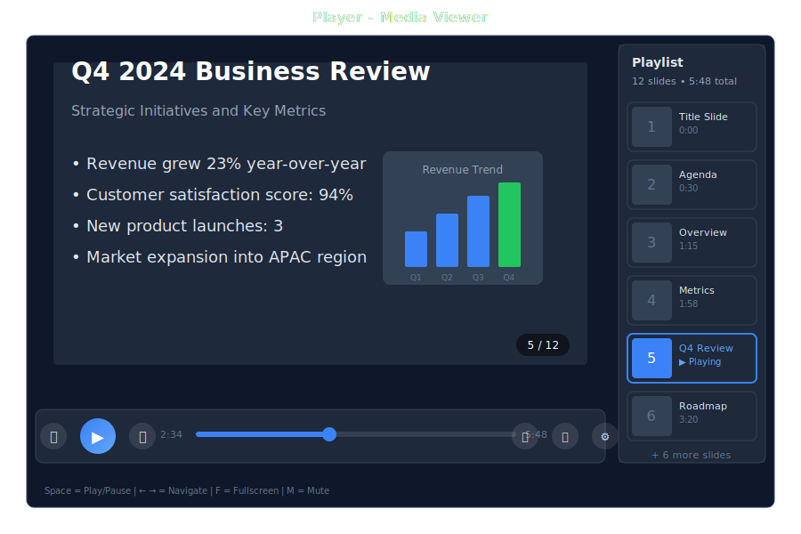

# Player - Media Viewer

> **Integrated viewing for documents, audio, video, and presentations**



---

## Overview

Player enables users to view and interact with various file types without leaving the conversation:

- **Documents**: PDF, DOCX, TXT, MD
- **Presentations**: PPTX, ODP
- **Audio**: MP3, WAV, OGG, M4A
- **Video**: MP4, WEBM, OGV
- **Images**: PNG, JPG, GIF, SVG, WEBP

---

## Accessing Player

### From Chat

When a bot shares a file, click the preview to open in Player:

<div class="wa-chat">
  <div class="wa-message bot">
    <div class="wa-bubble">
      <p>📎 quarterly-report.pptx</p>
      <p>Here's the quarterly report. Click to view.</p>
      <div class="wa-time">10:30</div>
    </div>
  </div>
  <div class="wa-message user">
    <div class="wa-bubble">
      <p>*clicks to open*</p>
      <div class="wa-time">10:30</div>
    </div>
  </div>
  <div class="wa-message bot">
    <div class="wa-bubble">
      <p>📊 Opening presentation viewer...</p>
      <p>Use ← → to navigate slides</p>
      <div class="wa-time">10:30</div>
    </div>
  </div>
</div>

### From Drive

Navigate to Drive tab and click any supported file to open in Player.

### Direct URL

Access files directly:

```
/player/{bot_id}/{file_path}
```

---

## Controls by File Type

### Document Controls

| Control | Action |
|---------|--------|
| Previous / Next | Navigate pages |
| Zoom in / out | Adjust view size |
| Download | Download original |
| Search | Search in document |
| Thumbnails | Page thumbnails |

### Audio Controls

| Control | Action |
|---------|--------|
| Play / Pause | Control playback |
| Rewind / Forward | Skip 10 seconds |
| Volume | Volume slider |
| Loop | Loop toggle |
| Download | Download file |

### Video Controls

| Control | Action |
|---------|--------|
| Play / Pause | Control playback |
| Skip | Skip backward / forward |
| Volume | Volume control |
| Fullscreen | Enter fullscreen |
| Speed | Playback speed |
| Picture-in-picture | Floating window |
| Download | Download file |

### Presentation Controls

| Control | Action |
|---------|--------|
| Previous / Next | Navigate slides |
| Fullscreen | Presentation mode |
| Overview | Slide overview |
| Notes | Speaker notes (if available) |
| Download | Download original |

---

## Keyboard Shortcuts

| Key | Action |
|-----|--------|
| `Space` | Play/Pause (audio/video) or Next (slides) |
| `←` / `→` | Previous / Next |
| `↑` / `↓` | Volume up / down |
| `F` | Fullscreen toggle |
| `M` | Mute toggle |
| `Esc` | Exit fullscreen / Close player |
| `+` / `-` | Zoom in / out |
| `Home` / `End` | Go to start / end |

---

## BASIC Integration

### Share Files with Player Preview

<div class="wa-chat">
  <div class="wa-message bot">
    <div class="wa-bubble">
      <p>🎬 training/welcome-video.mp4</p>
      <p>Watch this 2-minute introduction video.</p>
      <div class="wa-time">14:20</div>
    </div>
  </div>
  <div class="wa-message bot">
    <div class="wa-bubble">
      <p>📊 reports/q4-results.pptx</p>
      <p>Here are the quarterly results. Use arrow keys to navigate.</p>
      <div class="wa-time">14:21</div>
    </div>
  </div>
  <div class="wa-message bot">
    <div class="wa-bubble">
      <p>🎵 audio/podcast-episode-42.mp3</p>
      <p>Listen to the latest episode.</p>
      <div class="wa-time">14:22</div>
    </div>
  </div>
</div>

---

## Supported Formats

### Documents

| Format | Extension | Notes |
|--------|-----------|-------|
| PDF | `.pdf` | Full support with text search |
| Word | `.docx` | Converted to viewable format |
| Text | `.txt` | Plain text with syntax highlighting |
| Markdown | `.md` | Rendered with formatting |
| HTML | `.html` | Sanitized rendering |

### Presentations

| Format | Extension | Notes |
|--------|-----------|-------|
| PowerPoint | `.pptx` | Full slide support |
| OpenDocument | `.odp` | Converted to slides |
| PDF | `.pdf` | Treated as slides |

### Audio

| Format | Extension | Notes |
|--------|-----------|-------|
| MP3 | `.mp3` | Universal support |
| WAV | `.wav` | Uncompressed audio |
| OGG | `.ogg` | Open format |
| M4A | `.m4a` | AAC audio |
| FLAC | `.flac` | Lossless audio |

### Video

| Format | Extension | Notes |
|--------|-----------|-------|
| MP4 | `.mp4` | H.264/H.265 |
| WebM | `.webm` | VP8/VP9 |
| OGV | `.ogv` | Theora |

### Images

| Format | Extension | Notes |
|--------|-----------|-------|
| PNG | `.png` | Lossless with transparency |
| JPEG | `.jpg`, `.jpeg` | Compressed photos |
| GIF | `.gif` | Animated support |
| SVG | `.svg` | Vector graphics |
| WebP | `.webp` | Modern format |

---

## Configuration

Configure Player behavior in `config.csv`:

```csv
key,value
player-autoplay,false
player-default-volume,80
player-video-quality,auto
player-preload,metadata
player-allow-download,true
player-max-file-size-mb,100
```

---

## API Access

### Get File for Player

```
GET /api/drive/{bot_id}/files/{file_path}?preview=true
```

### Stream Media

```
GET /api/drive/{bot_id}/stream/{file_path}
```

Supports HTTP Range requests for seeking.

### Get Thumbnail

```
GET /api/drive/{bot_id}/thumbnail/{file_path}
```

---

## Security

- Files are served through authenticated endpoints
- User permissions respected for file access
- Downloads can be disabled per bot
- Watermarking available for sensitive documents

## Performance

- Lazy loading for large documents
- Adaptive streaming for video
- Thumbnail generation for previews
- Client-side caching for repeat views

## Mobile Support

Player is fully responsive:
- Touch gestures for navigation
- Pinch-to-zoom for documents
- Swipe for slides
- Native fullscreen support

---

## See Also

- [Drive App](./drive.md) - File management
- [Drive Integration](../../10-configuration-deployment/drive.md) - File storage configuration
- [Storage API](../../08-rest-api-tools/storage-api.md) - File management API