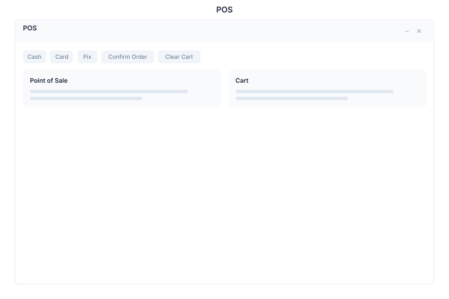

# POS 🟡 BETA - Point of Sale

> **Retail checkout system with cart management, payment processing, and receipt generation**

---

## Overview

POS provides a complete retail checkout experience with product browsing, cart management, multi-payment support, and automatic receipt generation. Designed for speed and simplicity, it handles daily retail operations efficiently.

---

## Features

### Products

| Capability | Description |
|------------|-------------|
| Browse | View all products with images and prices |
| Search | Quick search by name, SKU, or barcode |
| Details | Product information, stock levels, and variants |
| Favorites | Pin frequently sold products |

### Cart

| Capability | Description |
|------------|-------------|
| Add Items | Add products with quantity selection |
| Remove Items | Remove or adjust quantities |
| Clear Cart | Reset cart for new transaction |
| Discounts | Apply item or cart-level discounts |

### Payment

| Capability | Description |
|------------|-------------|
| Cash | Cash payment with change calculation |
| Card | Credit and debit card processing |
| Pix | Brazilian instant payment (QR code) |
| Split | Split payment across multiple methods |
| Partial | Partial payment with remaining balance |

### Categories

| Capability | Description |
|------------|-------------|
| Filter | Filter products by category |
| Tags | Custom tags for product organization |
| Quick Access | Category shortcuts for fast navigation |
| Search | Search within categories |

### Receipts

| Capability | Description |
|------------|-------------|
| Generate | Automatic receipt creation |
| Print | Thermal printer support |
| Email | Send receipt via email |
| History | Browse past receipts and transactions |

---

## Keyboard Shortcuts

| Shortcut | Action |
|----------|--------|
| `F1` | Open product search |
| `F2` | Focus cart |
| `F3` | Process payment |
| `F4` | Print receipt |
| `F5` | Clear cart |
| `F9` | Apply discount |
| `F12` | Complete transaction |
| `Del` | Remove selected item from cart |
| `Esc` | Cancel current operation |

---

## POS via Chat

**User:** Add product to cart

**Bot:** What product would you like to add? You can:

- Search by **name** — e.g., "Add Coffee"
- Scan **barcode** — enter the barcode number
- Browse by **category** — e.g., "Show beverages"

Please provide the product name or barcode.

---

**User:** Process payment

**Bot:** Cart Summary:
- 2x Coffee — $10.00
- 1x Sandwich — $8.50
- **Total: $28.50**

How would you like to pay?
- **Cash** — Enter amount tendered
- **Card** — Swipe or tap card
- **Pix** — Generate QR code

---

## API Reference

| Endpoint | Method | Description |
|----------|--------|-------------|
| `/api/pos/products` | GET | List all products |
| `/api/pos/products/{id}` | GET | Get product by ID |
| `/api/pos/products/search` | GET | Search products |
| `/api/pos/cart` | GET | Get current cart |
| `/api/pos/cart/items` | POST | Add item to cart |
| `/api/pos/cart/items/{id}` | PUT | Update cart item quantity |
| `/api/pos/cart/items/{id}` | DELETE | Remove item from cart |
| `/api/pos/cart/discount` | POST | Apply discount to cart |
| `/api/pos/payments` | POST | Process payment |
| `/api/pos/receipts` | GET | List past receipts |
| `/api/pos/receipts/{id}` | GET | Get receipt by ID |
| `/api/pos/receipts/{id}/print` | POST | Print receipt |
| `/api/pos/receipts/{id}/email` | POST | Email receipt |

---

## Related Pages

- [Products](../products.md) — Product catalog management
- [Payments](../payments.md) — Payment gateway configuration
- [Receipts](../receipts.md) — Receipt template management
- [Reports](../reports.md) — Sales and inventory reports
