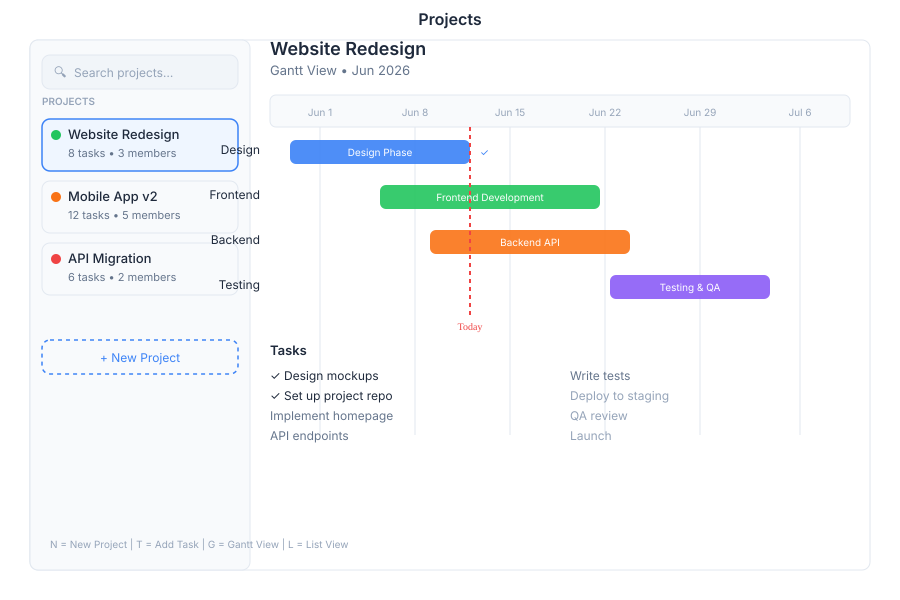

# Project 🟡 BETA - Project Management

> **Gantt charts, tasks, and resources**

---

## Overview

Project is the comprehensive project management module in General Bots Suite. Plan, track, and deliver projects with Gantt charts, task dependencies, resource allocation, and milestone tracking. Project provides everything teams need to manage projects from initiation to completion.

---

## Features

### Projects

Create and manage projects with full lifecycle support.

| Action | Description |
|--------|-------------|
| **Create Project** | Define project with name, description, and dates |
| **Archive Project** | Move completed projects to archive |
| **Set Status** | Mark as planning, active, on-hold, or completed |
| **Assign Team** | Add team members with roles and permissions |
| **Set Budget** | Define project budget and track expenses |

### Gantt Charts

Visual timeline view with dependency management.

| Feature | Description |
|---------|-------------|
| **Timeline View** | Interactive Gantt chart with drag-and-drop |
| **Dependencies** | Link tasks with finish-to-start, start-to-start, etc. |
| **Critical Path** | Highlight tasks affecting project completion |
| **Baselines** | Compare current progress against planned schedule |
| **Zoom Levels** | Day, week, month, quarter views |

### Tasks

Detailed task management with priorities and assignments.

| Action | Description |
|--------|-------------|
| **Create Task** | Define task with title, description, and assignee |
| **Set Priority** | Mark as critical, high, medium, or low |
| **Assign Resources** | Allocate team members to tasks |
| **Track Time** | Log time spent on tasks |
| **Set Dependencies** | Link tasks that must be completed in sequence |

### Resources

Resource allocation and capacity planning.

| Feature | Description |
|---------|-------------|
| **Resource Pool** | View all available team members |
| **Allocation** | Assign resources to projects and tasks |
| **Capacity** | Track available hours per resource |
| **Utilization** | Monitor resource usage across projects |
| **Conflicts** | Identify over-allocated resources |

### Milestones

Track significant project achievements and deadlines.

| Action | Description |
|--------|-------------|
| **Create Milestone** | Define key project checkpoint |
| **Set Date** | Assign target completion date |
| **Link Tasks** | Associate tasks with milestone |
| **Track Progress** | Monitor milestone completion status |
| **Notifications** | Alerts for upcoming milestone deadlines |

### Reports

Project performance and status reporting.

| Report | Description |
|--------|-------------|
| **Status Report** | Current project health and progress |
| **Resource Report** | Team allocation and utilization |
| **Budget Report** | Expense tracking vs. budget |
| **Timeline Report** | Schedule adherence and delays |
| **Risk Report** | Identified risks and mitigation status |

---

## Keyboard Shortcuts

| Shortcut | Action |
|----------|--------|
| `N` | Create new project |
| `T` | Create new task |
| `G` | Toggle Gantt view |
| `L` | Toggle list view |
| `F` | Filter tasks |
| `/` | Focus search |
| `?` | Show shortcuts |

---

## Project via Chat

### Creating a New Project

  

    

      
Create a new project: Website Redesign

      
09:00

    

  

  

    

      
✅ Project created:

      
📁 Website Redesign

      
📅 Start: Today

      
👥 Team: Unassigned

      
Would you like to add tasks or set a deadline?

      
09:00

    

  

### Showing Project Timeline

  

    

      
Show project timeline

      
14:30

    

  

  

    

      
📅 Project Timeline (Website Redesign):

      
Phase 1: Planning (Week 1-2) ✅ Complete

      
Phase 2: Design (Week 3-4) 🔄 In Progress

      
Phase 3: Development (Week 5-8) ⏳ Pending

      
Phase 4: Testing (Week 9-10) ⏳ Pending

      
📊 Overall: 35% complete

      
14:30

    

  

---

## API Reference

Project operations are available via REST API:

| Endpoint | Method | Description |
|----------|--------|-------------|
| `/api/projects` | GET | List all projects |
| `/api/projects` | POST | Create new project |
| `/api/projects/:id` | GET | Get project details |
| `/api/projects/:id` | PUT | Update project |
| `/api/projects/:id` | DELETE | Delete project |
| `/api/projects/:id/tasks` | GET | List project tasks |
| `/api/projects/:id/tasks` | POST | Create task in project |
| `/api/projects/:id/gantt` | GET | Get Gantt chart data |
| `/api/projects/:id/resources` | GET | Get resource allocation |
| `/api/projects/:id/milestones` | GET | List project milestones |

---

## Related Pages

- [Tasks App](./tasks.md) — Task management and execution
- [Goals App](./goals.md) — Align projects with strategic objectives
- [Calendar App](./calendar.md) — Schedule project meetings and deadlines
- [Drive App](./drive.md) — Store project documents and files
- [Suite Manual](../suite-manual.md) — Full Suite overview