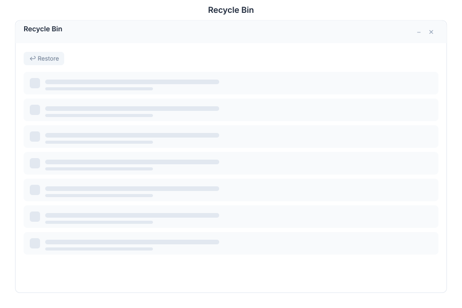

# Recycle Bin 🟡 PREVIEW

> **Preview application.** Usable today, not yet part of the supported surface.

Recycle Bin holds deleted files so a mistake can be undone. Deleting in [Explorer](./drive.md) moves items here rather than destroying them.

## What it does

| Capability | Detail |
|---|---|
| **List deleted items** | Everything removed from Drive, in one place |
| **Restore** | Put a file back where it came from |
| **Permanent delete** | Destroy a single item |
| **Empty the bin** | Permanently remove everything, with a confirmation step |

## Before you empty it

Emptying is **irreversible** and is not covered by the restore path — once the bin is emptied, recovery depends on your own backups. Confirm that backups are running before using it in production, and prefer restoring an individual file over emptying the whole bin.

## Opening it

Recycle Bin is a **preview** application. Turn on the **Preview** switch in the left sidebar, then open **Recycle Bin** from the app menu.

## See Also

- [Explorer](./drive.md) - Where files are deleted from
- [Backup and Recovery](../../12-ecosystem-reference/backup-recovery.md) - What protects you past this point
- [Apps overview](./README.md) - Stability classification for the whole suite
