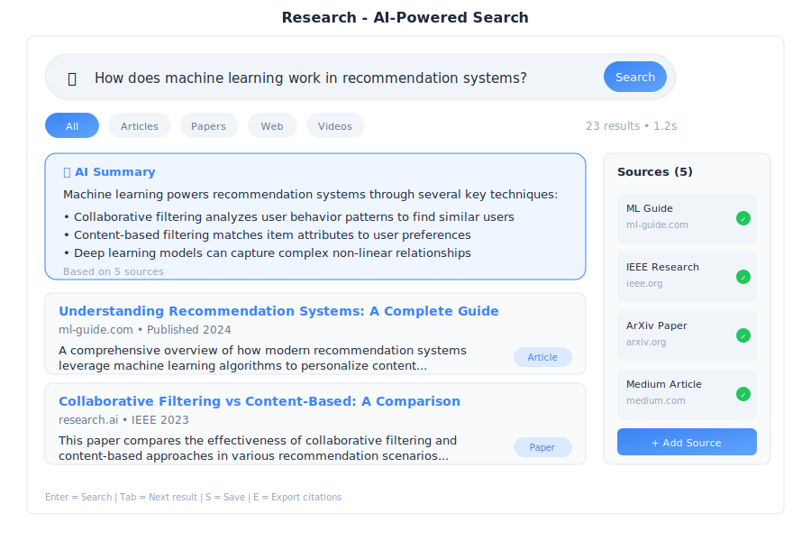

# Research - AI Search

> **Your intelligent research assistant**



---

## Overview

Research is the AI-powered search and discovery app in General Bots Suite. Find information from the web, your documents, and databases using natural language. Research understands your questions, finds relevant sources, and presents organized answers with citations.

---

## Features

### Basic Search

Just type your question in natural language:

**Example Questions:**

| Category | Examples |
|----------|----------|
| **📊 Business** | "What are our sales numbers for Q1 2025?" |
| **📚 Knowledge** | "How does photosynthesis work?" |
| **🔍 Research** | "Compare React vs Vue for web development" |
| **📋 Documents** | "What does our employee handbook say about PTO?" |

---

### Search Sources

Choose where to search:

| Source | What It Searches | Best For |
|--------|------------------|----------|
| **All** | Everything available | General questions |
| **Web** | Internet/public websites | Current events, general knowledge |
| **Documents** | Your uploaded files (.gbkb) | Company policies, internal info |
| **Database** | Connected databases | Business data, reports |
| **Custom** | Specific sources you choose | Focused research |

---

### AI-Powered Answers

Research doesn't just find links—it reads, understands, and summarizes:

<div class="wa-chat">
  <div class="wa-message user">
    <div class="wa-bubble">
      <p>What is our vacation policy?</p>
      <div class="wa-time">10:30</div>
    </div>
  </div>
  <div class="wa-message bot">
    <div class="wa-bubble">
      <p>📋 <strong>Answer:</strong></p>
      <p>According to your Employee Handbook (2024), the vacation policy is:</p>
      <p><strong>Full-Time Employees:</strong></p>
      <p>• 0-2 years: 15 days per year</p>
      <p>• 2-5 years: 20 days per year</p>
      <p>• 5+ years: 25 days per year</p>
      <p><strong>Key Points:</strong></p>
      <p>• Vacation must be requested 2 weeks in advance</p>
      <p>• Up to 5 days can be carried over to next year</p>
      <p>📚 Source: Employee_Handbook_2024.pdf, Page 23-24</p>
      <div class="wa-time">10:30</div>
    </div>
  </div>
</div>

---

### Follow-Up Questions

Continue your research with follow-up questions:

<div class="wa-chat">
  <div class="wa-message user">
    <div class="wa-bubble">
      <p>What are the main benefits of solar energy?</p>
      <div class="wa-time">10:30</div>
    </div>
  </div>
  <div class="wa-message bot">
    <div class="wa-bubble">
      <p>Solar energy offers several key benefits: renewable and sustainable, reduces electricity bills, low maintenance costs, and decreases carbon footprint...</p>
      <div class="wa-time">10:30</div>
    </div>
  </div>
  <div class="wa-message user">
    <div class="wa-bubble">
      <p>How does it compare to wind energy?</p>
      <div class="wa-time">10:31</div>
    </div>
  </div>
  <div class="wa-message bot">
    <div class="wa-bubble">
      <p>📋 <strong>Comparing Solar vs Wind Energy:</strong></p>
      <p>Based on your previous question, here's a comparison:</p>
      <p>• <strong>Installation:</strong> Solar on rooftops/land, Wind in open areas</p>
      <p>• <strong>Consistency:</strong> Solar during daylight, Wind is variable</p>
      <p>• <strong>Maintenance:</strong> Solar is lower, Wind is moderate</p>
      <p>• <strong>Cost/kWh:</strong> Solar $0.03-0.06, Wind $0.02-0.05</p>
      <p>Both are excellent renewable options. Solar is better for individual buildings, while wind is more efficient at scale.</p>
      <div class="wa-time">10:31</div>
    </div>
  </div>
</div>

---

### Source Citations

Every answer includes citations so you can verify:

| Source Type | Information Provided |
|-------------|---------------------|
| **Internal Documents** | File name, location, relevant pages |
| **Web Sources** | URL, retrieval date, site name |
| **Database** | Table name, query used |

**Actions available:**
- **View Document** - Open the source file
- **Open Link** - Navigate to web source
- **Copy Citation** - Copy formatted citation

---

### Research History

Access your previous searches:

1. Click **History** in the top right
2. Browse or search past queries
3. Click to revisit any search

History is organized by:
- **Today** - Recent searches
- **Yesterday** - Previous day
- **Last Week** - Older searches

---

### Export Results

Save your research for later use:

| Format | Best For |
|--------|----------|
| **PDF** | Sharing, printing |
| **Markdown** | Documentation |
| **Word** | Reports, editing |
| **Copy to Paper** | Continue writing |

**Export Options:**
- Include answer
- Include sources with citations
- Include search query
- Include timestamp

---

### Advanced Search

Use operators for more precise searches:

| Operator | Example | What It Does |
|----------|---------|--------------|
| `""` | `"exact phrase"` | Find exact match |
| `AND` | `solar AND wind` | Both terms required |
| `OR` | `solar OR wind` | Either term |
| `NOT` | `energy NOT nuclear` | Exclude term |
| `site:` | `site:company.com` | Search specific site |
| `type:` | `type:pdf` | Search specific file type |
| `date:` | `date:2025` | Filter by date |
| `in:` | `in:documents` | Search specific source |

**Examples:**

`"quarterly report" AND sales date:2025` - Finds documents with exact phrase "quarterly report" AND the word "sales" from 2025

`project proposal NOT draft type:pdf` - Finds PDF files about project proposals, excluding drafts

---

## Keyboard Shortcuts

| Shortcut | Action |
|----------|--------|
| `/` | Focus search box |
| `Enter` | Search |
| `Ctrl+Enter` | Search in new tab |
| `Escape` | Clear search / close panel |
| `↑` / `↓` | Navigate results |
| `Ctrl+C` | Copy answer |
| `Ctrl+S` | Save/export results |
| `H` | Open history |
| `Tab` | Cycle through sources |
| `1-5` | Jump to source N |

---

## Tips & Tricks

### Better Search Results

💡 **Be specific** - "Q1 2025 sales revenue by region" works better than "sales"

💡 **Use natural language** - Ask questions like you would ask a colleague

💡 **Try different phrasings** - If results aren't great, rephrase your question

💡 **Use follow-ups** - Build on previous searches for deeper research

### Finding Documents

💡 **Mention the document type** - "Find the PDF about vacation policy"

💡 **Reference dates** - "Meeting notes from last Tuesday"

💡 **Name departments** - "HR policies about sick leave"

### Web Research

💡 **Be current** - Add "2025" or "latest" for recent information

💡 **Compare sources** - Research shows multiple sources for verification

💡 **Check citations** - Click through to verify important information

---

## Troubleshooting

### No results found

**Possible causes:**
1. Query too specific
2. Information not in knowledge base
3. Typo in search terms

**Solution:**
1. Try broader search terms
2. Search "All" sources instead of one
3. Check spelling
4. Try different phrasing
5. Upload relevant documents to knowledge base

---

### Wrong or irrelevant results

**Possible causes:**
1. Ambiguous query
2. Outdated documents in KB
3. Source selection too broad

**Solution:**
1. Be more specific in your question
2. Use quotes for exact phrases
3. Select specific source (Documents only, Web only)
4. Use advanced operators

---

### Sources not loading

**Possible causes:**
1. Document was moved or deleted
2. Web page no longer available
3. Permission issues

**Solution:**
1. Check if document exists in Drive
2. Try opening the web link directly
3. Ask administrator about permissions
4. Use cached/saved version if available

---

### Search is slow

**Possible causes:**
1. Searching many sources
2. Large knowledge base
3. Complex query

**Solution:**
1. Select specific source instead of "All"
2. Be more specific to narrow results
3. Wait for indexing to complete (if recent uploads)
4. Check network connection

---

### AI answer seems incorrect

**Possible causes:**
1. Outdated information in sources
2. AI misinterpreted question
3. Conflicting information in sources

**Solution:**
1. Always verify with cited sources
2. Rephrase your question
3. Ask for clarification: "Are you sure about X?"
4. Check multiple sources for accuracy

---

## BASIC Integration

Use Research in your bot dialogs:

### Basic Search

```botserver/docs/src/07-user-interface/apps/research-basic.basic
HEAR question AS TEXT "What would you like to know?"

result = SEARCH question

TALK result.answer

TALK "Sources:"
FOR EACH source IN result.sources
    TALK "- " + source.title
NEXT
```

### Search Specific Sources

```botserver/docs/src/07-user-interface/apps/research-sources.basic
' Search only documents
result = SEARCH "vacation policy" IN "documents"

' Search only web
result = SEARCH "latest AI news" IN "web"

' Search specific knowledge base
result = SEARCH "product specs" IN "products.gbkb"
```

### Research with Follow-up

```botserver/docs/src/07-user-interface/apps/research-followup.basic
TALK "What would you like to research?"
HEAR topic AS TEXT

result = SEARCH topic
TALK result.answer

HEAR followUp AS TEXT "Any follow-up questions? (or 'done')"

WHILE followUp <> "done"
    result = SEARCH followUp WITH CONTEXT result
    TALK result.answer
    HEAR followUp AS TEXT "Any more questions? (or 'done')"
WEND

TALK "Research complete!"
```

### Export Research

```botserver/docs/src/07-user-interface/apps/research-export.basic
HEAR query AS TEXT "What should I research?"

result = SEARCH query

' Export as PDF
pdf = EXPORT RESEARCH result AS "PDF"
SEND FILE pdf

' Or copy to Paper
doc = CREATE DOCUMENT "Research: " + query
doc.content = result.answer + "\n\nSources:\n" + result.citations
SAVE DOCUMENT doc

TALK "Research saved to Paper"
```

### Automated Research Report

```botserver/docs/src/07-user-interface/apps/research-report.basic
topics = ["market trends", "competitor analysis", "customer feedback"]

report = ""
FOR EACH topic IN topics
    result = SEARCH topic + " 2025"
    report = report + "## " + topic + "\n\n"
    report = report + result.answer + "\n\n"
NEXT

doc = CREATE DOCUMENT "Weekly Research Report"
doc.content = report
SAVE DOCUMENT doc

TALK "Research report created with " + COUNT(topics) + " topics"
```

---

## See Also

- [Paper App](./paper.md) - Write documents based on your research
- [Drive App](./drive.md) - Upload documents to knowledge base
- [Chat App](./chat.md) - Ask quick questions
- [How To: Add Documents to Knowledge Base](../how-to/add-kb-documents.md)