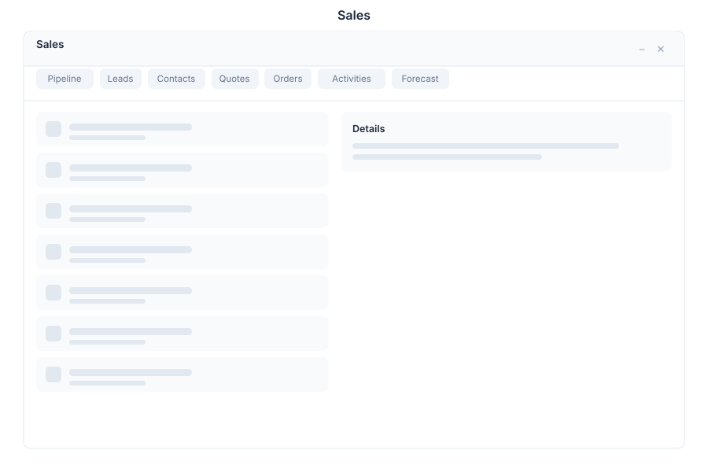

# Sales - CRM Pipeline

> **Lead to close sales pipeline with kanban board, activity tracking, and forecasting**

---

## Overview

Sales CRM manages the entire sales pipeline from lead generation to deal closure. Track contacts, log activities, forecast revenue, and manage deals through customizable pipeline stages — all powered by AI assistance.

---

## Features

### Pipeline

| Capability | Description |
|------------|-------------|
| Kanban Board | Visual pipeline with drag-and-drop stages |
| Stages | Configurable deal stages (Lead, Qualified, Proposal, Negotiation, Won, Lost) |
| Filters | Filter by rep, value, date, or stage |
| Sorting | Sort by value, date, probability, or name |

### Contacts

| Capability | Description |
|------------|-------------|
| Manage | Create, edit, and organize contacts |
| History | Full interaction history per contact |
| Segments | Group contacts by criteria |
| Import/Export | CSV and vCard support |

### Activities

| Capability | Description |
|------------|-------------|
| Calls | Log phone calls with notes |
| Emails | Track email correspondence |
| Meetings | Schedule and record meetings |
| Tasks | Create and assign follow-up tasks |

### Forecast

| Capability | Description |
|------------|-------------|
| Predictions | AI-powered revenue predictions |
| Targets | Set and track sales targets |
| Trends | Visualize pipeline trends over time |
| Reports | Revenue and conversion reports |

---

## Keyboard Shortcuts

| Shortcut | Action |
|----------|--------|
| `Ctrl + P` | Open pipeline view |
| `Ctrl + C` | Create new contact |
| `Ctrl + D` | Create new deal |
| `Ctrl + A` | Log new activity |
| `Ctrl + F` | Search pipeline |
| `Ctrl + R` | Open forecast |
| `Ctrl + N` | Create new task |
| `Esc` | Close current panel |

---

## Sales via Chat

**User:** Show my pipeline

**Bot:** Your Sales Pipeline:

| Stage | Deals | Value |
|-------|-------|-------|
| Lead | 12 | $45,000 |
| Qualified | 8 | $120,000 |
| Proposal | 5 | $85,000 |
| Negotiation | 3 | $95,000 |
| Won | 6 | $210,000 |

**Total Pipeline:** $555,000 across 34 deals

Top deal: Enterprise License — $75,000 (Negotiation)

Would you like to drill down into any stage or view specific deals?

---

**User:** Create a new deal

**Bot:** I'll create a new deal for you. Please provide:

1. **Deal name** — e.g., "Acme Corp Annual License"
2. **Contact** — Who is the primary contact?
3. **Value** — Estimated deal value
4. **Stage** — Current pipeline stage

Or I can extract this from a recent email conversation.

---

## API Reference

| Endpoint | Method | Description |
|----------|--------|-------------|
| `/api/sales/pipeline` | GET | Get full pipeline overview |
| `/api/sales/pipeline/stages` | GET | List pipeline stages |
| `/api/sales/deals` | GET | List all deals |
| `/api/sales/deals` | POST | Create new deal |
| `/api/sales/deals/{id}` | GET | Get deal by ID |
| `/api/sales/deals/{id}` | PUT | Update deal |
| `/api/sales/deals/{id}` | DELETE | Delete deal |
| `/api/sales/deals/{id}/stage` | PUT | Move deal to stage |
| `/api/sales/contacts` | GET | List all contacts |
| `/api/sales/contacts` | POST | Create new contact |
| `/api/sales/contacts/{id}` | GET | Get contact by ID |
| `/api/sales/contacts/{id}` | PUT | Update contact |
| `/api/sales/activities` | GET | List activities |
| `/api/sales/activities` | POST | Log new activity |
| `/api/sales/forecast` | GET | Get revenue forecast |
| `/api/sales/reports` | GET | Generate sales reports |

---

## Related Pages

- [Contacts](../contacts.md) — Contact management
- [Activities](../activities.md) — Activity logging
- [Forecast](../forecast.md) — Revenue prediction
- [Reports](../reports.md) — Sales analytics
