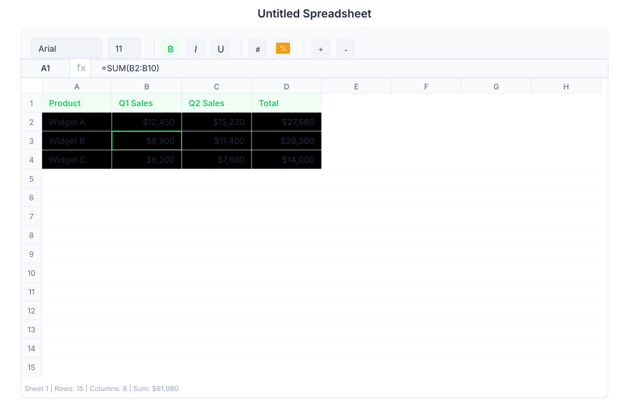

# Sheet 🟡 BETA - Spreadsheets

> **AI spreadsheet with desktop-grade features**



---

## Overview

Sheet is the spreadsheet application in General Bots Suite. It stores workbooks in Drive, imports and exports `.xlsx` and CSV, evaluates a large worksheet function library server-side, and renders a virtualised grid that scrolls over very large row counts.

Sheet is in **beta**, and the gap between it and a desktop spreadsheet is currently wide. The tables below mark each capability honestly:

- **Available** — implemented and usable today.
- **Partial** — present but incomplete or unreliable; the note says how.
- **Planned** — modelled, or exposed in the API, but not yet functional end to end.

The work to close the gap is tracked in [Sheet Parity Plan](./sheet-parity-plan.md). Read that page before relying on Sheet for a workbook you cannot afford to lose.

---

## Features

### Cells

| Action | Status | Notes |
|--------|--------|-------|
| Edit a cell | Available | Double-click, `F2`, or type over the selection |
| A1-style references | Available | `A1`, `A1:C10` |
| Number, currency, date and percentage formats | Planned | Format codes are read from `.xlsx` and stored, but the grid renders the raw underlying value |
| Merge cells | Planned | The API accepts a merge and the model stores it; the grid does not render merges, and the toolbar button currently merges a cell with itself |
| Resize rows and columns | Planned | Widths and heights are imported from `.xlsx` and persisted, but the grid uses fixed sizes |
| Range selection | Planned | Selection is a single cell |
| Multi-range selection (`Ctrl`+click) | Planned | — |
| Freeze panes | Planned | Imported from `.xlsx` and stored; not rendered |
| Cell comments and notes | Planned | Threaded comments are modelled with a full API; the grid renders no marker |

### Formulas

Around 170 worksheet functions are implemented server-side, including the Microsoft 365 dynamic-array family. A representative sample:

| Function | Syntax | Description |
|----------|--------|-------------|
| SUM | `=SUM(A1:A10)` | Sum of a range |
| AVERAGE | `=AVERAGE(B1:B5)` | Mean of a range |
| COUNT / COUNTA / COUNTBLANK | `=COUNTA(C1:C20)` | Counting variants |
| IF / IFERROR | `=IF(A1>10,"Yes","No")` | Conditional logic |
| VLOOKUP / HLOOKUP / XLOOKUP / MATCH / INDEX | `=XLOOKUP(A1,D:D,E:E)` | Lookups |
| SUMIF / SUMIFS / COUNTIF / COUNTIFS / AVERAGEIFS / MAXIFS / MINIFS | `=SUMIFS(C:C,A:A,"Jan")` | Criteria aggregation |
| MAX / MIN / MEDIAN / STDEV / PERCENTILE / QUARTILE / RANK | `=MEDIAN(A1:A10)` | Statistics |
| FILTER / SORT / SORTBY / UNIQUE / SEQUENCE / RANDARRAY | `=UNIQUE(A1:A100)` | Dynamic arrays |
| HSTACK / VSTACK / TOCOL / TOROW / TAKE / DROP / EXPAND | `=VSTACK(A1:A5,C1:C5)` | Array shaping |
| LET / LAMBDA / MAP / REDUCE / BYROW / BYCOL / MAKEARRAY | `=LET(x,A1,x*2)` | Lambda family |
| TEXTSPLIT / TEXTBEFORE / TEXTAFTER / VALUETOTEXT | `=TEXTSPLIT(A1,",")` | Text 365 |
| GROUPBY / PIVOTBY / SUBTOTAL / AGGREGATE / PERCENTOF | `=GROUPBY(A:A,B:B,SUM)` | Grouping |
| DATE / YEAR / MONTH / DAY / DATEDIF / HOUR / MINUTE / SECOND | `=DATEDIF(A1,B1,"d")` | Dates |
| BOT_AI_PROMPT | `=BOT_AI_PROMPT("Analyze ", A1)` | AI-powered cell evaluation with caching — see [AI Sheet Cache](../../03-knowledge-ai/ai-sheet-cache.md) |

#### Current formula limitations

These are real and will bite immediately. Each is tracked in [Sheet Parity Plan](./sheet-parity-plan.md).

| Limitation | Example | Result today |
|---|---|---|
| A formula must be a single function call | `=SUM(A1:A3)+1` | `#ERROR!` |
| No nested calls | `=INDEX(A1:A3,MATCH(20,A1:A3,0))` | `#ERROR!` |
| No `&` concatenation operator | `=A1&B1` | `#ERROR!` |
| No `^` exponentiation operator | `=A1^2` | `#ERROR!` |
| String literals are upper-cased | `=CONCATENATE("Total: ",A1)` | `TOTAL: 7` |
| No cross-sheet references | `=Sheet2!A1` | not resolved |
| `$` anchors are not preserved | `=$A$1` copied down | not translated correctly |
| Values are stored as text | `=SUM()` over `1,234.50` | `0` |
| Recalculation stops after 1000 dependent cells | a large model | downstream cells keep stale values, silently |

### Charts

| Type | Status |
|------|--------|
| Bar, Line, Pie, Scatter, Area | Planned — chart definitions are stored and returned by the API, but nothing renders them in the grid, and their data is snapshotted rather than bound to a range |

### Filters

| Filter | Status |
|--------|--------|
| Text contains / equals, number range, date range, empty/non-empty, custom formula | Planned — `POST /api/sheet/filter` accepts and stores a filter, but no rows are hidden in the grid |

### Sort

| Option | Status |
|--------|--------|
| Ascending / descending on a range | Partial — `POST /api/sheet/sort` reorders stored values; formulas referencing the moved cells are not rewritten |
| Multi-column, custom order | Planned |

### Import / Export

| Format | Import | Export | Notes |
|--------|--------|--------|-------|
| CSV | Available | Available | Exported values are unformatted |
| TSV | Available | Available | — |
| JSON | Available | Available | Internal document shape |
| `.xlsx` | Partial | Partial | Values, formulas, number format codes, cell styles, merged cells, column widths, row heights and frozen panes are read. **Defined names, data validation, conditional formatting, charts, images, pivot tables, tables, autofilter, hidden rows, hyperlinks, rich text runs, sheet protection, print setup and external links are dropped.** |
| Markdown | — | Available | — |
| ODS | — | Partial | Emits content XML, not a complete `.ods` package |
| PDF | — | Planned | — |

> **Warning — opening an `.xlsx` from Drive.** Sheet can write the edited workbook back over the original file. Because import is lossy, features Sheet does not model are not preserved on that write. Until [Sheet Parity Plan](./sheet-parity-plan.md) issue 8 lands, keep a copy of any workbook that contains charts, pivot tables, conditional formatting or data validation before editing it in Sheet.

---

## Keyboard Shortcuts

Implemented today:

| Shortcut | Action |
|----------|--------|
| `Enter` | Commit and move down |
| `Tab` | Commit and move right |
| `F2` | Edit the active cell |
| `Arrow` keys | Move the selection |

Documented but **not yet implemented** — tracked in [Sheet Parity Plan](./sheet-parity-plan.md):

| Shortcut | Action |
|----------|--------|
| `Ctrl+Z` / `Ctrl+Y` | Undo / redo |
| `Ctrl+C` / `Ctrl+V` / `Ctrl+X` | Copy / paste / cut |
| `Ctrl+Alt+V` | Paste Special |
| `Ctrl+D` / `Ctrl+R` | Fill down / fill right |
| `Delete` / `Backspace` | Clear a range |
| `Ctrl+A` | Select all |
| `Ctrl+Arrow` | Jump to the edge of the data |
| `Ctrl+Home` / `Ctrl+End` | First / last used cell |
| `PageUp` / `PageDown` | Page the viewport |
| `Alt+Enter` | Newline inside a cell |
| `Esc` | Abandon an edit |
| `F4` | Cycle `$` anchors in a reference |
| `Ctrl+Space` / `Shift+Space` | Select column / row |

---

## Sheet via Chat

The examples below show the intended conversational flow. Chat-driven sheet creation depends on the parity work in [Sheet Parity Plan](./sheet-parity-plan.md); treat them as the target experience rather than a description of current behaviour.

### Creating a Sales Report

<div class="wa-chat">
  <div class="wa-message user">
    <div class="wa-bubble">
      <p>Create a sales report</p>
      <div class="wa-time">09:00</div>
    </div>
  </div>
  <div class="wa-message bot">
    <div class="wa-bubble">
      <p>📊 I've created a new spreadsheet: <strong>Sales Report</strong></p>
      <p>Here's the structure:</p>
      <p>| Month | Revenue | Orders | Avg Order |</p>
      <p>| Jan | $12,400 | 156 | $79.49 |</p>
      <p>| Feb | $15,200 | 189 | $80.42 |</p>
      <p>| Mar | $18,900 | 234 | $80.77 |</p>
      <p>[Open in Sheet] [Edit via Chat]</p>
      <div class="wa-time">09:00</div>
    </div>
  </div>
</div>

### Calculating Totals

<div class="wa-chat">
  <div class="wa-message user">
    <div class="wa-bubble">
      <p>Calculate the total revenue</p>
      <div class="wa-time">10:30</div>
    </div>
  </div>
  <div class="wa-message bot">
    <div class="wa-bubble">
      <p>🔢 I've added a <strong>SUM</strong> formula to cell B16:</p>
      <p>=SUM(B2:B15)</p>
      <p>Result: <strong>$246,500</strong></p>
      <p>I've also added averages for Orders and Avg Order columns.</p>
      <div class="wa-time">10:30</div>
    </div>
  </div>
</div>

### Generating a Chart

<div class="wa-chat">
  <div class="wa-message user">
    <div class="wa-bubble">
      <p>Create a chart showing revenue by month</p>
      <div class="wa-time">11:00</div>
    </div>
  </div>
  <div class="wa-message bot">
    <div class="wa-bubble">
      <p>📈 Chart created: <strong>Monthly Revenue</strong></p>
      <p>Type: Bar chart</p>
      <p>Data range: A1:B15</p>
      <p>[View Chart] [Edit Chart] [Export as PNG]</p>
      <div class="wa-time">11:00</div>
    </div>
  </div>
</div>

---

## API Endpoints

| Endpoint | Method | Description |
|----------|--------|-------------|
| `/api/sheet/list` | GET | List all spreadsheets |
| `/api/sheet/search` | GET | Search spreadsheets |
| `/api/sheet/load` | GET | Load spreadsheet by ID |
| `/api/sheet/save` | POST | Save spreadsheet |
| `/api/sheet/delete` | POST | Delete spreadsheet |
| `/api/sheet/cell` | POST | Update cell value |
| `/api/sheet/format` | POST | Format cells |
| `/api/sheet/formula` | POST | Evaluate spreadsheet formula |
| `/api/sheet/range` | POST | Get range values |
| `/api/sheet/worksheet-meta` | POST | Update worksheet metadata |
| `/api/sheet/pivot` | POST | Create pivot table |
| `/api/sheet/export` | POST | Export spreadsheet |
| `/api/sheet/share` | POST | Share spreadsheet |
| `/api/sheet/new` | GET | Create new blank spreadsheet |
| `/api/sheet/merge` | POST | Merge cells |
| `/api/sheet/unmerge` | POST | Unmerge cells |
| `/api/sheet/freeze` | POST | Freeze panes |
| `/api/sheet/sort` | POST | Sort range |
| `/api/sheet/filter` | POST | Filter data |
| `/api/sheet/chart` | POST | Create chart |
| `/api/sheet/conditional-format` | POST | Apply conditional formatting |
| `/api/sheet/data-validation` | POST | Apply data validation rules |
| `/api/sheet/ai` | POST | Query spreadsheet AI assistant |
| `/api/sheet/:id` | GET | Get spreadsheet by ID |
| `/ws/sheet/:sheet_id` | GET | WebSocket for collaborative editing |

### Create Spreadsheet Request

```json
{
    "title": "Sales Report",
    "sheets": [
        {
            "name": "Revenue",
            "rows": 20,
            "columns": 10,
            "data": {
                "A1": "Month",
                "B1": "Revenue",
                "A2": "Jan",
                "B2": 12400
            }
        }
    ]
}
```

### Cell Update Request

```json
{
    "cells": {
        "B16": "=SUM(B2:B15)",
        "C16": "=AVERAGE(C2:C15)"
    }
}
```

### Spreadsheet Response

```json
{
    "id": "sheet-789",
    "title": "Sales Report",
    "sheets": [
        {
            "name": "Revenue",
            "data": [
                ["Month", "Revenue", "Orders"],
                ["Jan", 12400, 156],
                ["Feb", 15200, 189]
            ],
            "charts": [
                {
                    "id": "chart-001",
                    "type": "bar",
                    "title": "Monthly Revenue",
                    "data_range": "A1:B15"
                }
            ]
        }
    ],
    "created_at": "2025-05-15T09:00:00Z",
    "updated_at": "2025-05-15T11:00:00Z"
}
```

---

## Configuration

Current grid limits are compiled in, not configurable:

| Limit | Current value | Desktop spreadsheets |
|-------|---------------|---------------------|
| Columns | 26 | 16,384 (`XFD`) |
| Rows | 1,200,000 | 1,048,576 |
| Recalculated cells per edit | 1,000 (silently truncated) | unlimited |

Catching up to the desktop standard is part of [Sheet Parity Plan](./sheet-parity-plan.md) issues 4 and 6.

---

## Troubleshooting

### A formula returns `#ERROR!`

Check it against the limitations table above first — `=SUM(A1:A3)+1`, `=A1&B1`, `=A1^2` and any nested call return `#ERROR!` by design of the current evaluator, not because of anything wrong with your sheet. Otherwise:

1. Confirm the formula starts with `=`.
2. Confirm the function name is in the implemented set.
3. Check for a circular reference.

### A number is treated as text

Values are stored as strings today, so a number typed with a thousands separator (`1,234.50`) or a currency symbol is not recognised as numeric and aggregates as zero. Type the bare number.

### Cell formatting is not shown

Number format codes are imported and stored but not rendered — a currency cell displays its raw value. Tracked as issue 5 in the parity plan.

### A worksheet cannot be reached

Only the first worksheet is reachable; the tab bar is not yet implemented. Tracked as issue 12.

### Import lost part of the file

See the import table above for exactly what is dropped. Charts, pivot tables, conditional formatting and data validation do not survive import today.

### Chart is not displayed

Charts are not rendered in the grid yet. The definition is stored and returned by the API.

---

## See Also

- [Sheet Parity Plan](./sheet-parity-plan.md) — current gaps and the plan to close them
- [Sheets API](../../08-rest-api-tools/sheets-api.md) — endpoint reference
- [Suite Manual](../suite-manual.md) — complete user guide
- [Drive](./drive.md) — file storage for imports
- [Chat App](./chat.md) — create sheets via chat
- [BASIC Database Keywords](../../04-basic-scripting/keyword-database.md) — script integration
