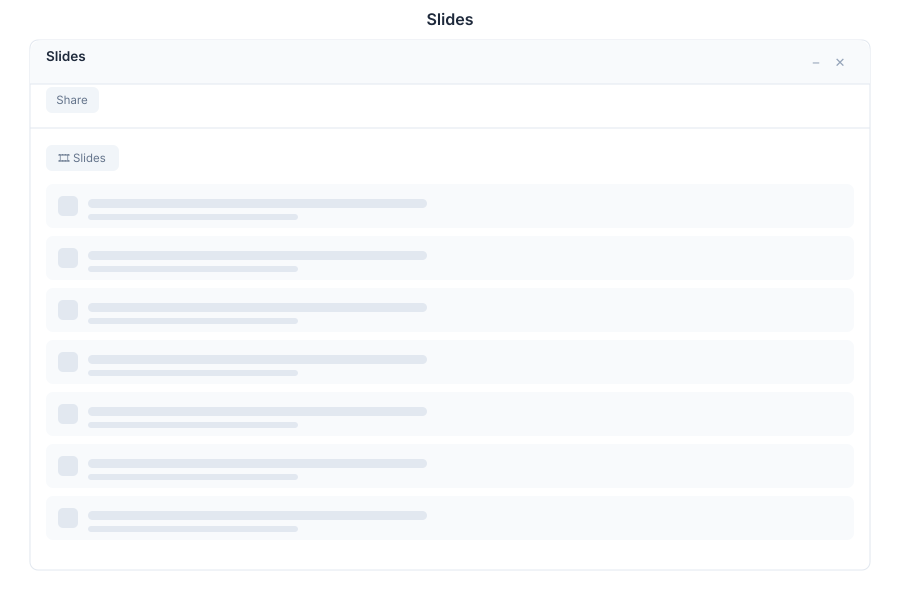

# Slides - Presentations

> **AI-powered presentation builder**



---

## Overview

Slides is the presentation editor in General Bots Suite. Build professional presentations with AI assistance, choose from themed templates, add media, and present with a built-in presenter mode. Export to PDF for easy sharing and distribution.

---

## Features

### Slides

| Action | Description |
|--------|-------------|
| Add | Create a new blank slide |
| Duplicate | Copy the current slide |
| Delete | Remove a slide |
| Reorder | Drag to rearrange slide order |
| Navigate | Click thumbnails or use arrow keys |
| Zoom | Zoom in/out of slide canvas |

### Themes

| Theme | Style |
|-------|-------|
| Professional | Clean, corporate design |
| Creative | Bold colors and layouts |
| Minimal | Simple and elegant |
| Dark | Dark background with light text |
| Academic | Formal, research-oriented |
| Custom | Upload your own template |

### Transitions

| Transition | Effect |
|------------|--------|
| None | Instant switch |
| Fade | Smooth fade in/out |
| Slide | Slide left/right |
| Zoom | Scale in/out |
| Wipe | Wipe across screen |

### Media

| Element | Description |
|---------|-------------|
| Image | Upload or embed images |
| Video | Embedded video player |
| Audio | Background or narration audio |
| Chart | Data visualization |
| Shape | Rectangles, circles, arrows |
| Icon | Built-in icon library |

### Presenter Mode

| Feature | Description |
|---------|-------------|
| Current Slide | Large view of current slide |
| Next Preview | Preview of next slide |
| Notes | Speaker notes panel |
| Timer | Presentation duration |
| Controls | Previous, next, pointer |

### Export

| Format | Description |
|--------|-------------|
| PDF | High-quality document |
| PPTX | PowerPoint compatible |
| Images | PNG per slide |
| HTML | Interactive web presentation |

---

## Keyboard Shortcuts

| Shortcut | Action |
|----------|--------|
| `N` | New slide |
| `F5` | Start presentation |
| `Escape` | Exit presentation |
| `Ctrl+Z` | Undo |
| `Ctrl+Y` | Redo |
| `Ctrl+D` | Duplicate slide |
| `Ctrl+Shift+N` | Add blank slide |
| `Delete` | Delete selected element |
| `Ctrl+A` | Select all elements |
| `Tab` | Cycle through elements |
| `Arrow Keys` | Move selected element |

---

## Slides via Chat

### Creating a Presentation

<div class="wa-chat">
  <div class="wa-message user">
    <div class="wa-bubble">
      <p>Create a pitch deck</p>
      <div class="wa-time">09:00</div>
    </div>
  </div>
  <div class="wa-message bot">
    <div class="wa-bubble">
      <p>📊 I've created a presentation: <strong>Pitch Deck</strong></p>
      <p>Slides generated:</p>
      <p>1. Title Slide - Company Name</p>
      <p>2. Problem - The Challenge</p>
      <p>3. Solution - Our Approach</p>
      <p>4. Market Opportunity</p>
      <p>5. Business Model</p>
      <p>6. Team</p>
      <p>7. Financial Projections</p>
      <p>8. Call to Action</p>
      <p>[Open in Slides] [Edit via Chat] [Present Now]</p>
      <div class="wa-time">09:00</div>
    </div>
  </div>
</div>

### Adding Content to a Slide

<div class="wa-chat">
  <div class="wa-message user">
    <div class="wa-bubble">
      <p>Add a chart to the financial projections slide</p>
      <div class="wa-time">10:30</div>
    </div>
  </div>
  <div class="wa-message bot">
    <div class="wa-bubble">
      <p>📈 Added a revenue chart to slide 7:</p>
      <p>Chart Type: Bar chart</p>
      <p>Data:</p>
      <p>• 2025: $500K</p>
      <p>• 2026: $1.2M</p>
      <p>• 2027: $2.5M</p>
      <p>[Edit Chart] [Change Type] [Update Data]</p>
      <div class="wa-time">10:30</div>
    </div>
  </div>
</div>

### Applying a Theme

<div class="wa-chat">
  <div class="wa-message user">
    <div class="wa-bubble">
      <p>Change the theme to dark</p>
      <div class="wa-time">11:00</div>
    </div>
  </div>
  <div class="wa-message bot">
    <div class="wa-bubble">
      <p>🎨 Theme updated to <strong>Dark</strong>.</p>
      <p>All 8 slides now use the dark color scheme with light text.</p>
      <p>[Preview Slides] [Undo Change]</p>
      <div class="wa-time">11:00</div>
    </div>
  </div>
</div>

---

## API Endpoints

| Endpoint | Method | Description |
|----------|--------|-------------|
| `/api/slides` | GET | List all presentations |
| `/api/slides` | POST | Create new presentation |
| `/api/slides/:id` | GET | Get presentation data |
| `/api/slides/:id` | PATCH | Update presentation |
| `/api/slides/:id` | DELETE | Delete presentation |
| `/api/slides/:id/slides` | POST | Add new slide |
| `/api/slides/:id/slides/:slide_id` | PATCH | Update slide content |
| `/api/slides/:id/slides/:slide_id` | DELETE | Delete slide |
| `/api/slides/:id/export` | GET | Export as PDF/PPTX |
| `/api/slides/search` | GET | Search presentations |

### Create Presentation Request

```json
{
    "title": "Pitch Deck",
    "theme": "professional",
    "slides": [
        {
            "type": "title",
            "title": "Company Name",
            "subtitle": "Revolutionizing the Industry"
        },
        {
            "type": "content",
            "title": "The Problem",
            "content": "Current solutions are outdated...",
            "layout": "two-column"
        }
    ]
}
```

### Slide Response

```json
{
    "id": "slide-deck-456",
    "title": "Pitch Deck",
    "theme": "professional",
    "slides": [
        {
            "id": "slide-001",
            "type": "title",
            "title": "Company Name",
            "subtitle": "Revolutionizing the Industry",
            "order": 1,
            "transition": "fade",
            "elements": [
                {
                    "type": "text",
                    "content": "Company Name",
                    "position": { "x": 100, "y": 200 },
                    "style": { "font-size": "48px", "color": "#ffffff" }
                }
            ]
        }
    ],
    "created_at": "2025-05-15T09:00:00Z",
    "updated_at": "2025-05-15T11:00:00Z"
}
```

---

## Configuration

Slides settings can be configured in `config.csv`:

```csv
key,value
max-slides,100
default-theme,professional
auto-save-interval,30
export-quality,high
```

---

## Troubleshooting

### Presentation Not Loading

1. Check presentation file isn't corrupted
2. Verify theme is available
3. Check browser compatibility
4. Refresh the page

### Media Not Embedding

1. Verify file format is supported (PNG, JPG, MP4, MP3)
2. Check file size limits
3. Ensure media URLs are accessible
4. Try re-uploading the media

### Export Failing

1. Check presentation isn't too large
2. Verify all media is properly embedded
3. Ensure sufficient server resources
4. Try exporting as PDF first

---

## See Also

- [Suite Manual](../suite-manual.md) - Complete user guide
- [Drive](./drive.md) - File storage for media
- [Chat App](./chat.md) - Create presentations via chat
- [BASIC File Keywords](../../04-basic-scripting/keyword-file.md) - Script integration
