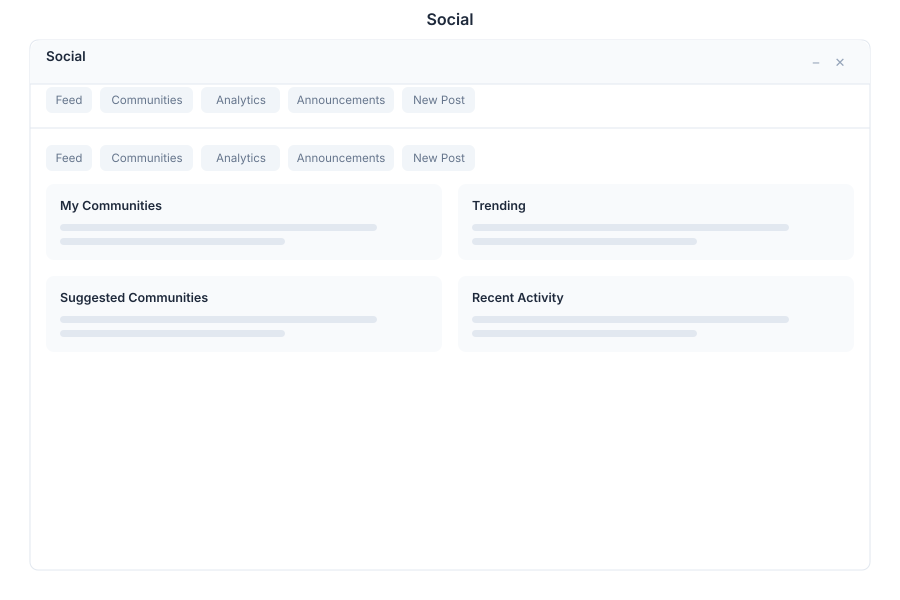

# Social 🟡 BETA - Community

> **Internal social feed & communities**

---

## Overview

Social is the internal social network and community module in General Bots Suite. Create posts, join communities, share updates, and collaborate with colleagues in a familiar social feed format. Social helps organizations build culture and facilitate informal communication.

---

## Features

### Feed

Activity feed with posts, reactions, and comments.

| Action | Description |
|--------|-------------|
| **Create Post** | Share updates, questions, or content |
| **React** | Like, celebrate, or react to posts |
| **Comment** | Add comments and replies |
| **Share** | Repost to your own feed |
| **Save** | Bookmark posts for later reading |

### Communities

Create and manage interest-based groups.

| Action | Description |
|--------|-------------|
| **Create Community** | Define community with name and description |
| **Join Community** | Request membership or auto-join |
| **Manage Members** | Add/remove members, set roles |
| **Set Privacy** | Public, private, or secret communities |
| **Moderate Content** | Review and manage posts |

### Announcements

Broadcast important information organization-wide.

| Feature | Description |
|---------|-------------|
| **Create Announcement** | Post important updates with priority |
| **Pin Announcement** | Keep important posts at top |
| **Target Audience** | Send to specific groups or everyone |
| **Track Readers** | See who has viewed the announcement |
| **Require Acknowledgment** | Mark as read confirmation |

### Direct Messages

Private messaging between colleagues.

| Action | Description |
|--------|-------------|
| **Send Message** | Private message to individuals |
| **Group Chat** | Create group conversations |
| **Share Files** | Attach documents and media |
| **Read Receipts** | See when messages are read |
| **Message Search** | Search through message history |

### Content Types

Rich media support for diverse communication.

| Type | Description |
|------|-------------|
| **Text** | Plain text and markdown formatting |
| **Images** | Photo uploads with galleries |
| **Files** | Document and file attachments |
| **Polls** | Create polls for group decisions |
| **Events** | Share calendar events |
| **Links** | Auto-preview for shared links |

---

## Keyboard Shortcuts

| Shortcut | Action |
|----------|--------|
| `N` | Create new post |
| `C` | Comment on selected post |
| `L` | Like/React to post |
| `M` | Open direct messages |
| `F` | Focus search |
| `/` | Focus search |
| `?` | Show shortcuts |

---

## Social via Chat

### Posting an Update

  

    

      
Post an update: Just shipped the new dashboard feature!

      
09:00

    

  

  

    

      
✅ Post published:

      
📝 "Just shipped the new dashboard feature!"

      
👥 Visible to: All followers

      
💬 Comments: 0

      
❤️ Reactions: 0

      
09:00

    

  

### Showing My Communities

  

    

      
Show my communities

      
14:30

    

  

  

    

      
👥 Your Communities (4 joined):

      
🏢 Engineering - 45 members, 12 posts today

      
🎨 Design - 18 members, 5 posts today

      
📈 Marketing - 22 members, 8 posts today

      
☕ Random - 67 members, 23 posts today

      
14:30

    

  

---

## API Reference

Social operations are available via REST API:

| Endpoint | Method | Description |
|----------|--------|-------------|
| `/api/social/feed` | GET | Get activity feed |
| `/api/social/posts` | POST | Create new post |
| `/api/social/posts/:id` | GET | Get post details |
| `/api/social/posts/:id` | DELETE | Delete post |
| `/api/social/posts/:id/reactions` | POST | Add reaction |
| `/api/social/posts/:id/comments` | GET | Get comments |
| `/api/social/posts/:id/comments` | POST | Add comment |
| `/api/social/communities` | GET | List communities |
| `/api/social/communities` | POST | Create community |
| `/api/social/communities/:id/join` | POST | Join community |
| `/api/social/messages` | GET | Get direct messages |
| `/api/social/messages` | POST | Send message |

---

## Related Pages

- [Chat App](./chat.md) — Real-time AI conversations
- [Drive App](./drive.md) — Share files in posts
- [Calendar App](./calendar.md) — Schedule community events
- [Meet App](./meet.md) — Start video calls from posts
- [Suite Manual](../suite-manual.md) — Full Suite overview