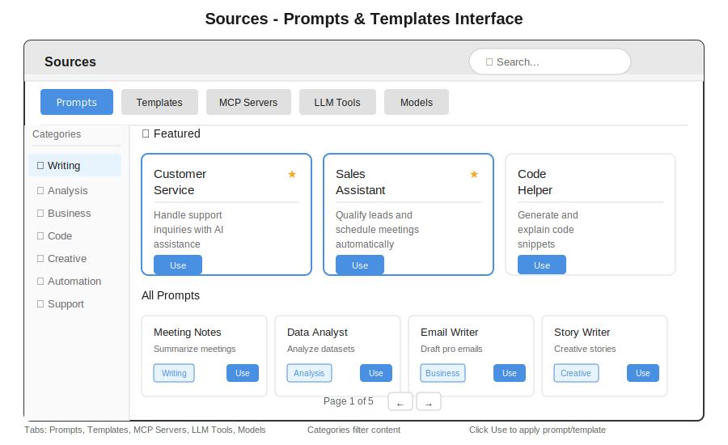

# Sources

> **Repositories, Apps, Prompts, Templates & MCP Servers**

---



## Overview

Sources is where you connect everything your bot can reference. Add Git repositories, manage generated apps, configure prompts, and connect MCP servers. Most importantly, Sources enables **@mentions** in chat—reference `@botserver` to work on a repository or `@myapp` to modify an app you created.

---

## Tabs

| Tab | What It Contains |
|-----|------------------|
| **Repositories** | Git repos (GitHub, GitLab, Bitbucket) |
| **Apps** | HTMX apps created with CREATE SITE |
| **Prompts** | System prompts and templates |
| **Templates** | Bot packages (.gbai) |
| **News** | Platform updates and announcements |
| **MCP Servers** | Model Context Protocol servers |
| **LLM Tools** | Available LLM-invokable tools |
| **Models** | Configured AI models |

---

## Repositories

Connect Git repositories so Tasks can read, modify, and commit code.

### Adding a Repository

1. Click **+ Add Repository**
2. Enter the repository URL (HTTPS or SSH)
3. Authenticate if private
4. Click **Connect**

### Repository Card

Each connected repository shows:

| Field | Description |
|-------|-------------|
| **Name** | Repository name with @mention tag |
| **Owner** | Organization or user |
| **Description** | From repository README |
| **Language** | Primary programming language |
| **Stars/Forks** | GitHub metrics |
| **Status** | Connected or disconnected |

### Using @mentions with Repositories

In chat, type `@` followed by the repo name:

```
You: @botserver add error handling to the login function

Bot: I'll modify botserver. Looking at the login function...
     [Task created: Add error handling to login]
```

The system will:
1. Clone or pull the latest code
2. Analyze the relevant files
3. Make the requested changes
4. Create a commit or pull request

### Repository Actions

| Action | Description |
|--------|-------------|
| **Browse** | View files and folders |
| **Mention** | Insert @repo into chat |
| **Disconnect** | Remove from Sources |
| **Settings** | Configure branch, credentials |

---

## Apps

Apps are HTMX applications created with `CREATE SITE`. They appear here automatically.

### App Card

Each app shows:

| Field | Description |
|-------|-------------|
| **Name** | App name with @mention tag |
| **Type** | HTMX, Dashboard, Site |
| **Description** | Generated from creation prompt |
| **URL** | Live endpoint (e.g., `/crm`) |
| **Created** | When the app was generated |

### Using @mentions with Apps

Reference apps to modify them:

```
You: @crm change the submit button to green

Bot: I'll update the CRM app. Modifying the button styles...
     [Task created: Change submit button color]
```

```
You: @dashboard add a new KPI card for monthly revenue

Bot: I'll add that to your dashboard. Creating the KPI card...
     [Task created: Add monthly revenue KPI]
```

### App Actions

| Action | Description |
|--------|-------------|
| **Open** | View app in new tab |
| **Edit** | Open Tasks with app context |
| **Mention** | Insert @app into chat |
| **Delete** | Remove app and files |

---

## @Mention Autocomplete

When typing in chat, `@` triggers autocomplete:

1. Type `@` to see suggestions
2. Continue typing to filter (e.g., `@bot` shows `@botserver`, `@botui`)
3. Press **Enter** or **Tab** to select
4. Press **Escape** to cancel

### Mention Types

| Type | Icon | Example |
|------|------|---------|
| Repository | Git icon | `@botserver` |
| App | Grid icon | `@mycrm` |

### Context for Tasks

When you mention a source, it becomes context for the task:

```
You: @botserver @botui make the API response format consistent

Bot: I'll update both repositories to use consistent response formats.
     [Task created with context: botserver, botui]
```

Without explicit mentions, Tasks uses recent context or asks for clarification.

---

## Prompts

System prompts define bot personality and behavior.

### Prompt Categories

| Category | Purpose |
|----------|---------|
| **Assistants** | Role-specific personas |
| **Tools** | Tool descriptions for LLM |
| **Personas** | Bot personality definitions |
| **Custom** | Your own prompts |

### Creating a Prompt

1. Click **+ New Prompt**
2. Enter name and category
3. Write prompt content
4. Use `{{variables}}` for dynamic values
5. Click **Save**

### Prompt Actions

| Action | Description |
|--------|-------------|
| **Use** | Apply to current session |
| **Copy** | Copy to clipboard |
| **Save** | Add to collection |
| **Edit** | Modify content |

---

## Templates

Bot packages ready to deploy.

### Available Templates

| Template | Description |
|----------|-------------|
| **CRM** | Customer relationship management |
| **Support** | Helpdesk and ticketing |
| **Analytics** | Dashboards and reports |
| **Compliance** | LGPD, GDPR, HIPAA |

### Installing a Template

1. Click on template card
2. Review contents
3. Click **Install**
4. Configure settings
5. Bot is ready

---

## MCP Servers

Model Context Protocol servers extend bot capabilities. MCP servers are configured via `mcp.csv` in the bot's `.gbai` folder, making their tools available to Tasks just like BASIC keywords.

### The mcp.csv File

MCP servers are configured by adding entries to `mcp.csv` in your bot's `.gbai` folder:

```
mybot.gbai/
├── mybot.gbdialog/     # BASIC scripts
├── mybot.gbdrive/      # Files and documents
├── config.csv          # Bot configuration
├── attendant.csv       # Attendant configuration
└── mcp.csv             # MCP server definitions
```

When botserver starts, it reads the `mcp.csv` file and loads all server configurations.

### Server Card

| Field | Description |
|-------|-------------|
| **Name** | Server identifier (used for `USE MCP` calls) |
| **Type** | filesystem, github, database, slack, etc. |
| **Status** | Active, Inactive, Error |
| **Tools** | Available tools count |
| **Source** | "directory" (from .gbmcp) |

### mcp.csv Format

The CSV file has the following columns:

| Column | Required | Description |
|--------|----------|-------------|
| `name` | Yes | Unique server identifier |
| `type` | Yes | Connection type: `stdio`, `http`, `websocket`, `tcp` |
| `command` | Yes | For stdio: command. For http/ws: URL |
| `args` | No | Command arguments (space-separated) |
| `description` | No | Human-readable description |
| `enabled` | No | `true` or `false` (default: `true`) |
| `auth_type` | No | `none`, `api_key`, `bearer` |
| `auth_env` | No | Environment variable for auth |

### Example mcp.csv

```csv
name,type,command,args,description,enabled
# MCP Server Configuration - lines starting with # are comments
filesystem,stdio,npx,"-y @modelcontextprotocol/server-filesystem /data",Access local files,true
github,stdio,npx,"-y @modelcontextprotocol/server-github",GitHub API,true,bearer,GITHUB_TOKEN
postgres,stdio,npx,"-y @modelcontextprotocol/server-postgres",Database queries,false
slack,stdio,npx,"-y @modelcontextprotocol/server-slack",Slack messaging,true,bearer,SLACK_BOT_TOKEN
myapi,http,https://api.example.com/mcp,,Custom API,true,api_key,MY_API_KEY
```

### Adding an MCP Server

**Method 1: Via UI**
1. Click **+ Add Server**
2. Enter server details
3. Configure connection type (stdio, http, websocket)
4. Test connection
5. Click **Save**

**Method 2: Via mcp.csv**
1. Open `mcp.csv` in your `.gbai` folder
2. Add a new line with server configuration
3. Restart bot or click **🔄 Reload** in Sources UI
4. Server appears automatically

### Using MCP Tools in BASIC

```bas
' Read a file using filesystem MCP server
content = USE MCP "filesystem", "read_file", {"path": "/data/config.json"}

' Query database
results = USE MCP "postgres", "query", {"sql": "SELECT * FROM users"}

' Send Slack message
USE MCP "slack", "send_message", {"channel": "#general", "text": "Hello!"}
```

### Connection Types

| Type | Description |
|------|-------------|
| **stdio** | Local process (npx, node, python) |
| **http** | REST API endpoint |
| **websocket** | WebSocket connection |
| **tcp** | Raw TCP socket |

### Popular MCP Servers

| Server | Package | Description |
|--------|---------|-------------|
| Filesystem | `@modelcontextprotocol/server-filesystem` | File operations |
| GitHub | `@modelcontextprotocol/server-github` | GitHub API |
| PostgreSQL | `@modelcontextprotocol/server-postgres` | Database queries |
| Slack | `@modelcontextprotocol/server-slack` | Messaging |

See [USE MCP](../../06-gbdialog/keyword-use-mcp.md) for complete documentation.

---

## LLM Tools

Tools that the LLM can invoke during conversations.

### Tool Sources

| Source | Description |
|--------|-------------|
| **Built-in** | Core BASIC keywords |
| **MCP** | From connected MCP servers |
| **Custom** | Your .bas files with DESCRIPTION |

### Tool Card

| Field | Description |
|-------|-------------|
| **Name** | Tool identifier |
| **Description** | What it does |
| **Parameters** | Required inputs |
| **Source** | Where it comes from |

---

## Models

Configured AI models for the platform.

### Model Card

| Field | Description |
|-------|-------------|
| **Name** | Model identifier |
| **Provider** | OpenAI, Anthropic, Local, etc. |
| **Status** | Active, coming soon |
| **Tags** | Capabilities (chat, code, vision) |

### Supported Providers

| Provider | Models |
|----------|--------|
| **OpenAI** | GPT-4, GPT-4o |
| **Anthropic** | Claude Sonnet 4.5, Claude Opus 4 |
| **Local** | llama.cpp GGUF models |
| **Azure** | Azure OpenAI deployments |

---

## Search

Use the search box to find across all source types:

- Type to search by name
- Results update as you type
- Press **Enter** to search
- Press **Escape** to clear

---

## Keyboard Shortcuts

| Shortcut | Action |
|----------|--------|
| `Ctrl+K` | Focus search |
| `1-6` | Switch tabs |
| `Escape` | Close modal |
| `Enter` | Open selected |

---

## BASIC Integration

### List Repositories

```bas
repos = GET REPOSITORIES
FOR EACH repo IN repos
    TALK repo.name + " - " + repo.description
NEXT
```

### List Apps

```bas
apps = GET APPS
FOR EACH app IN apps
    TALK app.name + " at /" + app.url
NEXT
```

### Get Task Context

```bas
' Get sources mentioned in current conversation
context = GET TASK CONTEXT
FOR EACH source IN context
    TALK "Working with: @" + source.name
NEXT
```

---

## See Also

- [Tasks](./tasks.md) - Execute work on repositories and apps
- [Chat](./chat.md) - Use @mentions in conversation
- [Autonomous Task AI](../../07-gbapp/autonomous-tasks.md) - How context flows to tasks