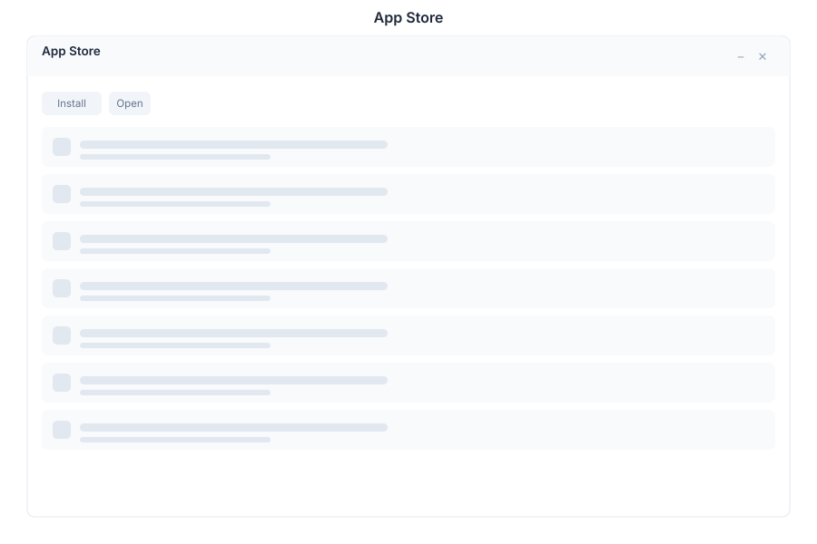

# App Store 🟡 PREVIEW

> **Preview application.** Usable today, not yet part of the supported surface.

The App Store lists the applications available to this installation and lets you install, pin and manage what appears on your desktop.

## What it does

| Capability | Detail |
|---|---|
| **Browse** | Every application the backend offers, with name and description |
| **Search** | Find an app by name from the search box |
| **Install / manage** | Add an application to your desktop or remove it from your own layout |
| **Popularity** | The backend keeps install counts so ranking survives navigation |

## How this relates to the Preview switch

Two different gates control what you see, and it is worth knowing which is which:

| Gate | Who decides | Effect |
|---|---|---|
| **Preview mode** | The administrator, in the `.product` file | Hides unreleased applications from everyone until they turn Preview mode on |
| **App Store install** | You | Controls your own desktop layout, within what the installation makes available |

Installing from the store cannot reveal an application the product configuration has withheld — Preview mode decides that.

## Opening it

The App Store is a **preview** application. Turn on the **Preview** switch in the left sidebar, then open **App Store** from the app menu.

## See Also

- [Product configuration](../../12-ecosystem-reference/README.md#preview_apps) - The `apps` and `preview_apps` lists
- [Desktop](./desktop.md) - The shell the store installs into
- [Apps overview](./README.md) - Stability classification for the whole suite
