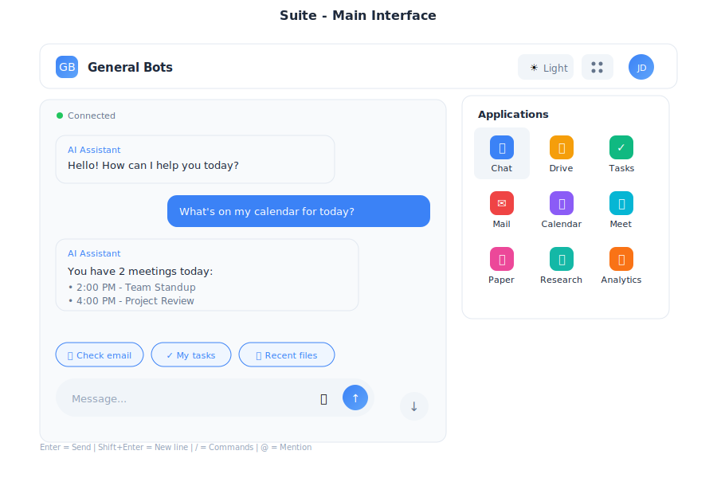

# Suite - Full Desktop Interface

> **Complete productivity suite with integrated applications**



---

## Overview

The Suite provides a complete desktop interface with multiple integrated applications for web, desktop, and mobile platforms. It serves as the primary interface for General Bots, combining AI-powered chat with productivity tools.

---

## Features

### Multi-Application Layout

The Suite includes integrated applications:

| App | Purpose |
|-----|---------|
| 💬 Chat | AI assistant conversations |
| 📁 Drive | File management |
| ⚡ Tasks | LLM-powered intelligent execution |
| ✉ Mail | Email client |
| 📅 Calendar | Scheduling |
| 🎥 Meet | Video calls |
| 🎬 Player | Media viewer |
| 📝 Paper | AI writing |
| 🔍 Research | AI search |
| 📊 Analytics | Dashboards |

### Responsive Design

The Suite adapts to any screen size:

- **Desktop (>1024px)**: Full multi-panel layout with persistent navigation
- **Tablet (768-1024px)**: Collapsible sidebar with touch-optimized controls
- **Mobile (<768px)**: Single column with bottom navigation and swipe gestures

### Theme Support

- Light and dark mode
- Custom color schemes via `.gbtheme`
- Automatic system preference detection

---

## Navigation

### Header Bar

The header provides quick access to:
- Logo and branding
- App selector grid
- Theme switcher
- User menu and settings

### App Launcher

Click the grid icon (⋮⋮⋮) to access all applications in a dropdown menu.

### Keyboard Shortcuts

| Shortcut | Action |
|----------|--------|
| `Alt+1` | Chat |
| `Alt+2` | Drive |
| `Alt+3` | Tasks |
| `Alt+4` | Mail |
| `Alt+5` | Calendar |
| `Alt+6` | Meet |
| `Esc` | Close menus |

---

## Usage

### As Desktop App

Use the `botui` Tauri application for native desktop experience:

```bash
# From the botui directory
cd botui
cargo tauri dev
# Opens Suite in native window
```

Or build the standalone app:

```bash
cd botui
cargo tauri build
# Creates distributable app in target/release
```

### As Web Interface

Default template for browser access:

```bash
./botserver
# Browse to http://localhost:9000
# Loads Suite interface
```

### As Mobile PWA

Install as Progressive Web App:
1. Open in mobile browser
2. Add to home screen
3. Launches as standalone app

---

## Example Workflows

### Quick Task Creation

<div class="wa-chat">
  <div class="wa-message user">
    <div class="wa-bubble">
      <p>Create a task to review the quarterly report by Friday</p>
      <div class="wa-time">10:30</div>
    </div>
  </div>
  <div class="wa-message bot">
    <div class="wa-bubble">
      <p>✅ Task created:</p>
      <p>📋 Review quarterly report</p>
      <p>📅 Due: Friday</p>
      <p>View in Tasks app?</p>
      <div class="wa-time">10:30</div>
    </div>
  </div>
</div>

### File Sharing

<div class="wa-chat">
  <div class="wa-message user">
    <div class="wa-bubble">
      <p>Share the project proposal with the team</p>
      <div class="wa-time">14:20</div>
    </div>
  </div>
  <div class="wa-message bot">
    <div class="wa-bubble">
      <p>📎 project-proposal.pdf</p>
      <p>Shared with: Team Members</p>
      <p>Link: https://...</p>
      <div class="wa-time">14:20</div>
    </div>
  </div>
</div>

### Meeting Scheduling

<div class="wa-chat">
  <div class="wa-message user">
    <div class="wa-bubble">
      <p>Schedule a meeting with Sarah tomorrow at 2pm</p>
      <div class="wa-time">09:15</div>
    </div>
  </div>
  <div class="wa-message bot">
    <div class="wa-bubble">
      <p>📅 Meeting scheduled:</p>
      <p>👤 With: Sarah</p>
      <p>🕐 Tomorrow at 2:00 PM</p>
      <p>📍 Video call link generated</p>
      <p>Invitation sent!</p>
      <div class="wa-time">09:15</div>
    </div>
  </div>
</div>

---

## Performance

| Metric | Target |
|--------|--------|
| Initial Load | < 200KB |
| WebSocket Latency | < 50ms |
| Touch Response | 60fps animations |
| Offline Support | Service worker caching |

---

## Browser Support

- Chrome/Edge 90+
- Firefox 88+
- Safari 14+
- Mobile browsers (iOS Safari, Chrome Mobile)

---

## Configuration

Customize Suite behavior in `config.csv`:

```csv
key,value
theme-color1,#0d2b55
theme-color2,#e3f2fd
theme-title,My Company Suite
theme-logo,https://example.com/logo.svg
suite-default-app,chat
suite-sidebar-collapsed,false
```

---

## See Also

- [Chat App](./chat.md) - AI assistant
- [Drive App](./drive.md) - File management
- [Tasks App](./tasks.md) - Task management
- [HTMX Architecture](../htmx-architecture.md) - Technical details
- [Theme Customization](../../07-user-interface-gbtheme/README.md) - Styling
