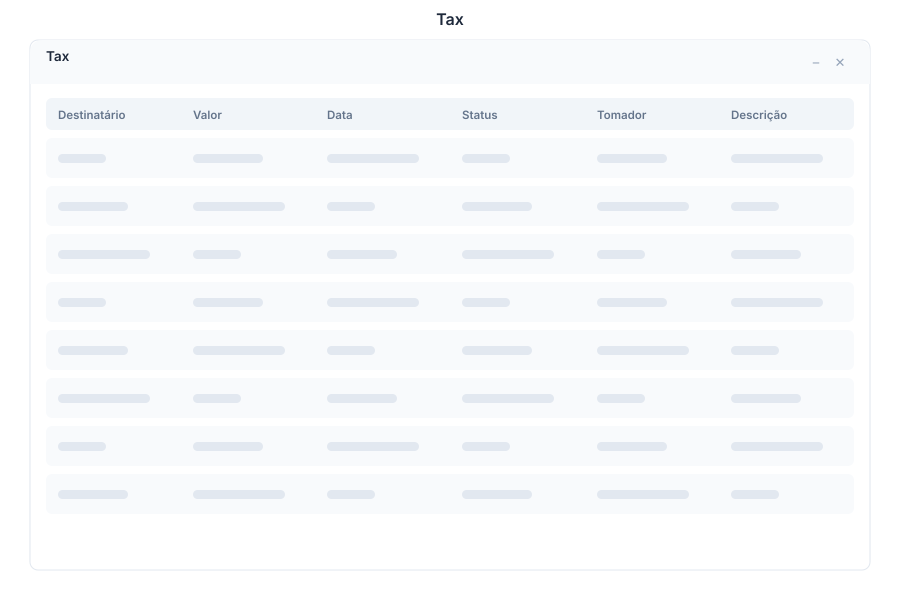

# Tax 🟡 BETA - Fiscal Management

> **Brazilian fiscal document management — NFe, NFSe, CT-e, and SPED**



---

## Overview

Tax provides comprehensive Brazilian fiscal document management, handling NFe (electronic invoices), NFSe (service invoices), CT-e (transport documents), and SPED fiscal reports. Automate emission, track status, and ensure compliance with SEFAZ regulations.

---

## Features

### NFe - Nota Fiscal Eletrônica

| Capability | Description |
|------------|-------------|
| Emission | Generate and transmit NFe to SEFAZ |
| Validation | Automatic field validation before emission |
| Correction | Issue carta de correção (correction letter) |
| Cancellation | Cancel NFe within legal deadlines |
| Status | Real-time SEFAZ processing status |

### NFSe - Nota Fiscal de Serviço

| Capability | Description |
|------------|-------------|
| Emission | Generate service invoices for municipalities |
| Templates | City-specific NFSe templates |
| RPS | RPS to NFSe conversion |
| Status | Track municipal processing status |

### CT-e - Conhecimento de Transporte

| Capability | Description |
|------------|-------------|
| Emission | Generate transport documents |
| Recipient | Add recipient and carrier details |
| Items | List transported goods |
| Status | Track CT-e authorization |

### SPED - Sistema Público de Escrituração Digital

| Capability | Description |
|------------|-------------|
| SPED Fiscal | Fiscal bookkeeping files |
| SPED Contribuições | PIS/COFINS contribution files |
| ECD | Contabilidade digital |
| ECF | Escrituração fiscal |
| Validation | Pre-submission validation checks |

### Status Tracking

| Capability | Description |
|------------|-------------|
| Dashboard | Overview of all pending documents |
| Timeline | Processing timeline per document |
| Alerts | Notifications for deadlines and errors |
| History | Complete emission history |

---

## Keyboard Shortcuts

| Shortcut | Action |
|----------|--------|
| `Ctrl + N` | New NFe |
| `Ctrl + S` | New NFSe |
| `Ctrl + T` | New CT-e |
| `Ctrl + R` | Generate SPED report |
| `Ctrl + V` | Validate document |
| `Ctrl + E` | Emit document |
| `Ctrl + C` | Cancel document |
| `F5` | Refresh status |
| `Esc` | Close current form |

---

## Tax via Chat

<div class="wa-chat">

**User:** Emitir NFe

**Bot:** Vou iniciar a emissão da NFe. Por favor, informe:

1. **Destinatário** — CNPJ/CPF do destinatário
2. **Produtos** — Itens da nota (código, descrição, quantidade, valor)
3. **Frete** — Tipo de frete (emitente, destinatário, terceiros, sem frete)

Ou posso extrair os dados de um pedido existente. Qual pedido deseja faturar?

---

**User:** Show pending NFSe

**Bot:** Here are your pending NFSe documents:

| NFSe | Client | Value | Status | Due Date |
|------|--------|-------|--------|----------|
| #1234 | Acme Ltda | $2,500.00 | Pending | 2024-01-20 |
| #1235 | Beta SA | $1,800.00 | Processing | 2024-01-22 |
| #1236 | Gamma ME | $3,200.00 | Emitted | 2024-01-18 |

Would you like to emit any pending documents or view details?

</div>

---

## Service Tax via Chat

Service-revenue taxation (IRPJ, CSLL, PIS/COFINS, ISS) is computed on demand
through the `service.tax` command with dynamic rates loaded per branch from
`billing_tax_rates`:

```json
{ "__api_call__": { "name": "service.tax", "params": { "service": "consultoria", "value": "12000.00" } } }
```

```json
{ "__api_call__": { "name": "payroll.diagnosis", "params": { "period": "2026-08" } } }
```

---

## API Reference

| Endpoint | Method | Description |
|----------|--------|-------------|
| `/api/tax/nfe` | GET | List NFe documents |
| `/api/tax/nfe` | POST | Create new NFe |
| `/api/tax/nfe/{id}` | GET | Get NFe by ID |
| `/api/tax/nfe/{id}/emit` | POST | Emit NFe to SEFAZ |
| `/api/tax/nfe/{id}/cancel` | POST | Cancel NFe |
| `/api/tax/nfe/{id}/correction` | POST | Issue correction letter |
| `/api/tax/nfe/{id}/status` | GET | Get SEFAZ processing status |
| `/api/tax/nfse` | GET | List NFSe documents |
| `/api/tax/nfse` | POST | Create new NFSe |
| `/api/tax/nfse/{id}/emit` | POST | Emit NFSe |
| `/api/tax/cte` | GET | List CT-e documents |
| `/api/tax/cte` | POST | Create new CT-e |
| `/api/tax/cte/{id}/emit` | POST | Emit CT-e |
| `/api/tax/sped/fiscal` | GET | Generate SPED Fiscal |
| `/api/tax/sped/contribuicoes` | GET | Generate SPED Contribuições |
| `/api/tax/sped/ecd` | GET | Generate ECD |
| `/api/tax/sped/ecf` | GET | Generate ECF |
| `/api/tax/status` | GET | Dashboard status overview |

---

## Related Pages

- [NFe](../nfe.md) — Electronic invoice details
- [NFSe](../nfse.md) — Service invoice details
- [CT-e](../cte.md) — Transport document details
- [SPED](../sped.md) — Fiscal report generation
