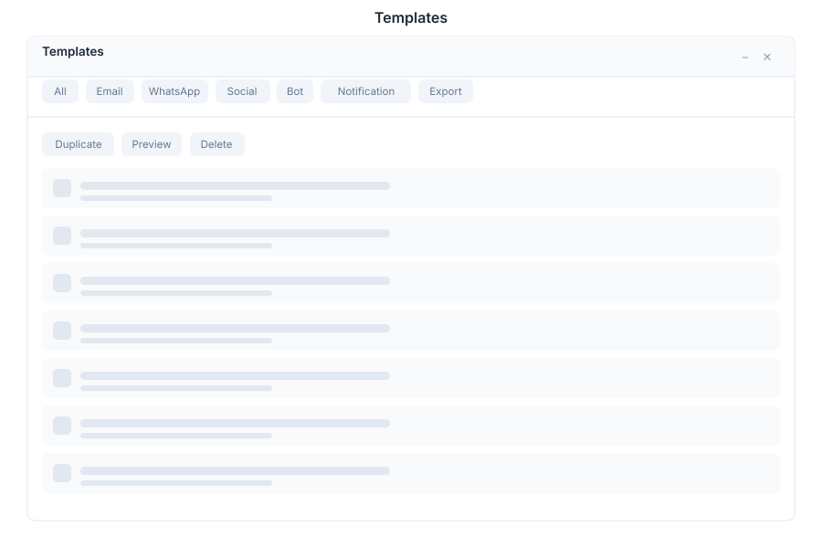

# Templates 🟡 BETA - Content

> **Reusable content templates**

---

## Overview

Templates is a content management system within General Bots Suite that enables creation and management of reusable message templates for email, WhatsApp, social media, and bot responses. Templates streamline communication workflows by providing consistent, branded content across all channels.

---

## Features

### Templates

| Action | Description |
|--------|-------------|
| **Create** | Build new templates from scratch or presets |
| **Edit** | Modify existing template content |
| **Clone** | Duplicate templates for variations |
| **Delete** | Remove unused templates |
| **Organize** | Categorize by type or purpose |

### Types

| Type | Description |
|------|-------------|
| **Email** | HTML email templates with responsive design |
| **WhatsApp** | WhatsApp Business API compliant templates |
| **Social** | Social media post templates |
| **Bot** | Bot conversation response templates |
| **SMS** | Short message service templates |

### Variables

| Feature | Description |
|---------|-------------|
| **Dynamic Fields** | Insert placeholder variables |
| **Conditionals** | Show/hide content based on conditions |
| **Loops** | Iterate over collections |
| **Default Values** | Fallback when variable is missing |
| **Validation** | Check variable syntax before sending |

### Import/Export

| Action | Description |
|--------|-------------|
| **Import JSON** | Load templates from JSON files |
| **Export JSON** | Save templates as JSON |
| **Import CSV** | Bulk create from spreadsheet |
| **Export CSV** | Export for spreadsheet editing |
| **API Sync** | Sync with external systems |

### Preview

| Feature | Description |
|---------|-------------|
| **Live Preview** | See rendered template in real-time |
| **Mobile Preview** | View on mobile device dimensions |
| **Send Test** | Send test to email/phone |
| **Version History** | View previous template versions |
| **Compare** | Diff between template versions |

---

## Keyboard Shortcuts

| Shortcut | Action |
|----------|--------|
| `G` then `T` | Go to Templates |
| `N` | Create new template |
| `E` | Edit selected template |
| `D` | Duplicate template |
| `/` | Focus search |
| `Ctrl+S` | Save template |
| `Ctrl+P` | Preview template |
| `Esc` | Close preview |

---

## Templates via Chat

### Creating a Template

  

    

      
Create an email template

      
11:00

    

  

  

    

      
📧 New Email Template

      
✅ Template created

      
📝 Name: Untitled Template

      
📌 Type: Email

      
🔧 Edit to add content and variables

      
11:00

    

  

### Viewing Templates

  

    

      
Show my templates

      
11:05

    

  

  

    

      
📋 Your Templates (8 total):

      
📧 Welcome Email - Last used 2 days ago

      
📱 WhatsApp Promo - Last used 1 week ago

      
💬 Support Response - Last used today

      
📱 Order Confirmation - Last used 3 days ago

      
... and 4 more

      
11:05

    

  

---

## API Reference

| Endpoint | Method | Description |
|----------|--------|-------------|
| `/api/templates` | GET | List all templates |
| `/api/templates` | POST | Create new template |
| `/api/templates/:id` | GET | Get template by ID |
| `/api/templates/:id` | PUT | Update template |
| `/api/templates/:id` | DELETE | Delete template |
| `/api/templates/:id/clone` | POST | Clone template |
| `/api/templates/:id/preview` | POST | Render template preview |
| `/api/templates/import` | POST | Import templates |
| `/api/templates/export` | GET | Export all templates |

---

## Related Pages

- [Mail](mail.md) — Email sending and management
- [Campaigns](campaigns.md) — Marketing campaign execution
- [CRM](crm.md) — Customer relationship management
- [Tasks](tasks.md) — Content creation workflows