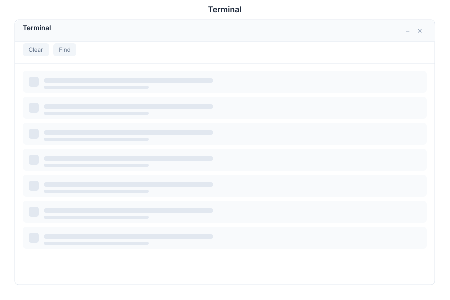

# Terminal - Console

> **Command-line terminal**

---

## Overview

Terminal is the command-line console module in General Bots Suite. Execute shell commands, run scripts, and manage system operations from a built-in terminal emulator. Terminal provides secure command execution with proper sandboxing and logging.

---

## Features

### Tabs

Multiple terminal sessions for parallel workflows.

| Action | Description |
|--------|-------------|
| **New Tab** | Create new terminal session |
| **Close Tab** | Close current terminal |
| **Switch Tabs** | Navigate between terminals |
| **Rename Tab** | Label terminals by purpose |
| **Split Panes** | View multiple terminals side-by-side |

### Commands

Execute shell commands with proper security.

| Feature | Description |
|---------|-------------|
| **Shell Access** | Bash, Zsh, or PowerShell support |
| **Command History** | Navigate through previous commands |
| **Auto-Complete** | Tab completion for commands and paths |
| **Aliases** | Custom command shortcuts |
| **Environment Variables** | Set and use environment variables |

### Copy/Paste

Efficient text handling in terminal sessions.

| Action | Description |
|--------|-------------|
| **Copy Selection** | Copy selected text to clipboard |
| **Paste Clipboard** | Paste text at cursor position |
| **Copy Output** | Copy command output directly |
| **Paste as Block** | Paste multi-line text as single command |

### Find

Search through terminal output and history.

| Feature | Description |
|---------|-------------|
| **Find in Output** | Search current terminal buffer |
| **Find in History** | Search command history |
| **Regex Support** | Use regular expressions |
| **Highlight Matches** | Visual highlighting of results |

### Scrollback

Navigate through terminal output history.

| Feature | Description |
|---------|-------------|
| **Scroll Buffer** | Configurable output history size |
| **Scroll to Top** | Jump to beginning of output |
| **Scroll to Bottom** | Jump to most recent output |
| **Page Up/Down** | Navigate by page |

---

## Keyboard Shortcuts

| Shortcut | Action |
|----------|--------|
| `Ctrl+Shift+F` | Find in terminal |
| `Ctrl+Shift+C` | Copy selection |
| `Ctrl+Shift+V` | Paste from clipboard |
| `Ctrl+Shift+T` | New terminal tab |
| `Ctrl+Shift+W` | Close terminal tab |
| `Ctrl+Shift+L` | Clear terminal |
| `Ctrl+Shift+N` | New split pane |
| `Ctrl+Shift+→` | Switch to next pane |
| `Ctrl+Shift+←` | Switch to previous pane |

---

## Terminal via Chat

### Running a Command

  

    

      
Run ls -la

      
09:00

    

  

  

    

      
🖥️ Executing: ls -la

      
total 56

      
drwxr-xr-x 8 user user 4096 Jan 15 09:00 .

      
drwxr-xr-x 3 user user 4096 Jan 15 08:00 ..

      
-rw-r--r-- 1 user user 220 Jan 15 08:00 .bash_logout

      
-rw-r--r-- 1 user user 3771 Jan 15 08:00 .bashrc

      
drwxr-xr-x 2 user user 4096 Jan 15 09:00 Documents

      
09:00

    

  

### Checking Disk Space

  

    

      
Check disk space

      
14:30

    

  

  

    

      
🖥️ Executing: df -h

      
Filesystem      Size  Used Avail Use% Mounted on

      
/dev/sda1       50G   32G   16G  67% /

      
tmpfs           16G  1.2G   15G   8% /dev/shm

      
/dev/sdb1      100G   45G   50G  48% /data

      
💾 Summary: 67% used on root, 48% used on data

      
14:30

    

  

---

## API Reference

Terminal operations are available via REST API:

| Endpoint | Method | Description |
|----------|--------|-------------|
| `/api/terminal/sessions` | GET | List active sessions |
| `/api/terminal/sessions` | POST | Create new session |
| `/api/terminal/sessions/:id` | DELETE | Close session |
| `/api/terminal/sessions/:id/exec` | POST | Execute command |
| `/api/terminal/sessions/:id/output` | GET | Get command output |
| `/api/terminal/sessions/:id/copy` | POST | Copy text |
| `/api/terminal/sessions/:id/paste` | POST | Paste text |
| `/api/terminal/sessions/:id/find` | GET | Search output |

---

## Related Pages

- [Drive App](./drive.md) — Manage files via terminal
- [Research App](./research.md) — Research with command-line tools
- [Chat App](./chat.md) — AI assistance for command generation
- [Admin App](./admin.md) — System administration
- [Suite Manual](../suite-manual.md) — Full Suite overview