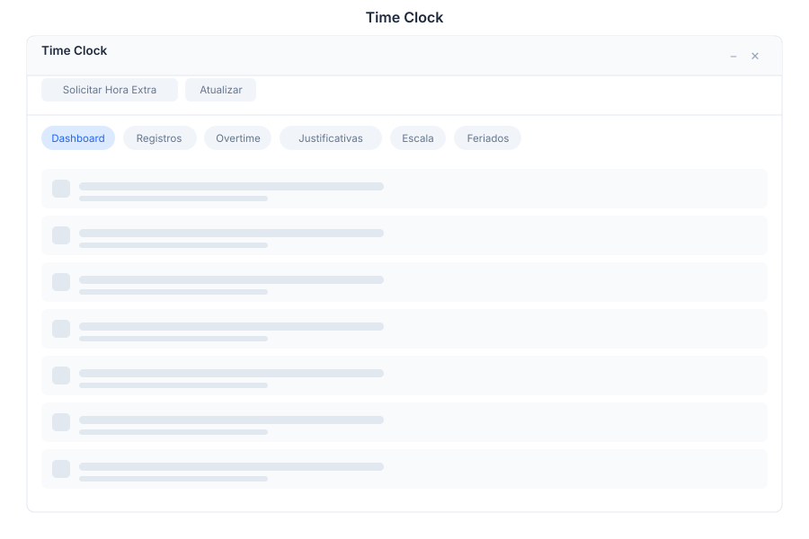

# Timeclock 🟡 BETA - Time Tracking

> **Employee time clock with GPS tracking, overtime management, and attendance reports**

---

## Overview

Timeclock provides accurate employee time tracking with GPS verification, overtime management, and comprehensive attendance reports. Employees can clock in/out, request overtime, and managers can approve entries and generate payroll-ready reports.

---

## Features

### Clock In/Out

| Capability | Description |
|------------|-------------|
| Clock In | Start work session with GPS verification |
| Clock Out | End work session |
| Break | Start/end break periods |
| GPS Tracking | Location verification on clock events |
| Geofence | Configurable work zone boundaries |

### Records

| Capability | Description |
|------------|-------------|
| History | Complete work session history |
| Edit | Manager corrections with notes |
| Filters | Filter by date, employee, or status |
| Export | CSV and Excel export |

### Overtime

| Capability | Description |
|------------|-------------|
| Request | Employee overtime requests |
| Approve | Manager approval workflow |
| Policies | Configurable overtime rules |
| Tracking | Cumulative overtime tracking |

### Reports

| Capability | Description |
|------------|-------------|
| Hours | Total hours worked per period |
| Attendance | Absence and presence tracking |
| Payroll | Payroll-ready summary reports |
| Analytics | Trend analysis and dashboards |

---

## Keyboard Shortcuts

| Shortcut | Action |
|----------|--------|
| `Ctrl + I` | Clock in |
| `Ctrl + O` | Clock out |
| `Ctrl + B` | Start/end break |
| `Ctrl + R` | View records |
| `Ctrl + H` | Request overtime |
| `Ctrl + P` | Generate payroll report |
| `Ctrl + F` | Filter records |
| `Esc` | Close current view |

---

## Timeclock via Chat

**User:** Clock in

**Bot:** Clocking you in now...

**Clock-in recorded:**
- **Time:** 09:00 AM
- **Location:** Office (verified)
- **Date:** January 16, 2024

You are now clocked in. Have a productive day!

*Tip: Don't forget to clock out or start a break when needed.*

---

**User:** Show my hours this week

**Bot:** Your hours for this week (Jan 15-19, 2024):

| Day | Clock In | Clock Out | Hours |
|-----|----------|-----------|-------|
| Mon | 09:00 | 18:00 | 8.0h |
| Tue | 08:45 | 17:30 | 7.75h |
| Wed | 09:00 | 19:00 | 9.0h |
| Thu | 09:15 | — | In progress |
| Fri | — | — | — |

**Total this week:** 24.75 hours
**Overtime:** 0.75 hours

Would you like to request overtime or generate a report?

---

## API Reference

| Endpoint | Method | Description |
|----------|--------|-------------|
| `/api/timeclock/clock/in` | POST | Clock in |
| `/api/timeclock/clock/out` | POST | Clock out |
| `/api/timeclock/clock/break` | POST | Toggle break status |
| `/api/timeclock/clock/status` | GET | Get current clock status |
| `/api/timeclock/records` | GET | List time records |
| `/api/timeclock/records/{id}` | GET | Get record by ID |
| `/api/timeclock/records/{id}` | PUT | Update record |
| `/api/timeclock/overtime` | GET | List overtime requests |
| `/api/timeclock/overtime` | POST | Submit overtime request |
| `/api/timeclock/overtime/{id}/approve` | POST | Approve overtime |
| `/api/timeclock/overtime/{id}/reject` | POST | Reject overtime |
| `/api/timeclock/reports/hours` | GET | Hours worked report |
| `/api/timeclock/reports/attendance` | GET | Attendance report |
| `/api/timeclock/reports/payroll` | GET | Payroll summary |
| `/api/timeclock/reports/export` | GET | Export report as CSV/Excel |

---

## Related Pages

- [Employees](../employees.md) — Employee management
- [Attendance](../attendance.md) — Attendance policies
- [Payroll](../payroll.md) — Payroll integration
- [Reports](../reports.md) — Reporting and analytics
