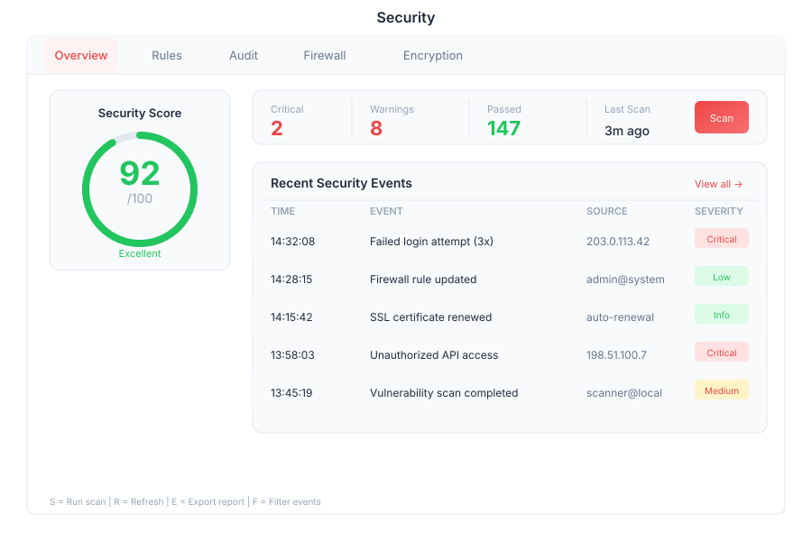

# Tools - Security

> **Security dashboard & compliance**

---

## Overview

Tools is a comprehensive security dashboard and compliance management system within General Bots Suite. Monitor security posture, manage firewall rules, track audit logs, handle encryption keys, and maintain compliance with industry standards. Tools provides centralized security operations for the entire platform.

---

## Features

### Security Score

| Metric | Description |
|--------|-------------|
| **Overall Score** | Security posture rating (0-100) |
| **Risk Level** | Current risk classification |
| **Trend** | Score changes over time |
| **Recommendations** | Improvement suggestions |
| **Benchmarks** | Comparison with industry standards |

### Rules

| Action | Description |
|--------|-------------|
| **Create** | Define new security rules |
| **Enable** | Activate/deactivate rules |
| **Edit** | Modify rule conditions |
| **Delete** | Remove obsolete rules |
| **Test** | Validate rules against test data |

### Audit Log

| Feature | Description |
|---------|-------------|
| **Search** | Full-text search across all events |
| **Filter** | By date, user, action, or severity |
| **Export** | Download as CSV or JSON |
| **Retention** | Configurable log retention policies |
| **Real-time** | Live event streaming |

### Firewall

| Feature | Description |
|---------|-------------|
| **Rules** | Create/edit firewall rules |
| **Ports** | Manage open/closed ports |
| **Whitelist** | Allow specific IPs |
| **Blacklist** | Block suspicious IPs |
| **Logging** | Track blocked connections |

### Encryption

| Feature | Description |
|---------|-------------|
| **Keys** | Generate and manage encryption keys |
| **Certificates** | SSL/TLS certificate management |
| **Rotation** | Automatic key rotation schedules |
| **Audit** | Track key usage and access |
| **Compliance** | FIPS 140-2 compliance checking |

---

## Keyboard Shortcuts

| Shortcut | Action |
|----------|--------|
| `G` then `S` | Go to Security Score |
| `G` then `R` | Go to Rules |
| `G` then `A` | Go to Audit Log |
| `G` then `F` | Go to Firewall |
| `G` then `E` | Go to Encryption |
| `N` | Create new rule |
| `/` | Focus search |
| `Esc` | Close modal |

---

## Tools via Chat

### Checking Security Status

  

    

      
Security status

      
14:00

    

  

  

    

      
🛡️ Security Dashboard

      
📊 Score: 87/100 (Good)

      
⚠️ 3 recommendations pending

      
🔒 All encryption keys active

      
🔥 Firewall: 12 rules active

      
📝 Last audit: 2 hours ago

      
14:00

    

  

### Viewing Audit Log

  

    

      
Show audit log

      
14:05

    

  

  

    

      
📋 Recent Audit Events (10):

      
14:00 - User login: admin@company.com

      
13:45 - Rule enabled: IP Blocklist

      
13:30 - Key rotated: api-encryption

      
13:15 - Firewall rule added: 192.168.1.0/24

      
13:00 - User created: dev@company.com

      
14:05

    

  

---

## API Reference

| Endpoint | Method | Description |
|----------|--------|-------------|
| `/api/security/score` | GET | Get security score |
| `/api/security/rules` | GET | List security rules |
| `/api/security/rules` | POST | Create security rule |
| `/api/security/rules/:id` | PUT | Update rule |
| `/api/security/audit` | GET | Query audit log |
| `/api/security/firewall/rules` | GET | List firewall rules |
| `/api/security/firewall/rules` | POST | Add firewall rule |
| `/api/security/encryption/keys` | GET | List encryption keys |
| `/api/security/encryption/keys` | POST | Generate new key |
| `/api/security/recommendations` | GET | Get improvement suggestions |

---

## Related Pages

- [Admin](admin.md) — System administration
- [Compliance](compliance.md) — ISO 27001 compliance
- [Compliance API](compliance-api.md) — Compliance REST API
- [RBAC Overview](../../09-security/rbac-overview.md) — Role-based access control