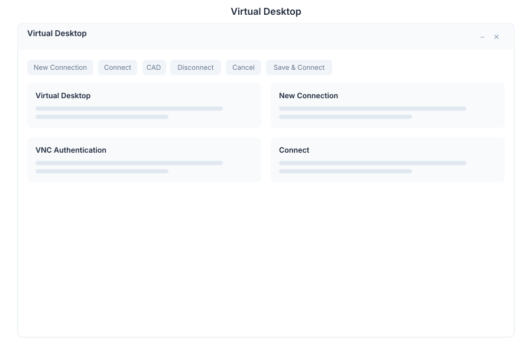

# Virtual Desktop (VDI) 🟡 PREVIEW

> **Preview application.** Usable today, not yet part of the supported surface.

VDI connects the suite to remote desktops. Instead of leaving the browser to reach a machine elsewhere, the remote session opens inside the suite as a window.

## What it does

| Capability | Detail |
|---|---|
| **Connections** | Define remote desktop connections by `host:port` |
| **VNC** | Connect to VNC servers, including password authentication |
| **RDP** | Remote Desktop Protocol connections |
| **Session window** | The remote session runs inside the suite's window manager |

## Why it is useful

Operational work often requires a machine that is not the one you are sitting at — a build host, a legacy system, a machine on another network. VDI keeps that session alongside the tasks and notes that describe why you opened it.

## Opening it

VDI is a **preview** application. Turn on the **Preview** switch in the left sidebar, then open **VDI** from the app menu.

## Security note

A remote desktop connection carries credentials and full control of the target machine. Restrict who can define connections, prefer key-based or directory-backed authentication over stored passwords, and confirm that the target is reachable only from networks you intend. Nothing here should be exposed to the public internet directly — reach it through your normal access path (VPN, tunnel or the [Browser](./browser.md) proxy).

## See Also

- [Browser](./browser.md) - Web sessions inside the suite
- [Terminal](./terminal.md) - Command line access
- [Security Policy](../../09-security/security-policy.md) - Access rules
- [Apps overview](./README.md) - Stability classification for the whole suite
