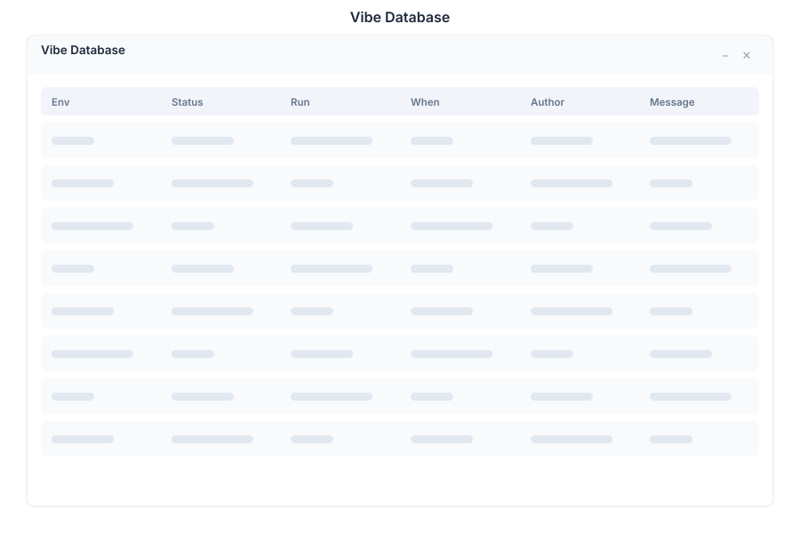

# Vibe Database 🟡 PREVIEW

> **Preview application.** Part of the [Vibe](./vibe.md) workspace, usable today, not yet part of the supported surface.

Vibe Database shows the schema of the selected project's database, so you can see the tables a project actually created rather than reading migration files.

## What it does

| Capability | Detail |
|---|---|
| **Schema inspection** | Tables and their columns for the selected project |
| **Project-scoped** | Each Vibe project has its own database; this app shows the selected one |
| **Read-oriented** | Built for understanding the shape of the data before changing code |

## When to open it

- Before writing a query in the project, so the column names are right
- After applying a migration that did not behave as expected
- When reviewing someone else's project and you need its data model quickly

For ad-hoc queries against the platform's own database rather than a Vibe project, use the [Database](./database.md) app.

## Opening it

Turn on the **Preview** switch in the left sidebar, then open **Vibe Database** from the app menu. Select the project first.

## See Also

- [Vibe](./vibe.md) - The project workspace
- [Database](./database.md) - SQL console for the platform database
- [Vibe Deploy](./vibe-deploy.md) - Publishing a project
- [Apps overview](./README.md) - Stability classification for the whole suite
