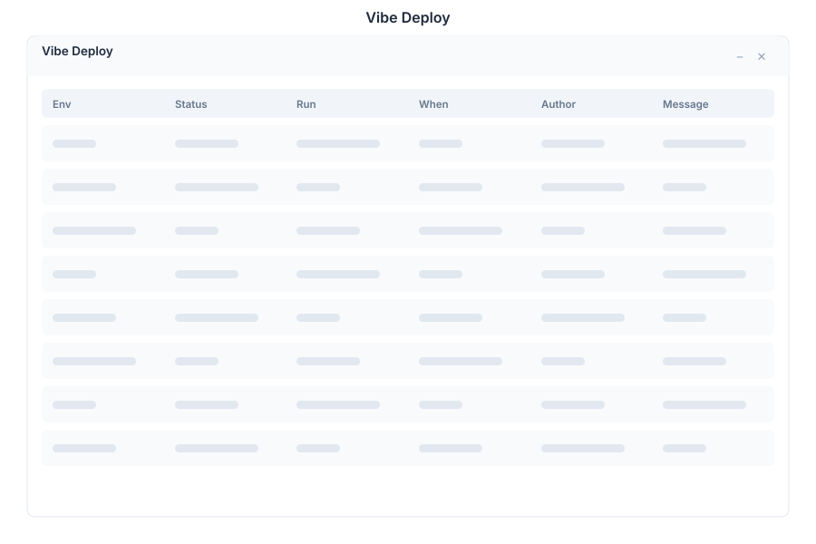

# Vibe Deploy 🟡 PREVIEW

> **Preview application.** Part of the [Vibe](./vibe.md) workspace, usable today, not yet part of the supported surface.

Vibe Deploy publishes the selected project to its target environment.

## What it does

| Capability | Detail |
|---|---|
| **Deploy the project** | Take the current project state and publish it to its target |
| **Environment awareness** | The action applies to the project's configured target rather than an arbitrary host |
| **Project-scoped** | Operates on the project you have selected, not on the whole workspace |

## Before deploying

| Check | Why |
|---|---|
| **Database** | Review the schema in [Vibe Database](./vibe-db.md) so the target can accept what the project expects |
| **Members** | Deploying publishes to a shared environment; confirm the project has an owner in [Project Members](./vibe-members.md) |
| **Cost** | A deploy can start or resize compute — check [Compute Metering](./vibe-metering.md) |
| **Secrets** | Credentials belong in Vault, not in project files |

## Opening it

Turn on the **Preview** switch in the left sidebar, then open **Vibe Deploy** from the app menu. Select the project first.

## A note on production

Deploying from here publishes real software. If your organisation requires a review gate, do the review before opening this app rather than relying on the target being safe by default.

## See Also

- [Vibe](./vibe.md) - The project workspace
- [Vibe Database](./vibe-db.md) - Schema of the selected project
- [CI/CD Integration](../../12-ecosystem-reference/ci-cd.md) - Automated delivery for the platform itself
- [Apps overview](./README.md) - Stability classification for the whole suite
