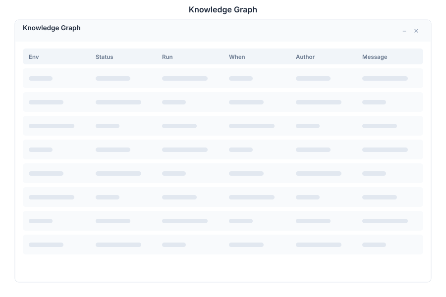

# Knowledge Graph (Vibe) 🟡 PREVIEW

> **Preview application.** Part of the [Vibe](./vibe.md) workspace, usable today, not yet part of the supported surface.

The Knowledge Graph shows how a Vibe project is actually wired: which use cases it answers, which runs executed them, and which tools each run reached for.

## What it does

| Capability | Detail |
|---|---|
| **Use cases** | The things the project is built to do |
| **Runs** | Individual executions, including when they happened and how they ended |
| **Tool usage** | The tools each run invoked, attached to the run that called them |
| **Panel view** | Opens as a window in the suite, with a side panel for detail on the selected node |

## Why it is worth opening

When a project behaves unexpectedly, this is usually the fastest way to find out why: you can see which run made which decision, rather than reasoning from the prompt alone. It is the audit trail of an agentic project.

## Opening it

Turn on the **Preview** switch in the left sidebar, then open **Knowledge Graph** from the app menu. It is scoped to the **currently selected Vibe project**, so select the project first.

You can also ask for it in conversation — the assistant can open the knowledge graph as a window.

## See Also

- [Vibe](./vibe.md) - The project workspace this belongs to
- [Vibe Metrics](./vibe-metrics.md) - Cost and budget telemetry
- [Apps overview](./README.md) - Stability classification for the whole suite
