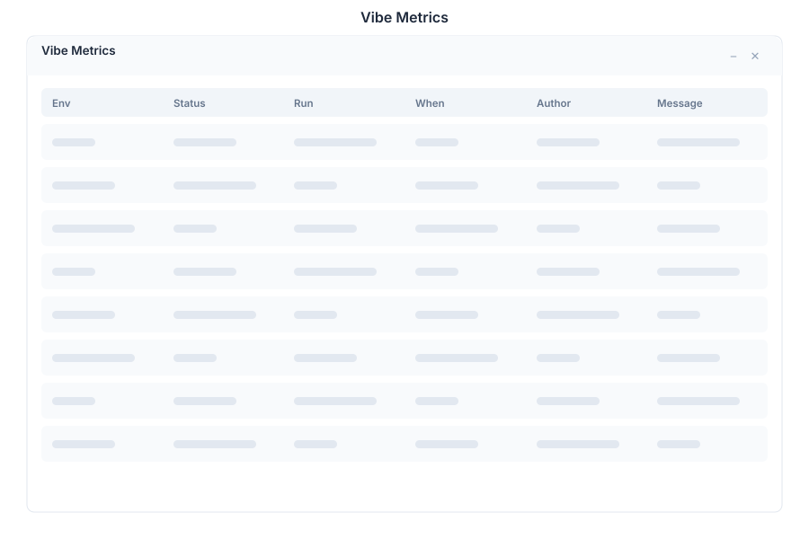

# Vibe Metrics 🟡 PREVIEW

> **Preview application.** Part of the [Vibe](./vibe.md) workspace, usable today, not yet part of the supported surface.

Vibe Metrics is the telemetry view of a project: what a run cost, how much budget is left, how many tool calls were made and how active the session was.

## What it does

| Capability | Detail |
|---|---|
| **Cost** | Spend attributed to runs in the selected project |
| **Budget** | Budget remaining, so a project does not quietly exhaust its allowance |
| **Tool calls** | How often tools are invoked — useful for spotting a loop or a runaway agent |
| **Session activity** | How much work is happening, over time |

## Why it matters

Agentic workloads are unbounded by nature: a loop that looks harmless in code can call a model hundreds of times. Watching cost and tool-call volume is the difference between a project that scales and one that surprises you with a bill. Pair this with [Compute Metering](./vibe-metering.md), which covers VM hours rather than model calls.

## Opening it

Turn on the **Preview** switch in the left sidebar, then open **Vibe Metrics** from the app menu. Metrics are scoped to the selected project.

## See Also

- [Vibe](./vibe.md) - The project workspace
- [Compute Metering](./vibe-metering.md) - VM-hour usage and limits
- [Knowledge Graph](./vibe-graph.md) - What the runs actually did
- [Apps overview](./README.md) - Stability classification for the whole suite
