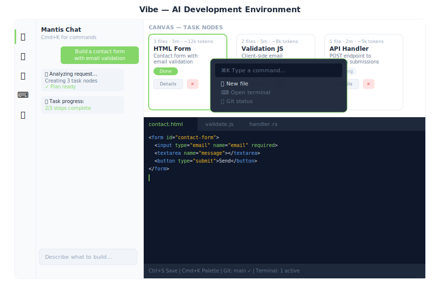

# Vibe — AI Development Environment

> **Chat-driven coding, deployment, and infrastructure management**

---

## Overview

Vibe is the integrated development environment inside General Bots Suite. Describe what you want to build in plain language and Mantis AI agents generate task nodes, write code, run commands, and deploy — all from a single interface.

---

## Features

### Chat-Driven Development
Type a request in the chat panel. Mantis #1 classifies the intent via `POST /api/autotask/classify`, generates a plan, and creates task nodes on the canvas.

### Canvas (Task Nodes)
Each task is represented as a node on the horizontal canvas showing:
- File count, estimated time, token usage
- Status (Planning → In Progress → Done)
- Sub-tasks (expandable file list)
- **Details** button — fetches full task info from `GET /api/autotask/tasks/:id`
- **Delete** button — removes node from canvas

Canvas state is **persisted in localStorage** (`vibe-canvas-nodes`) and restored on page load.

### Command Palette
Press `Cmd+K` (or `Ctrl+K`) to open the command palette:

| Command | Action |
|---------|--------|
| New file | Opens editor panel |
| Open terminal | Opens terminal panel |
| Git status | Opens git panel |
| Database schema | Opens database panel |
| Clear canvas | Removes all task nodes |
| Deploy | Triggers deployment |

Press `Escape` to close.

### Monaco Editor
Full code editor with:
- File tree sidebar → `GET /api/editor/files`
- Click to open files → `GET /api/editor/file/*path`
- `Ctrl+S` to save → `POST /api/editor/file/*path`
- Syntax highlighting for Rust, JS, HTML, CSS, TOML

### Terminal
Embedded xterm.js terminal connected via WebSocket → `/api/terminal/ws`.

Create, list, and kill terminal sessions via `POST /api/terminal/create`, `GET /api/terminal/list`, `POST /api/terminal/kill`.

### Database Tool
- ER diagram of all tables
- Table viewer with pagination → `GET /api/database/table/:name/data`
- SQL query builder → `POST /api/database/query`
- Row insert/update/delete → `POST /api/database/table/:name/row`

### Git Integration
- Status and diff viewer → `GET /api/git/status`, `GET /api/git/diff/:file`
- Commit → `POST /api/git/commit`
- Push → `POST /api/git/push`
- Branch management → `GET /api/git/branches`, `POST /api/git/branch/:name`
- Log → `GET /api/git/log`

### Deployment
Click **Deploy** to trigger `POST /api/bots/:id/deploy`. Real-time progress streams via the task progress WebSocket, shown in the chat panel.

---

## Enabling Vibe

Vibe is always available in the suite — no feature gate required. Access it from the desktop icon or via `http://localhost:3000/suite/vibe`.

---

## See Also

- [Tasks](./tasks.md) — AutoTask system that powers Vibe
- [Designer](./designer.md) — Visual bot designer
- [Drive](./drive.md) — File storage backing the editor
