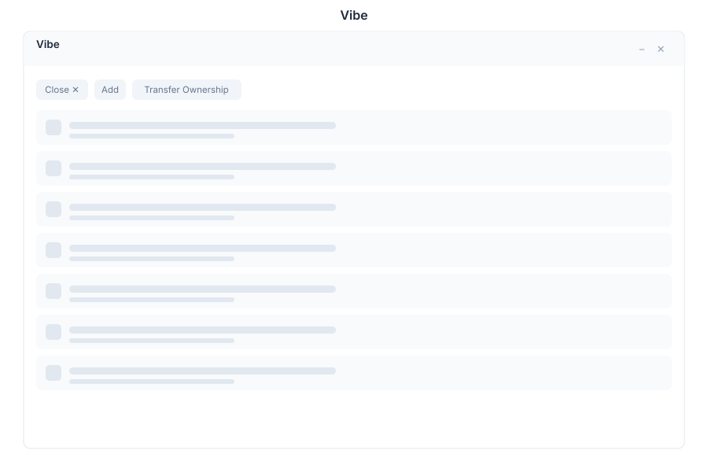

# Vibe — AI Development Environment 🟡 BETA

> **Chat-driven coding, deployment, and infrastructure management**



> [!NOTE]
> **Planned Features & Future Scope [SOON]**
> * **Hermes Agent Harness [SOON]**: An advanced cognitive loop system following formal harness engineering patterns for autonomous multi-step software construction.
> * **Advanced Vibe Knowledge Graphs [SOON]**: Formal deep semantic mapping of project use cases and code logic databases using advanced graph engines.

---

## Overview

Vibe is the integrated development environment inside General Bots Suite. Describe what you want to build in plain language and Mantis AI agents generate task nodes, write code, run commands, and deploy — all from a single interface.

---

## Features

### Chat-Driven Development
Type a request in the chat panel. Mantis #1 classifies the intent via `POST /api/autotask/classify`, generates a plan, and creates task nodes on the canvas.

### Canvas (Task Nodes)
Each task is represented as a node on the horizontal canvas showing:
- File count, estimated time, token usage
- Status (Planning → In Progress → Done)
- Sub-tasks (expandable file list)
- **Details** button — fetches full task info from `GET /api/autotask/tasks/:id`
- **Delete** button — removes node from canvas

Canvas state is **persisted in localStorage** (`vibe-canvas-nodes`) and restored on page load.

### Ribbon Toolbar
Commands are grouped by pipeline stage so each tab shows only the actions that
apply to that phase:

| Stage | Commands |
|-------|----------|
| **PLAN** | New Project · Designer · Knowledge Graph · Database |
| **BUILD** | Code Editor · Terminal · Browser · Source Control · Database |
| **REVIEW** | Approve & Resume · Deny & Cancel · Knowledge Graph · Review Changes |
| **DEPLOY** | Deploy · Push · Members |
| **MONITOR** | Metrics · Deployments · Logs |

Every command maps to a real handler (dialogs, run approve/deny, project create,
members typeahead, knowledge-graph panel, designer deep-link). `review` commands
only take effect while a run is actually waiting at an approval gate.

### Command Palette
Press `Cmd+K` (or `Ctrl+K`) to open the command palette:

| Command | Action |
|---------|--------|
| New file | Opens editor panel |
| Open terminal | Opens terminal panel |
| Git status | Opens git panel |
| Database schema | Opens database panel |
| Clear canvas | Removes all task nodes |
| Deploy | Triggers deployment |

Press `Escape` to close.

### Monaco Editor
Full code editor with:
- File tree sidebar → `GET /api/editor/files`
- Click to open files → `GET /api/editor/file/*path`
- `Ctrl+S` to save → `POST /api/editor/file/*path`
- Syntax highlighting for Rust, JS, HTML, CSS, TOML

### Terminal
Embedded xterm.js terminal connected via WebSocket → `/api/terminal/ws`.

Create, list, and kill terminal sessions via `POST /api/terminal/create`, `GET /api/terminal/list`, `POST /api/terminal/kill`.

### Database Tool
- ER diagram of all tables
- Table viewer with pagination → `GET /api/database/table/:name/data`
- SQL query builder → `POST /api/database/query`
- Row insert/update/delete → `POST /api/database/table/:name/row`

### Git Integration
- Status and diff viewer → `GET /api/git/status`, `GET /api/git/diff/:file`
- Commit → `POST /api/git/commit`
- Push → `POST /api/git/push`
- Branch management → `GET /api/git/branches`, `POST /api/git/branch/:name`
- Log → `GET /api/git/log`

### VM Hosting (incus)
Projects can be hosted on a real container: the `vm/instances` API creates an
incus container per project (tier → CPU/RAM: `small` 1cpu/1GiB, `medium` 2/2,
`large` 4/4) with `VIBE_PROJECT=1` set. Workspace files are copied in and the
app runs on port 80 — `GET /api/vm/instances` reports real incus state
(`running`/`stopped`) read from `incus list --format json`. The dev user must
be in the `incus-admin` group to talk to the incus socket.

### Deployment
Click **Deploy** to package the project workspace and push it to the
self-hosted Forgejo (ALM) instance. The publish path (`/api/deployment/deploy`)
now sends the actual workspace files (skipping `.git`, `node_modules`, `target`,
etc.) so `ForgejoClient::push_app` commits real source — not an empty app —
before the CI/CD workflow runs.

Forgejo runs locally like the other stack components: `localhost:4747`, with
credentials self-provisioned into Vault `secret/gbo/alm` (url/username/password/
API token/runner token) during botserver bootstrap. Consumers resolve
`FORGEJO_URL → ALM_URL → http://localhost:4747` (no hardcoded remote URL).
Real-time progress streams via the task progress WebSocket, shown in the chat panel.

---

## Vibe Agent Gateway (project registry + tool harness)

Vibe is backed by the `botvibe` crate, exposed through `botserver` under the `vibe` feature.

### Project Registry (DB-backed)

Projects live in the `vibe_projects` table (migration `6.5.49-vibe-projects`), replacing hardcoded workspace modeling. Scoped by `org_id`/`branch_id` like other SaaS tables (nil UUID = global default-bot scope):

| Method | Endpoint | Description |
|--------|----------|-------------|
| `POST` | `/api/vibe/projects` | Create project (name, kind: bot/website/custom, repo, framework, env) |
| `GET` | `/api/vibe/projects` | List projects (filter by `branch_id`, `project_type`, `status`; paginate) |
| `GET` | `/api/vibe/projects/:project_id` | Get one project |
| `PUT` | `/api/vibe/projects/:project_id` | Update name/type/repo/framework/env/status/payload |
| `DELETE` | `/api/vibe/projects/:project_id` | Delete a project |

Payload is a free-form JSONB pragma used by agents (deploy hints, hooks, manifest).

### Run API (agent runs)

| Method | Endpoint | Description |
|--------|----------|-------------|
| `POST` | `/api/vibe/run` | Create a run: `{"intent": "...", "use_case": "...", "auto_approve": bool}` |
| `GET` | `/api/vibe/run/:run_id` | Run state + executed tool calls |
| `POST` | `/api/vibe/run/:run_id/cancel` | Cancel a run |
| `POST` | `/api/vibe/run/:run_id/approve` | Approve pending tool calls |
| `GET` | `/api/vibe/runs` | List runs (filters: state, use_case, limit, offset) |
| `GET` | `/api/vibe/tools` · `/api/vibe/tools/:use_case` | Tool discovery |
| `GET` | `/api/vibe/events/:run_id` | Progress event stream (telemetry) |
| `GET` | `/api/vibe/metrics` / `/api/vibe/metrics/:run_id` | Run metrics |

### Real Tool Harness

The tool registry no longer returns stubs — the harness (`botvibe/src/harness/`) implements sandboxed tools operating on a per-project workspace under `VIBE_WORKSPACE_ROOT` (default `/opt/gbo/data/vibe-workspaces/{project}`).

LLM configuration resolves per-bot with the bot's **real branch** preferred
(fixing a bug where a stale `nil`-branch `bot_configuration` row shadowed the
active config and caused every run to fail with `401`). Streamed tool-call
arguments that arrive truncated (invalid JSON) are detected and the turn is
retried non-streaming, so `file/write` never silently emits an empty/corrupt
file. Runs remain queryable during execution (`state=running`) and project
creation is idempotent (re-`POST`ing the same name returns the existing project).

| Tool | Description | Approval |
|------|-------------|----------|
| `file/read` `file/write` `file/list` `file/delete` `file/exists` | Workspace-confined file operations (path traversal guarded) | write/delete require approval |
| `shell/run` | Run allowlisted commands (git, cat, ls, npm, cargo, python3, …) with arg validation, env wipe, timeout | requires approval |
| `git/status` `git/log` `git/diff` `git/commit` `git/init` | Local git operations in the project workspace | commit/init require approval |
| `logs/read` `logs/list` | Runtime log tailing | read-only |
| `test/run` `test/list` | Test suite execution + framework detection | run requires approval |

Any not-yet-wired plugin tool returns an honest error instead of fake success JSON.

### VIBE bridge keywords (chat)

The BASIC surface can drive the agent through the local Vibe API:

| Keyword | Purpose |
|---------|---------|
| `VIBE RUN "{intent}"` | Create an agent run (returns run_id + state) |
| `VIBE STATUS "{run_id}"` | Poll run state + executed tool count |
| `VIBE APPROVE "{run_id}"` | Approve pending tool calls |
| `VIBE CANCEL "{run_id}"` | Cancel a run |
| `VIBE TOOLS` | List available tools |
| `VIBE EVENTS "{run_id}"` | Stream latest progress events |

Example `start.bas`:

```basic
' start.bas — Vibe demo
ADD_SUGGESTION "VIBE RUN \"Criar website institucional\"" as "Criar website"
ADD_SELECTION "VIBE TOOLS" as "Ver ferramentas do Vibe"
SET CONTEXT "vibe" AS "You are the Pragmatismo assistant. Use VIBE RUN to create projects."
TALK "Olá! Posso criar projetos com o agente Vibe."
```

The Pragmatismo payload (`start.bas`, `PROMPT.md`, `config.csv`, MCP tool defs) is seeded automatically into the `pragmatismo.gbai` bucket when the `sampledata` feature is enabled (#750).

---

## Enabling Vibe

Vibe is always available in the suite — no feature gate required. Access it from the desktop icon or via `http://localhost:3000/suite/vibe`.

---

## See Also

- [Tasks](./tasks.md) — AutoTask system that powers Vibe
- [Designer](./designer.md) — Visual bot designer
- [Drive](./drive.md) — File storage backing the editor
