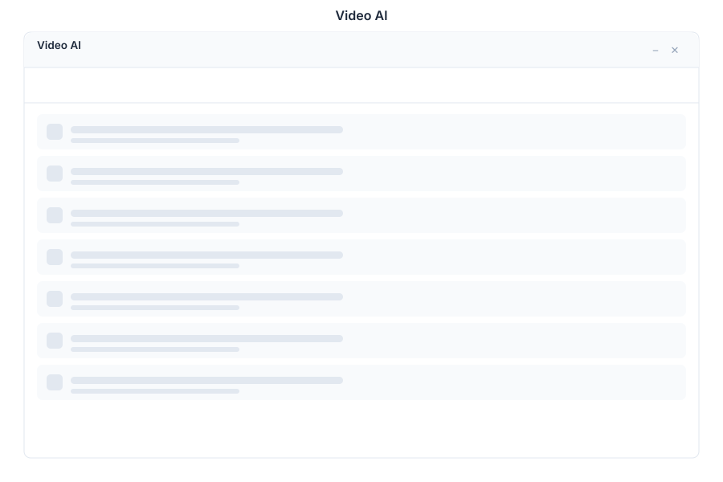

# Video 🟡 BETA - AI Monitoring

> **AI-powered camera monitoring**

---

## Overview

Video is an AI-powered camera monitoring system within General Bots Suite. Monitor live camera feeds, detect objects, people, and vehicles in real-time, receive intelligent alerts, and analyze video analytics. Video provides comprehensive surveillance capabilities without requiring specialized hardware.

---

## Features

### Cameras

| Action | Description |
|--------|-------------|
| **Add Camera** | Connect RTSP, ONVIF, or IP cameras |
| **View Feeds** | Real-time video streaming with low latency |
| **Configure** | Set resolution, frame rate, and recording quality |
| **Group** | Organize cameras by location or function |
| **Health Check** | Monitor camera status and connectivity |

### Detection

| Type | Description |
|------|-------------|
| **People** | Person detection with bounding boxes |
| **Vehicles** | Car, truck, motorcycle, bicycle recognition |
| **Objects** | Custom object detection training |
| **Faces** | Face detection and recognition |
| **Motion** | Motion detection with sensitivity settings |

### Alerts

| Feature | Description |
|---------|-------------|
| **Notifications** | Email, SMS, push, and webhook alerts |
| **Rules** | Create custom detection rules |
| **Schedules** | Set alert active hours |
| **Cooldowns** | Prevent alert flooding |
| **Escalation** | Multi-level alert escalation |

### Analytics

| Metric | Description |
|--------|-------------|
| **Counts** | People/vehicle counts per time period |
| **Trends** | Historical analysis and patterns |
| **Heatmaps** | Activity visualization |
| **Dwell Time** | Time spent in specific areas |
| **Occupancy** | Real-time occupancy tracking |

### Recording

| Feature | Description |
|---------|-------------|
| **Continuous** | 24/7 recording to storage |
| **Event-Based** | Record on detection events |
| **Playback** | Timeline-based video review |
| **Export** | Download clips as MP4 |
| **Retention** | Configurable storage policies |

---

## Keyboard Shortcuts

| Shortcut | Action |
|----------|--------|
| `G` then `C` | Go to Cameras |
| `G` then `D` | Go to Detections |
| `G` then `A` | Go to Alerts |
| `Space` | Play/Pause feed |
| `F` | Toggle fullscreen |
| `N` | Next camera |
| `P` | Previous camera |
| `R` | Start recording |
| `/` | Focus search |

---

## Video via Chat

### Viewing Camera Feeds

  

    

      
Show camera feeds

      
10:00

    

  

  

    

      
📹 Camera Feeds Status:

      
✅ Front Door - Online (1080p)

      
✅ Parking Lot - Online (720p)

      
✅ Lobby - Online (1080p)

      
⚠️ Warehouse - Offline

      
📊 3/4 cameras active

      
10:00

    

  

### Checking Alerts

  

    

      
Any alerts today?

      
10:05

    

  

  

    

      
🔔 Today's Alerts (5 total):

      
08:15 - Person detected at Front Door

      
09:30 - Vehicle in restricted area

      
09:45 - Motion detected after hours

      
10:00 - Unrecognized face at Lobby

      
10:02 - Crowd detected in Parking Lot

      
10:05

    

  

---

## API Reference

| Endpoint | Method | Description |
|----------|--------|-------------|
| `/api/video/cameras` | GET | List all cameras |
| `/api/video/cameras` | POST | Add new camera |
| `/api/video/cameras/:id/stream` | GET | Get live stream URL |
| `/api/video/detections` | GET | Query detection events |
| `/api/video/alerts` | GET | List alerts |
| `/api/video/alerts/:id` | PUT | Update alert status |
| `/api/video/analytics/counts` | GET | Get people/vehicle counts |
| `/api/video/analytics/heatmap` | GET | Generate heatmap data |
| `/api/video/recordings` | GET | List recordings |
| `/api/video/recordings/:id/download` | GET | Download recording |

---

## Related Pages

- [Dashboards](dashboards.md) — Real-time monitoring dashboards
- [Analytics](analytics.md) — Advanced analytics and reporting
- [Tasks](tasks.md) — Surveillance task management
- [Meet](meet.md) — Live video conferencing