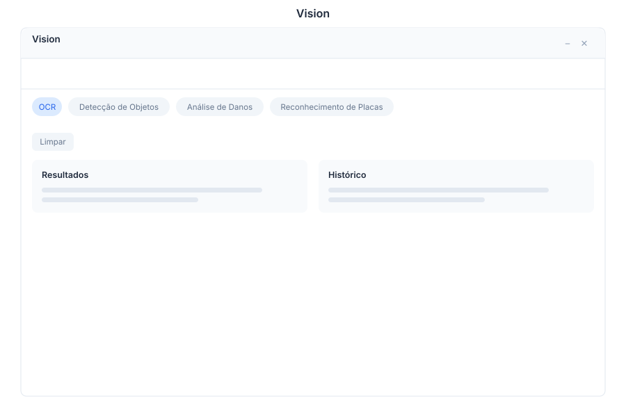

# Vision 🟡 BETA - Image Recognition

> **AI-powered image analysis — OCR, object detection, damage assessment, and license plates**



---

## Overview

Vision leverages AI models to analyze images for text extraction, object identification, damage assessment, and license plate recognition. Upload images and receive instant, structured analysis results with full history tracking.

---

## Features

### OCR - Text Extraction

| Capability | Description |
|------------|-------------|
| Document Scan | Extract text from scanned documents |
| Handwriting | Recognize handwritten text |
| Multi-language | Support for multiple languages |
| Structured Output | Formatted extraction results |

### Object Detection

| Capability | Description |
|------------|-------------|
| Identify Objects | Detect and label objects in images |
| Count | Count instances of each object |
| Location | Bounding box coordinates |
| Confidence | Detection confidence scores |

### Damage Analysis

| Capability | Description |
|------------|-------------|
| Assessment | AI-powered damage evaluation |
| Severity | Classify damage severity levels |
| Estimate | Cost estimation for repairs |
| Report | Generate damage assessment reports |

### License Plates

| Capability | Description |
|------------|-------------|
| Recognition | Read license plate numbers |
| Database | Cross-reference with vehicle databases |
| Country | Multi-country plate format support |
| History | Track recognized plates over time |

### History

| Capability | Description |
|------------|-------------|
| Browse | View all past analyses |
| Search | Search by analysis type or result |
| Export | Export analysis results |
| Share | Share results with team |

---

## Keyboard Shortcuts

| Shortcut | Action |
|----------|--------|
| `Ctrl + V` | Open image analysis |
| `Ctrl + O` | OCR text extraction |
| `Ctrl + D` | Object detection |
| `Ctrl + A` | Damage analysis |
| `Ctrl + L` | License plate recognition |
| `Ctrl + H` | View analysis history |
| `Ctrl + U` | Upload new image |
| `Esc` | Close current analysis |

---

## Vision via Chat

<div class="wa-chat">

**User:** Analyze this image

**Bot:** I've analyzed the uploaded image. Here are the results:

**Analysis Type:** Object Detection
**Objects Found:**
- **Car** — Confidence: 98.5%
- **Person** — Confidence: 96.2%
- **Traffic Light** — Confidence: 94.8%
- **Building** — Confidence: 92.1%

**Scene:** Urban street intersection
**Lighting:** Daytime, clear conditions

Would you like me to perform a specific analysis (OCR, damage, license plate)?

---

**User:** Extract text from image

**Bot:** Performing OCR text extraction...

**Extracted Text:**
```
ACME CORPORATION
Invoice #INV-2024-001
Date: January 16, 2024
Total: $1,250.00
Status: PAID
```

**Confidence:** 97.3%
**Languages Detected:** English

Would you like me to:
- Create an invoice record from this data?
- Search for this invoice in your system?
- Export the extracted text?

</div>

---

## API Reference

| Endpoint | Method | Description |
|----------|--------|-------------|
| `/api/vision/analyze` | POST | Upload and analyze image |
| `/api/vision/ocr` | POST | OCR text extraction |
| `/api/vision/objects` | POST | Object detection |
| `/api/vision/damage` | POST | Damage analysis |
| `/api/vision/license-plate` | POST | License plate recognition |
| `/api/vision/history` | GET | List analysis history |
| `/api/vision/history/{id}` | GET | Get analysis by ID |
| `/api/vision/history/{id}/export` | GET | Export analysis results |
| `/api/vision/history/{id}/share` | POST | Share analysis results |
| `/api/vision/models` | GET | List available AI models |
| `/api/vision/models/{id}` | GET | Get model details and capabilities |

---

## Related Pages

- [Documents](../documents.md) — Document management with OCR
- [Vehicles](../vehicles.md) — Vehicle database integration
- [Reports](../reports.md) — Analysis reports and exports
- [AI Models](../ai-models.md) — Available AI model details
