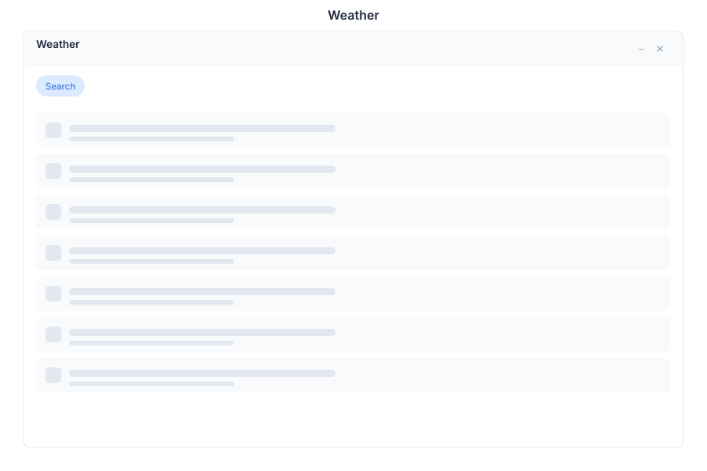

# Weather 🟡 PREVIEW

> **Preview application.** Usable today, not yet part of the supported surface.

Weather shows current conditions for a city you search for, or for your own location.

## What it does

| Capability | Detail |
|---|---|
| **Search by city** | Type a city name to see its conditions |
| **Current conditions** | Temperature and conditions for the selected place |
| **My location** | Use the browser's location instead of typing a city |

## Why it is in a business suite

Weather is context, not decoration. Schedule changes, site visits, travel and delivery planning all depend on it, and having it inside the same desktop as the calendar and the tasks avoids switching to another device for a one-line answer.

An assistant can also answer weather questions directly in [Chat](./chat.md) without opening this app.

## Opening it

Weather is a **preview** application. Turn on the **Preview** switch in the left sidebar, then open **Weather** from the app menu.

## Limits

- "My location" depends on the browser granting location permission.
- Conditions come from an external provider, so it requires outbound network access.

## See Also

- [Channels](../../06-channels/channels.md) - Asking the bot for an answer instead
- [Calendar](./calendar.md) - Planning around the forecast
- [Apps overview](./README.md) - Stability classification for the whole suite
