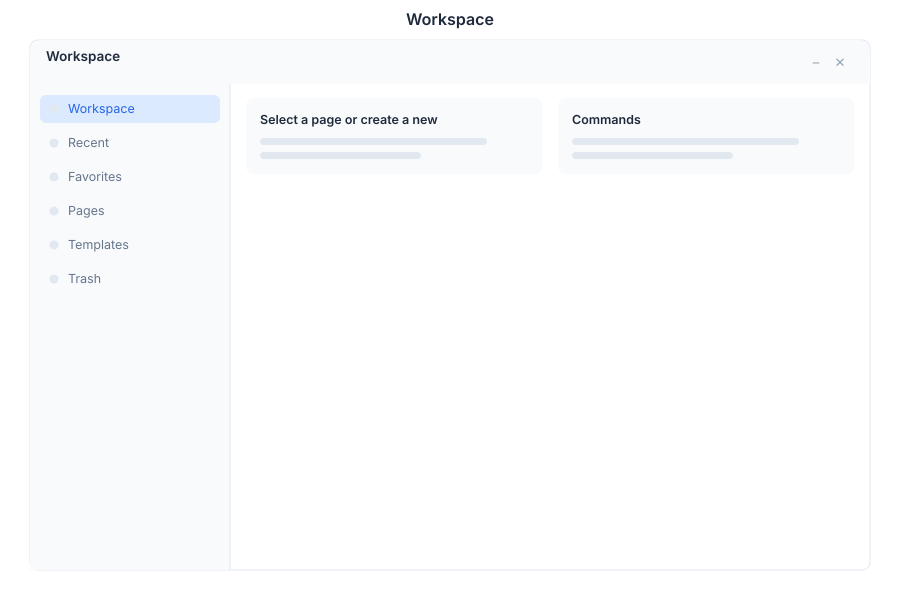

# Workspace - Pages & Blocks

> **Notion-style page editor**

---

## Overview

Workspace is the Notion-style page editor and knowledge base module in General Bots Suite. Create, organize, and collaborate on documents using flexible block-based editing. Workspace provides a powerful yet intuitive platform for team knowledge management and documentation.

---

## Features

### Pages

Create and organize pages in a hierarchical structure.

| Action | Description |
|--------|-------------|
| **Create Page** | Start new document with title |
| **Nest Pages** | Create sub-pages for organization |
| **Favorite Pages** | Pin important pages for quick access |
| **Move Pages** | Reorganize page hierarchy |
| **Archive Pages** | Move unused pages to archive |

### Blocks

Flexible content blocks for rich document creation.

| Block Type | Description |
|------------|-------------|
| **Text** | Paragraph text with formatting |
| **Headings** | H1, H2, H3 headings for structure |
| **Lists** | Bullet, numbered, and checkbox lists |
| **Toggles** | Expandable/collapsible content sections |
| **Code** | Code blocks with syntax highlighting |
| **Callouts** | Highlighted information boxes |
| **Quotes** | Blockquotes for references |
| **Dividers** | Horizontal lines for separation |
| **Images** | Embedded images with captions |
| **Files** | Attached documents and media |

### Search

Full-text search across all workspace content.

| Feature | Description |
|---------|-------------|
| **Quick Search** | Instant search as you type |
| **Advanced Filters** | Search by type, author, date |
| **Highlight Results** | Visual highlighting in search results |
| **Recent Pages** | Quick access to recently edited |

### Templates

Pre-built page templates for common use cases.

| Template | Description |
|----------|-------------|
| **Meeting Notes** | Structured meeting documentation |
| **Project Brief** | Project planning and overview |
| **Weekly Report** | Status update template |
| **Brainstorm** | Idea capture and organization |
| **Documentation** | Technical documentation format |

### Collaboration

Real-time collaboration features for teams.

| Feature | Description |
|---------|-------------|
| **Comments** | Add comments to any block |
| **Mentions** | Tag colleagues with @mentions |
| **Version History** | View and restore previous versions |
| **Page Sharing** | Share pages with specific people |
| **Public Pages** | Publish pages to the web |

---

## Keyboard Shortcuts

| Shortcut | Action |
|----------|--------|
| `N` | Create new page |
| `E` | Edit page |
| `F` | Favorite/unfavorite page |
| `S` | Focus search |
| `Ctrl+Shift+F` | Full-screen edit mode |
| `/` | Open block menu |
| `?` | Show shortcuts |

---

## Workspace via Chat

### Creating a New Page

  

    

      
Create a new page: Product Roadmap Q3

      
09:00

    

  

  

    

      
✅ Page created:

      
📄 Product Roadmap Q3

      
📁 Location: Workspace root

      
✏️ Ready for editing

      
Would you like to add content or use a template?

      
09:00

    

  

### Searching for Content

  

    

      
Search for roadmap

      
14:30

    

  

  

    

      
🔍 Search results for "roadmap" (3 found):

      
📄 Product Roadmap Q3 - Edited 2 hours ago

      
📄 Engineering Roadmap 2024 - Edited yesterday

      
📄 Marketing Roadmap - Edited 3 days ago

      
14:30

    

  

---

## API Reference

Workspace operations are available via REST API:

| Endpoint | Method | Description |
|----------|--------|-------------|
| `/api/workspace/pages` | GET | List all pages |
| `/api/workspace/pages` | POST | Create new page |
| `/api/workspace/pages/:id` | GET | Get page content |
| `/api/workspace/pages/:id` | PUT | Update page |
| `/api/workspace/pages/:id` | DELETE | Delete page |
| `/api/workspace/pages/:id/blocks` | GET | Get page blocks |
| `/api/workspace/pages/:id/blocks` | POST | Add block to page |
| `/api/workspace/pages/:id/favorite` | POST | Toggle favorite |
| `/api/workspace/pages/:id/comments` | GET | Get page comments |
| `/api/workspace/search` | GET | Search workspace |
| `/api/workspace/templates` | GET | List templates |

---

## Related Pages

- [Drive App](./drive.md) — Store and manage files
- [Paper App](./paper.md) — Word processing documents
- [Tasks App](./tasks.md) — Task management
- [Chat App](./chat.md) — AI assistance for content creation
- [Suite Manual](../suite-manual.md) — Full Suite overview