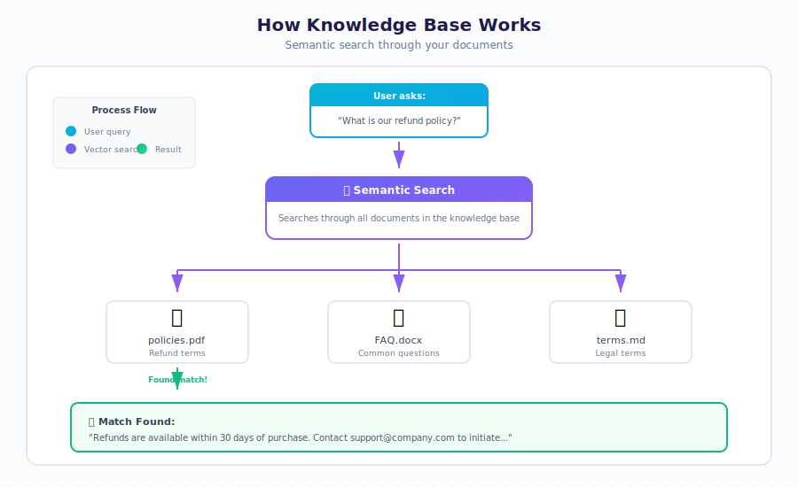

# How To: Add Documents to Knowledge Base

> **Tutorial 3 of the Knowledge Base Series**
>
> *Teach your bot from files in 15 minutes*

---


---

## Objective

By the end of this tutorial, you will have:
- Prepared documents for the knowledge base
- Uploaded files to your bot's `.gbkb` folder
- Indexed documents for semantic search
- Tested that your bot can answer questions from the documents

---

## Time Required

⏱️ **15 minutes**

---

## Prerequisites

Before you begin, make sure you have:

- [ ] A working bot (see [Create Your First Bot](./create-first-bot.md))
- [ ] Access to the Drive app
- [ ] Documents to upload (PDF, Word, Text, or Markdown files)

---

## What is a Knowledge Base?

A **Knowledge Base (KB)** is a collection of documents that your bot uses to answer questions. When a user asks something, the bot searches through these documents to find relevant information.



---

## Supported File Formats

| Format | Extension | Best For |
|--------|-----------|----------|
| **PDF** | `.pdf` | Manuals, reports, official documents |
| **Word** | `.docx`, `.doc` | Policies, procedures, articles |
| **Text** | `.txt` | Simple content, FAQs |
| **Markdown** | `.md` | Technical documentation |
| **Excel** | `.xlsx`, `.xls` | FAQs, structured data |
| **PowerPoint** | `.pptx` | Training materials |
| **HTML** | `.html` | Web content |

---

## Step 1: Prepare Your Documents

### 1.1 Gather Your Files

Collect the documents you want your bot to learn from. Good candidates include:

- ✅ Product manuals
- ✅ FAQ documents
- ✅ Company policies
- ✅ Help articles
- ✅ Training materials

### 1.2 Review Document Quality

Before uploading, check that your documents:

| Check | Why It Matters |
|-------|----------------|
| Text is selectable | Scanned images can't be indexed |
| Content is accurate | Bot will repeat incorrect info |
| Information is current | Outdated docs confuse users |
| No sensitive data | Protect confidential information |

⚠️ **Warning**: The bot will use exactly what's in your documents. Remove any outdated or incorrect information first.

### 1.3 Organize Files (Optional)

For large knowledge bases, organize files into folders by topic:

```
mycompany.gbkb/
├── 📁 products/
│   ├── product-guide.pdf
│   └── specifications.docx
├── 📁 policies/
│   ├── refund-policy.pdf
│   └── privacy-policy.md
├── 📁 support/
│   ├── faq.docx
│   └── troubleshooting.pdf
└── 📁 training/
    └── onboarding-guide.pptx
```

✅ **Checkpoint**: You have documents ready to upload.

---

## Step 2: Upload Files to Knowledge Base

### 2.1 Open the Drive App

Click the **Apps Menu** (⋮⋮⋮) and select **Drive**.

### 2.2 Navigate to Your Bot's KB Folder

Navigate to your bot's knowledge base folder:

```
📂 mycompany.gbai
   └── 📂 mycompany.gbkb    ◄── Open this folder
```

```
┌─────────────────────────────────────────────────────────────────────────┐
│  📁 Drive                                                               │
├─────────────────────────────────────────────────────────────────────────┤
│  📂 mycompany.gbai                                                      │
│     ├── 📂 mycompany.gbdialog                                          │
│     ├── 📂 mycompany.gbot                                               │
│     ├── 📂 mycompany.gbkb     ◄── Knowledge base folder                │
│     │      └── (your documents go here)                                │
│     └── 📂 mycompany.gbdrive                                            │
│                                                                         │
└─────────────────────────────────────────────────────────────────────────┘
```

### 2.3 Upload Your Documents

**Method A: Drag and Drop**
1. Open your file explorer
2. Select the documents you want to upload
3. Drag them into the Drive window

**Method B: Upload Button**
1. Click the **Upload** button (📤)
2. Select files from your computer
3. Click **Open**

```
┌─────────────────────────────────────────────────────────────────────────┐
│  📁 Drive > mycompany.gbai > mycompany.gbkb                            │
├─────────────────────────────────────────────────────────────────────────┤
│  ┌─────────────────┐  ┌─────────────────┐                              │
│  │ 📤 Upload       │  │ 📁 New Folder   │                              │
│  └─────────────────┘  └─────────────────┘                              │
├─────────────────────────────────────────────────────────────────────────┤
│                                                                         │
│  📄 company-faq.pdf                              2.3 MB   Just now     │
│  📄 product-manual.docx                          1.1 MB   Just now     │
│  📄 refund-policy.pdf                            0.5 MB   Just now     │
│                                                                         │
│  ━━━━━━━━━━━━━━━━━━━━━━━━━━━━━━━━━━━━━━━━━━━━━━━━━━━━━━━━━━━━━━━━━━━━ │
│  ↑ Drag files here to upload                                           │
│                                                                         │
└─────────────────────────────────────────────────────────────────────────┘
```

### 2.4 Wait for Upload to Complete

You'll see a progress indicator for each file. Wait until all uploads finish.

💡 **Tip**: Large files may take longer. PDF files typically upload fastest.

✅ **Checkpoint**: Your documents appear in the `.gbkb` folder.

---

## Step 3: Index the Knowledge Base

After uploading, you need to index the documents so the bot can search them.

### 3.1 Automatic Indexing

In most cases, indexing happens automatically when files are uploaded. Look for:
- A "Processing..." indicator
- Files changing from gray to normal color
- A completion notification

### 3.2 Manual Indexing (If Needed)

If automatic indexing doesn't start, trigger it manually:

**From Chat:**
```
/reindex
```

**From a BASIC Dialog:**
```basic
' Clear and rebuild the knowledge base
CLEAR KB
USE KB "mycompany"
```

### 3.3 Check Indexing Status

You can check how many documents are indexed:

**From Chat:**
```
/kb stats
```

**Expected Output:**
```
┌─────────────────────────────────────────────────────────────────────────┐
│  📊 Knowledge Base Statistics                                          │
├─────────────────────────────────────────────────────────────────────────┤
│                                                                         │
│  Collection: mycompany                                                  │
│  Documents:  3                                                          │
│  Vectors:    847                                                        │
│  Status:     ● Ready                                                    │
│  Last Index: 2 minutes ago                                              │
│                                                                         │
└─────────────────────────────────────────────────────────────────────────┘
```

✅ **Checkpoint**: Documents are indexed and ready to search.

---

## Step 4: Test the Knowledge Base

### 4.1 Open Chat

Click the **Apps Menu** (⋮⋮⋮) and select **Chat**.

### 4.2 Ask a Question from Your Documents

Type a question that can be answered by your uploaded documents:

```
You: What is the refund policy?
```

### 4.3 Verify the Response

The bot should answer using information from your documents:

```
┌─────────────────────────────────────────────────────────────────────────┐
│  💬 Chat                                                                │
├─────────────────────────────────────────────────────────────────────────┤
│                                                                         │
│      ┌─────────────────────────────────────────────────────────────┐   │
│      │  👤 You                                                     │   │
│      │  What is the refund policy?                                 │   │
│      └─────────────────────────────────────────────────────────────┘   │
│                                                                         │
│      ┌─────────────────────────────────────────────────────────────┐   │
│      │  🤖 Bot                                                     │   │
│      │                                                             │   │
│      │  Based on our refund policy document:                       │   │
│      │                                                             │   │
│      │  Customers may request a full refund within 30 days of      │   │
│      │  purchase. After 30 days, refunds are prorated based on     │   │
│      │  usage. To request a refund, contact support@company.com    │   │
│      │  with your order number.                                    │   │
│      │                                                             │   │
│      │  📄 Source: refund-policy.pdf                               │   │
│      └─────────────────────────────────────────────────────────────┘   │
│                                                                         │
└─────────────────────────────────────────────────────────────────────────┘
```

### 4.4 Test Different Questions

Try several questions to ensure the knowledge base is working:

| Test Question | Expected Source |
|---------------|-----------------|
| "How do I return a product?" | refund-policy.pdf |
| "What are the product specs?" | product-manual.docx |
| "How do I contact support?" | company-faq.pdf |

✅ **Checkpoint**: Your bot answers questions using the uploaded documents!

---

## 🎉 Congratulations!

You've successfully added documents to your knowledge base! Here's what you accomplished:

```
┌─────────────────────────────────────────────────────────────────────────┐
│                                                                         │
│    ✓ Prepared documents for upload                                      │
│    ✓ Uploaded files to the .gbkb folder                                │
│    ✓ Indexed documents for semantic search                              │
│    ✓ Tested that the bot can answer from documents                      │
│                                                                         │
│    Your bot can now answer questions from your documents!               │
│                                                                         │
└─────────────────────────────────────────────────────────────────────────┘
```

---

## Troubleshooting

### Problem: Bot doesn't find information from documents

**Cause**: Documents may not be indexed yet.

**Solution**:
1. Check indexing status with `/kb stats`
2. Wait a few minutes for processing to complete
3. Try `/reindex` to force re-indexing

### Problem: Bot gives wrong information

**Cause**: Document contains outdated or incorrect content.

**Solution**:
1. Review the source document
2. Update or replace the incorrect document
3. Re-index the knowledge base

### Problem: "No relevant information found"

**Cause**: Question doesn't match document content well enough.

**Solution**:
1. Try rephrasing the question
2. Use keywords that appear in your documents
3. Check that the document actually contains the answer

### Problem: Upload fails

**Cause**: File too large or unsupported format.

**Solution**:
1. Check file size (max 50MB per file)
2. Verify file format is supported
3. Try converting to PDF if format issues persist

### Problem: PDF text not extracted

**Cause**: PDF contains scanned images, not selectable text.

**Solution**:
1. Use OCR software to convert image-based PDFs
2. Or recreate the document as a text-based PDF
3. Consider using Word format instead

---

## Best Practices

### Document Organization

```
┌─────────────────────────────────────────────────────────────────────────┐
│                    RECOMMENDED KB STRUCTURE                             │
├─────────────────────────────────────────────────────────────────────────┤
│                                                                         │
│  mycompany.gbkb/                                                        │
│  │                                                                      │
│  ├── 📁 policies/          ◄── Company policies                        │
│  │   ├── refund-policy.pdf                                              │
│  │   ├── privacy-policy.pdf                                             │
│  │   └── terms-of-service.pdf                                           │
│  │                                                                      │
│  ├── 📁 products/          ◄── Product documentation                   │
│  │   ├── product-guide.pdf                                              │
│  │   ├── user-manual.pdf                                                │
│  │   └── specifications.xlsx                                            │
│  │                                                                      │
│  ├── 📁 support/           ◄── Support resources                       │
│  │   ├── faq.docx                                                       │
│  │   └── troubleshooting.pdf                                            │
│  │                                                                      │
│  └── 📁 internal/          ◄── Internal documentation                  │
│      ├── processes.docx                                                 │
│      └── guidelines.pdf                                                 │
│                                                                         │
└─────────────────────────────────────────────────────────────────────────┘
```

### Content Guidelines

1. **Be specific** — Clear, detailed content produces better answers
2. **Use headings** — Helps the bot find relevant sections
3. **Include keywords** — Use terms users are likely to search for
4. **Update regularly** — Keep documents current
5. **Remove duplicates** — Avoid conflicting information

### Naming Conventions

| ✅ Good Names | ❌ Bad Names |
|--------------|-------------|
| `refund-policy-2024.pdf` | `doc1.pdf` |
| `product-manual-v2.docx` | `final final (2).docx` |
| `employee-handbook.pdf` | `new document.pdf` |

---

## Advanced: Using KB in Dialogs

You can reference the knowledge base in your BASIC dialogs:

```basic
' Activate a specific knowledge base
USE KB "mycompany"

' Ask the user what they want to know
TALK "What would you like to know about?"
HEAR question

' The bot will automatically search the KB and respond
```

### Multiple Knowledge Bases

You can have different knowledge bases for different purposes:

```basic
' Switch between knowledge bases based on topic
TALK "Are you asking about Products or Policies?"
HEAR topic

IF topic = "Products" THEN
    USE KB "products"
ELSE IF topic = "Policies" THEN
    USE KB "policies"
END IF

TALK "What would you like to know?"
HEAR question
```

---

## Next Steps

| Next Tutorial | What You'll Learn |
|---------------|-------------------|
| [Import a Website](./import-website.md) | Crawl web pages into your KB |
| [Create FAQ Responses](./create-faq.md) | Define question-answer pairs |
| [Manage Collections](./manage-collections.md) | Organize knowledge by topic |

---

## Quick Reference

### Chat Commands

| Command | Description |
|---------|-------------|
| `/kb stats` | Show knowledge base statistics |
| `/reindex` | Rebuild the search index |
| `/kb list` | List all KB collections |

### BASIC Keywords

| Keyword | Description | Example |
|---------|-------------|---------|
| `USE KB` | Activate a KB | `USE KB "mycompany"` |
| `CLEAR KB` | Clear current KB | `CLEAR KB` |
| `KB STATISTICS` | Get KB info | `stats = KB STATISTICS` |

### File Size Limits

| File Type | Max Size |
|-----------|----------|
| PDF | 50 MB |
| Word | 25 MB |
| Excel | 25 MB |
| Text/MD | 10 MB |

---

*Tutorial 3 of 30 • [Back to How-To Index](./README.md) • [Next: Import a Website →](./import-website.md)*