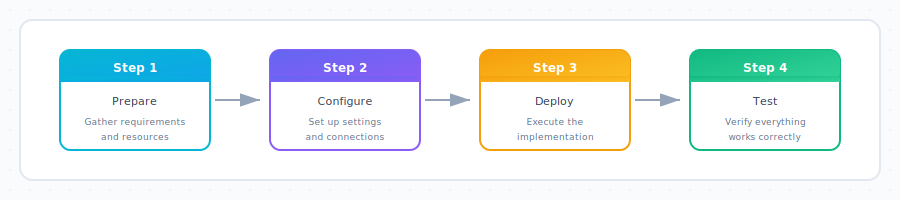
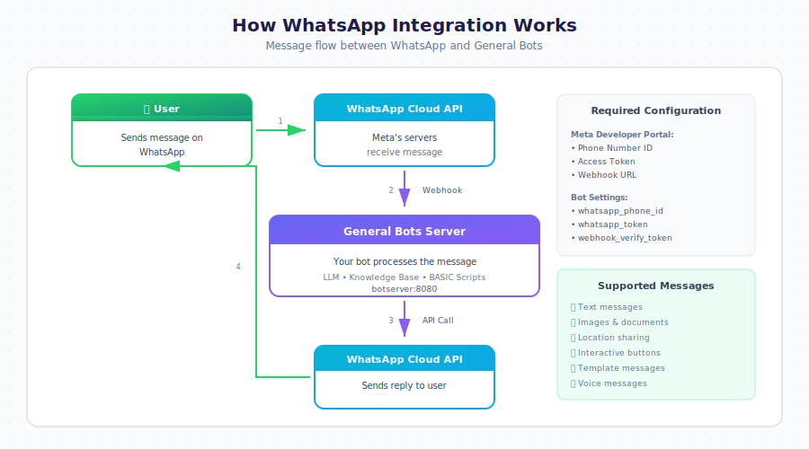

# How To: Connect WhatsApp

> **Tutorial 5 of the Channels Series**
>
> *Connect your bot to WhatsApp in 20 minutes*

---



---

## Objective

By the end of this tutorial, you will have:
- Created a Meta Business account
- Set up a WhatsApp Business App
- Connected WhatsApp to your General Bots instance
- Tested the connection with a real message

---

## Time Required

⏱️ **20 minutes**

---

## Prerequisites

Before you begin, make sure you have:

- [ ] A working bot (see [Create Your First Bot](./create-first-bot.md))
- [ ] A phone number for WhatsApp Business (cannot be used with regular WhatsApp)
- [ ] A Facebook account
- [ ] Administrator access to General Bots

---

## Understanding WhatsApp Integration



---

## Step 1: Set Up Meta Business Account

### 1.1 Go to Meta for Developers

Open your browser and navigate to:

**https://developers.facebook.com**

```
┌─────────────────────────────────────────────────────────────────────────┐
│  🌐 Browser                                                     [─][□][×]│
├─────────────────────────────────────────────────────────────────────────┤
│  ← → ↻  │ https://developers.facebook.com                        │ ☆ │  │
├─────────────────────────────────────────────────────────────────────────┤
│                                                                         │
│                     Meta for Developers                                 │
│                                                                         │
│                   ┌─────────────────────┐                               │
│                   │      Log In         │                               │
│                   └─────────────────────┘                               │
│                                                                         │
└─────────────────────────────────────────────────────────────────────────┘
```

### 1.2 Log In with Facebook

1. Click **Log In**
2. Enter your Facebook credentials
3. Click **Log In**

### 1.3 Create a Meta Business Account (If Needed)

If you don't have a business account:

1. Go to **https://business.facebook.com**
2. Click **Create Account**
3. Enter your business name
4. Enter your name and business email
5. Click **Submit**

💡 **Note**: You can use your personal Facebook account, but a business account is recommended for production use.

✅ **Checkpoint**: You should now be logged into Meta for Developers.

---

## Step 2: Create a WhatsApp App

### 2.1 Go to My Apps

Click **My Apps** in the top navigation.

```
┌─────────────────────────────────────────────────────────────────────────┐
│  Meta for Developers                           [My Apps ▼] [👤 Account] │
├─────────────────────────────────────────────────────────────────────────┤
│                                                                         │
│                              My Apps                                    │
│                              ───────                                    │
│                                                                         │
│                   ┌─────────────────────────┐                           │
│                   │     + Create App        │ ◄── Click here            │
│                   └─────────────────────────┘                           │
│                                                                         │
│                   You don't have any apps yet.                          │
│                                                                         │
└─────────────────────────────────────────────────────────────────────────┘
```

### 2.2 Create a New App

1. Click **Create App**
2. Select **Business** as the app type
3. Click **Next**

```
┌─────────────────────────────────────────────────────────────────────────┐
│  Create an App                                                    [×]   │
├─────────────────────────────────────────────────────────────────────────┤
│                                                                         │
│  Select an app type:                                                    │
│                                                                         │
│  ┌─────────────────┐  ┌─────────────────┐  ┌─────────────────┐         │
│  │    Consumer     │  │   ● Business    │  │     Gaming      │         │
│  │                 │  │   ◄── Select    │  │                 │         │
│  │  For consumer   │  │                 │  │  For game       │         │
│  │  apps           │  │  For business   │  │  integrations   │         │
│  │                 │  │  integrations   │  │                 │         │
│  └─────────────────┘  └─────────────────┘  └─────────────────┘         │
│                                                                         │
│                                                        [Next]           │
│                                                                         │
└─────────────────────────────────────────────────────────────────────────┘
```

### 2.3 Fill In App Details

| Field | What to Enter | Example |
|-------|---------------|---------|
| **App Name** | Your bot's name | My Company Bot |
| **App Contact Email** | Your email | admin@company.com |
| **Business Account** | Select or create | My Company |

```
┌─────────────────────────────────────────────────────────────────────────┐
│  Add App Details                                                  [×]   │
├─────────────────────────────────────────────────────────────────────────┤
│                                                                         │
│  App Name:                                                              │
│  ┌─────────────────────────────────────────────────────────────────┐   │
│  │ My Company Bot                                                  │   │
│  └─────────────────────────────────────────────────────────────────┘   │
│                                                                         │
│  App Contact Email:                                                     │
│  ┌─────────────────────────────────────────────────────────────────┐   │
│  │ admin@company.com                                               │   │
│  └─────────────────────────────────────────────────────────────────┘   │
│                                                                         │
│  Business Account:                                                      │
│  ┌─────────────────────────────────────────────────────────────────┐   │
│  │ My Company                                              [▼]     │   │
│  └─────────────────────────────────────────────────────────────────┘   │
│                                                                         │
│                                                    [Create App]         │
│                                                                         │
└─────────────────────────────────────────────────────────────────────────┘
```

4. Click **Create App**
5. Complete the security check if prompted

### 2.4 Add WhatsApp to Your App

1. In the app dashboard, scroll to **Add Products**
2. Find **WhatsApp** and click **Set Up**

```
┌─────────────────────────────────────────────────────────────────────────┐
│  Add Products to Your App                                               │
├─────────────────────────────────────────────────────────────────────────┤
│                                                                         │
│  ┌─────────────────┐  ┌─────────────────┐  ┌─────────────────┐         │
│  │   Messenger     │  │   📱 WhatsApp   │  │   Instagram     │         │
│  │                 │  │                 │  │                 │         │
│  │   [Set Up]      │  │   [Set Up] ◄──  │  │   [Set Up]      │         │
│  │                 │  │   Click here    │  │                 │         │
│  └─────────────────┘  └─────────────────┘  └─────────────────┘         │
│                                                                         │
└─────────────────────────────────────────────────────────────────────────┘
```

✅ **Checkpoint**: WhatsApp should now appear in your app's left sidebar.

---

## Step 3: Configure WhatsApp Settings

### 3.1 Get Your API Credentials

In the left sidebar, click **WhatsApp** → **API Setup**.

You'll see:
- **Phone number ID** - Identifies your WhatsApp number
- **WhatsApp Business Account ID** - Your business account
- **Temporary access token** - For testing (expires in 24 hours)

```
┌─────────────────────────────────────────────────────────────────────────┐
│  WhatsApp > API Setup                                                   │
├─────────────────────────────────────────────────────────────────────────┤
│                                                                         │
│  STEP 1: Select Phone Numbers                                           │
│  ────────────────────────────                                           │
│                                                                         │
│  From: [Test Number - 15550001234         ▼]                           │
│                                                                         │
│  To: (Add a recipient phone number for testing)                         │
│  ┌─────────────────────────────────────────────────────────────────┐   │
│  │ +1 555 123 4567                                                 │   │
│  └─────────────────────────────────────────────────────────────────┘   │
│                                                                         │
│  ─────────────────────────────────────────────────────────────────────  │
│                                                                         │
│  STEP 2: Send Messages with the API                                     │
│  ──────────────────────────────────                                     │
│                                                                         │
│  Temporary Access Token:                                                │
│  ┌─────────────────────────────────────────────────────────────────┐   │
│  │ EAAGm0PX4ZCp...                                        [Copy]   │   │
│  └─────────────────────────────────────────────────────────────────┘   │
│  ⚠️ This token expires in 24 hours. Use System User for production.     │
│                                                                         │
│  Phone Number ID: 123456789012345                          [Copy]       │
│  WhatsApp Business Account ID: 987654321098765             [Copy]       │
│                                                                         │
└─────────────────────────────────────────────────────────────────────────┘
```

📝 **Write down these values** - You'll need them in the next step:
- Phone Number ID: `_______________`
- Access Token: `_______________`

### 3.2 Create a Permanent Access Token

For production, you need a permanent token:

1. Go to **Business Settings** → **System Users**
2. Click **Add** to create a system user
3. Name it (e.g., "WhatsApp Bot")
4. Set role to **Admin**
5. Click **Generate Token**
6. Select your app and the `whatsapp_business_messaging` permission
7. Click **Generate Token**

💡 **Important**: Save this token securely! You won't be able to see it again.

### 3.3 Configure the Webhook

The webhook tells Meta where to send incoming messages.

1. In the left sidebar, click **WhatsApp** → **Configuration**
2. Under **Webhook**, click **Edit**

```
┌─────────────────────────────────────────────────────────────────────────┐
│  Webhook Configuration                                            [×]   │
├─────────────────────────────────────────────────────────────────────────┤
│                                                                         │
│  Callback URL:                                                          │
│  ┌─────────────────────────────────────────────────────────────────┐   │
│  │ https://your-bot-server.com/webhook/whatsapp                    │   │
│  └─────────────────────────────────────────────────────────────────┘   │
│                                                                         │
│  Verify Token:                                                          │
│  ┌─────────────────────────────────────────────────────────────────┐   │
│  │ your-custom-verify-token-here                                   │   │
│  └─────────────────────────────────────────────────────────────────┘   │
│                                                                         │
│  ⚠️ Your server must respond to Meta's verification request             │
│                                                                         │
│  ┌─────────────────────────────────────────────────────────────────┐   │
│  │                    Verify and Save                              │   │
│  └─────────────────────────────────────────────────────────────────┘   │
│                                                                         │
└─────────────────────────────────────────────────────────────────────────┘
```

**Enter these values:**

| Field | Value |
|-------|-------|
| Callback URL | `https://your-server.com/webhook/whatsapp` |
| Verify Token | A secret string you create (e.g., `my_bot_verify_123`) |

3. Click **Verify and Save**

### 3.4 Subscribe to Webhook Events

After verifying, select which events to receive:

```
┌─────────────────────────────────────────────────────────────────────────┐
│  Webhook Fields                                                         │
├─────────────────────────────────────────────────────────────────────────┤
│                                                                         │
│  ☑ messages              ◄── Required! Receive incoming messages       │
│  ☐ message_template_status_update                                       │
│  ☐ phone_number_name_update                                             │
│  ☐ phone_number_quality_update                                          │
│  ☑ account_review_update                                                │
│  ☐ account_update                                                       │
│  ☐ business_capability_update                                           │
│  ☐ flows                                                                │
│  ☑ security                                                             │
│  ☑ message_echoes                                                       │
│                                                                         │
└─────────────────────────────────────────────────────────────────────────┘
```

At minimum, select:
- **messages** (required - to receive user messages)

✅ **Checkpoint**: Webhook should show as "Active" with a green indicator.

---

## Step 4: Configure General Bots

### 4.1 Open Bot Settings

1. In General Bots, go to **Sources**
2. Click **⚙️** on your bot
3. Go to the **Channels** tab

```
┌─────────────────────────────────────────────────────────────────────────┐
│  Bot Settings: support                                            [×]   │
├─────────────────────────────────────────────────────────────────────────┤
│                                                                         │
│  ┌──────────┬──────────┬──────────┬──────────┬──────────┐              │
│  │ General  │    AI    │*Channels*│ Security │ Advanced │              │
│  └──────────┴──────────┴──────────┴──────────┴──────────┘              │
│                                                                         │
│  CONNECTED CHANNELS                                                     │
│  ──────────────────                                                     │
│                                                                         │
│  ┌─────────────────────────────────────────────────────────────────┐   │
│  │ 🌐 Web Chat                                      Status: ● On   │   │
│  │    Embedded widget on your website                              │   │
│  │    [Configure]                                                  │   │
│  └─────────────────────────────────────────────────────────────────┘   │
│                                                                         │
│  ┌─────────────────────────────────────────────────────────────────┐   │
│  │ 📱 WhatsApp                                      Status: ○ Off  │   │
│  │    Not configured                                               │   │
│  │    [Configure] ◄── Click here                                   │   │
│  └─────────────────────────────────────────────────────────────────┘   │
│                                                                         │
└─────────────────────────────────────────────────────────────────────────┘
```

### 4.2 Enter WhatsApp Credentials

Click **Configure** for WhatsApp and enter your credentials:

```
┌─────────────────────────────────────────────────────────────────────────┐
│  WhatsApp Configuration                                           [×]   │
├─────────────────────────────────────────────────────────────────────────┤
│                                                                         │
│  META API CREDENTIALS                                                   │
│  ────────────────────                                                   │
│                                                                         │
│  Phone Number ID:                                                       │
│  ┌─────────────────────────────────────────────────────────────────┐   │
│  │ 123456789012345                                                 │   │
│  └─────────────────────────────────────────────────────────────────┘   │
│                                                                         │
│  Access Token:                                                          │
│  ┌─────────────────────────────────────────────────────────────────┐   │
│  │ ••••••••••••••••••••••••••••••••••••••                          │   │
│  └─────────────────────────────────────────────────────────────────┘   │
│                                                                         │
│  Verify Token:                                                          │
│  ┌─────────────────────────────────────────────────────────────────┐   │
│  │ my_bot_verify_123                                               │   │
│  └─────────────────────────────────────────────────────────────────┘   │
│  ⚠️ Must match the token you set in Meta Developer Portal               │
│                                                                         │
│  ─────────────────────────────────────────────────────────────────────  │
│                                                                         │
│  WEBHOOK URL (provide this to Meta)                                     │
│  ──────────────────────────────────                                     │
│  ┌─────────────────────────────────────────────────────────────────┐   │
│  │ https://your-server.com/webhook/whatsapp                [Copy]  │   │
│  └─────────────────────────────────────────────────────────────────┘   │
│                                                                         │
│  ┌─────────────────┐  ┌─────────────────┐                              │
│  │  Test Connection │  │      Save       │                              │
│  └─────────────────┘  └─────────────────┘                              │
│                                                                         │
└─────────────────────────────────────────────────────────────────────────┘
```

### 4.3 Test the Connection

1. Click **Test Connection**
2. You should see "Connection successful!"

If the test fails, check:
- Token is correct and not expired
- Phone Number ID is correct
- Your server is accessible from the internet

### 4.4 Save and Enable

1. Click **Save**
2. Toggle WhatsApp to **On**

✅ **Checkpoint**: WhatsApp should now show Status: ● On

---

## Step 5: Test Your WhatsApp Bot

### 5.1 Add Test Phone Number

In Meta Developer Portal:

1. Go to **WhatsApp** → **API Setup**
2. Under "To", add your phone number
3. Click **Send** to receive a test message

### 5.2 Send a Test Message

1. Open WhatsApp on your phone
2. Message the bot's number (the test number from Meta)
3. Send: "Hello"

```
┌─────────────────────────────────────────────────────────────────────────┐
│                                                                         │
│                    WhatsApp                                             │
│                                                                         │
│  ┌─────────────────────────────────────────────────────────────────┐   │
│  │                                                                 │   │
│  │  My Company Bot                                                 │   │
│  │  +1 555 000 1234                                               │   │
│  │                                                                 │   │
│  │  ─────────────────────────────────────────────────────────────  │   │
│  │                                                                 │   │
│  │                                              ┌───────────────┐  │   │
│  │                                              │    Hello      │  │   │
│  │                                              │         10:30 │  │   │
│  │                                              └───────────────┘  │   │
│  │                                                                 │   │
│  │  ┌─────────────────────────────────────────┐                    │   │
│  │  │ Hello! How can I help you today?        │                    │   │
│  │  │ 10:30                                   │                    │   │
│  │  └─────────────────────────────────────────┘                    │   │
│  │                                                                 │   │
│  │                                              ┌───────────────┐  │   │
│  │                                              │ I need help   │  │   │
│  │                                              │ with my order │  │   │
│  │                                              │         10:31 │  │   │
│  │                                              └───────────────┘  │   │
│  │                                                                 │   │
│  │  ┌─────────────────────────────────────────┐                    │   │
│  │  │ I'd be happy to help with your order!   │                    │   │
│  │  │ What's your order number?               │                    │   │
│  │  │ 10:31                                   │                    │   │
│  │  └─────────────────────────────────────────┘                    │   │
│  │                                                                 │   │
│  └─────────────────────────────────────────────────────────────────┘   │
│                                                                         │
│  ┌─────────────────────────────────────────────────────────────────┐   │
│  │ Type a message...                                          📎   │   │
│  └─────────────────────────────────────────────────────────────────┘   │
│                                                                         │
└─────────────────────────────────────────────────────────────────────────┘
```

### 5.3 Verify in General Bots

Check that the conversation appears in Analytics:

1. Go to **Analytics** → **Sessions**
2. You should see a new session with channel "WhatsApp"

---

## 🎉 Congratulations!

Your bot is now connected to WhatsApp! Users can message your WhatsApp Business number and receive responses from your bot.

```
┌─────────────────────────────────────────────────────────────────────────┐
│                                                                         │
│                         ✓ SUCCESS!                                      │
│                                                                         │
│                    Your WhatsApp bot is live!                           │
│                                                                         │
│     ┌───────────┐              ┌───────────┐              ┌──────────┐ │
│     │           │              │           │              │          │ │
│     │    📱     │  ────────▶   │    🤖     │  ────────▶   │    💬    │ │
│     │  WhatsApp │              │  General  │              │   Bot    │ │
│     │   User    │  ◀────────   │   Bots    │  ◀────────   │ Response │ │
│     │           │              │           │              │          │ │
│     └───────────┘              └───────────┘              └──────────┘ │
│                                                                         │
└─────────────────────────────────────────────────────────────────────────┘
```

---

## Going to Production

### Add a Real Phone Number

The test number has limitations. For production:

1. Go to **WhatsApp** → **Phone Numbers** in Meta Developer Portal
2. Click **Add Phone Number**
3. Enter your business phone number
4. Verify via SMS or voice call
5. Update the Phone Number ID in General Bots settings

### Submit for App Review

Before going live with real customers:

1. Go to **App Review** in Meta Developer Portal
2. Request `whatsapp_business_messaging` permission
3. Complete the review process (takes 2-5 business days)

### Set Up Message Templates

For proactive messages (not replies), you need approved templates:

1. Go to **WhatsApp** → **Message Templates**
2. Create templates for notifications, alerts, etc.
3. Wait for Meta approval (usually 24 hours)

---

## Troubleshooting

### Problem: "Webhook verification failed"

**Possible causes:**
1. Verify token doesn't match
2. Server not responding
3. HTTPS not configured

**Solution:**
1. Check the verify token matches exactly in both places
2. Verify your server is accessible: `curl https://your-server.com/webhook/whatsapp`
3. Ensure you have a valid SSL certificate

---

### Problem: Messages not arriving

**Possible causes:**
1. Webhook not subscribed to "messages"
2. App in development mode with unlisted numbers
3. Access token expired

**Solution:**
1. Check webhook subscriptions include "messages"
2. Add test phone numbers in API Setup
3. Generate a new access token

---

### Problem: Bot responds slowly

**Possible causes:**
1. Network latency
2. Bot processing time
3. Meta rate limits

**Solution:**
1. Ensure server is geographically close to users
2. Optimize bot dialog processing
3. Check rate limit status in Meta dashboard

---

### Problem: "Error 190: Invalid OAuth access token"

**Possible causes:**
1. Token expired (temporary tokens last 24 hours)
2. Token was revoked
3. Wrong token used

**Solution:**
1. Generate a new System User token (permanent)
2. Update the token in General Bots settings
3. Verify you're using the WhatsApp access token, not a Facebook token

---

### Problem: Phone number shows as unverified

**Possible causes:**
1. Verification not completed
2. Two-factor authentication issue
3. Number already in use

**Solution:**
1. Re-request verification code
2. Check business verification status
3. Contact Meta support if number was previously registered

---

## What You Learned

In this tutorial, you:

- ✅ Created a Meta Developer account and app
- ✅ Configured WhatsApp Cloud API
- ✅ Set up webhook for incoming messages
- ✅ Connected WhatsApp to General Bots
- ✅ Tested the integration with real messages

---

## Next Steps

Now that WhatsApp is connected, try these:

| Next Tutorial | What You'll Learn |
|---------------|-------------------|
| [Write Your First Dialog](./write-first-dialog.md) | Create custom conversation flows |
| [Add KB Documents](./add-kb-documents.md) | Make your bot smarter |
| [Monitor Sessions](./monitor-sessions.md) | Track WhatsApp conversations |

---

## Quick Reference

### WhatsApp Message Limits

| Tier | Messages/Day | How to Qualify |
|------|--------------|----------------|
| Unverified | 250 | New accounts |
| Verified | 1,000 | Complete business verification |
| Tier 1 | 10,000 | Good quality rating |
| Tier 2 | 100,000 | Maintain quality |
| Tier 3 | Unlimited | High volume, good quality |

### Quality Rating

Meta monitors your WhatsApp quality based on:
- User blocks and reports
- Message template quality
- Response time

Keep quality high by:
- Responding to all messages
- Not spamming users
- Using approved templates for outbound messages

### Key URLs

| Resource | URL |
|----------|-----|
| Meta for Developers | https://developers.facebook.com |
| Meta Business Suite | https://business.facebook.com |
| WhatsApp Cloud API Docs | https://developers.facebook.com/docs/whatsapp |
| API Status | https://metastatus.com |

### Configuration via config.csv

Configure WhatsApp in your bot's `config.csv`:

```csv
name,value
whatsapp-phone-number-id,123456789012345
whatsapp-access-token,EAAGm0PX4ZCp...
whatsapp-verify-token,my_bot_verify_123
whatsapp-business-account-id,987654321098765
```

**Note**: Do not use environment variables for WhatsApp configuration. All settings belong in `config.csv`.

---

## See Also

- [Chat App](../apps/chat.md) - Web chat interface
- [Sources App](../apps/sources.md) - Bot configuration
- [Compliance App](../apps/compliance.md) - Data privacy for WhatsApp
- [BASIC Keywords](../../04-basic-scripting/keywords-reference.md) - WhatsApp-specific keywords