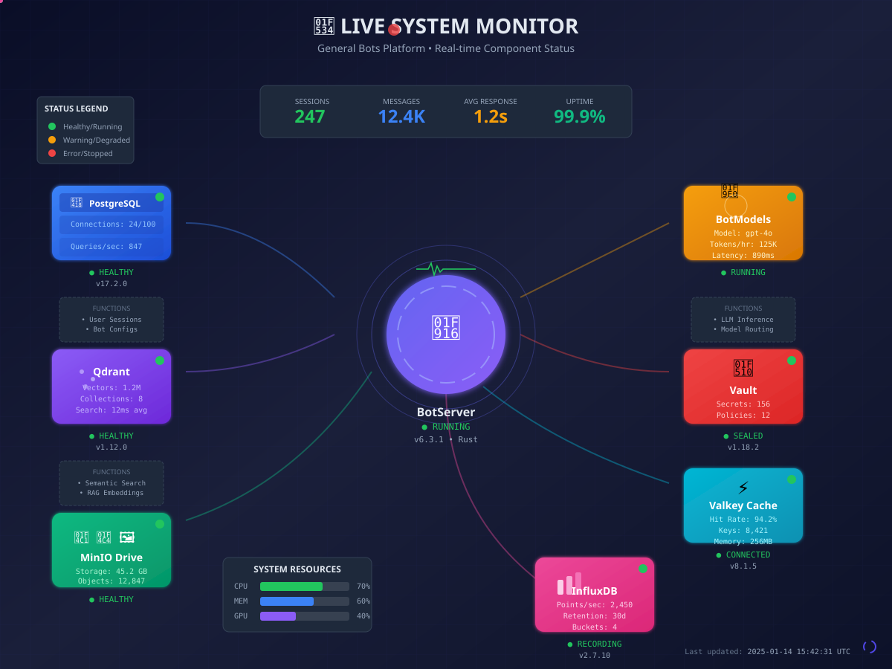

# How To: Monitor Your Bot 🟡 BETA

> **Tutorial 12 of the Analytics & Monitoring Series**
>
> *Watch conversations and system health in real-time*

---

```
┌─────────────────────────────────────────────────────────────────────────┐
│                                                                         │
│   ┌─────────────────────────────────────────────────────────────────┐   │
│   │                                                                 │   │
│   │     📊  MONITOR YOUR BOT                                        │   │
│   │                                                                 │   │
│   │     ┌─────────┐    ┌─────────┐    ┌─────────┐    ┌─────────┐   │   │
│   │     │  Step   │───▶│  Step   │───▶│  Step   │───▶│  Step   │   │   │
│   │     │   1     │    │   2     │    │   3     │    │   4     │   │   │
│   │     │ Access  │    │  View   │    │  Check  │    │  Set    │   │   │
│   │     │Dashboard│    │Sessions │    │ Health  │    │ Alerts  │   │   │
│   │     └─────────┘    └─────────┘    └─────────┘    └─────────┘   │   │
│   │                                                                 │   │
│   └─────────────────────────────────────────────────────────────────┘   │
│                                                                         │
└─────────────────────────────────────────────────────────────────────────┘
```

---

## Objective

By the end of this tutorial, you will have:
- Accessed the monitoring dashboard
- Viewed active sessions and conversations
- Checked system health and resources
- Understood the live system architecture
- Configured alerts for important events

---

## Time Required

⏱️ **10 minutes**

---

## Prerequisites

Before you begin, make sure you have:

- [ ] A running bot with some activity
- [ ] Administrator or Monitor role permissions
- [ ] Access to the General Bots Suite

---

## Understanding the System Architecture

Your General Bots deployment is a **living system** of interconnected components. Understanding how they work together helps you monitor effectively.



### Component Overview

| Component | Purpose | Status Indicators |
|-----------|---------|-------------------|
| **botserver** | Core application, handles all requests | Response time, active sessions |
| **PostgreSQL** | Primary database, stores users & config | Connections, query rate |
| **Qdrant** | Vector database, powers semantic search | Vector count, search latency |
| **MinIO** | File storage, manages documents | Storage used, object count |
| **BotModels** | LLM server, generates AI responses | Tokens/hour, model latency |
| **Vault** | Secrets manager, stores API keys | Sealed status, policy count |
| **Cache** | Cache layer, speeds up responses | Hit rate, memory usage |
| **InfluxDB** | Metrics database, stores analytics | Points/sec, retention |

---

## Step 1: Access the Monitoring Dashboard

### 1.1 Open the Apps Menu

Click the **nine-dot grid** (⋮⋮⋮) in the top-right corner.

### 1.2 Select Monitoring

Click **Analytics** or **Monitoring** (depending on your configuration).

```
┌─────────────────────────────────────────────────────────────────────────┐
│                                                                         │
│                         ┌───────────────────┐                           │
│                         │   💬 Chat         │                           │
│                         │   📁 Drive        │                           │
│                         │   📊 Analytics    │ ◄── May be here           │
│                         │   📈 Monitoring   │ ◄── Or here               │
│                         │   ⚙️  Settings     │                           │
│                         └───────────────────┘                           │
│                                                                         │
└─────────────────────────────────────────────────────────────────────────┘
```

### 1.3 View the Dashboard

The monitoring dashboard displays real-time metrics:

```
┌─────────────────────────────────────────────────────────────────────────┐
│  📊 Monitoring Dashboard                              🔴 LIVE           │
├─────────────────────────────────────────────────────────────────────────┤
│                                                                         │
│  ┌─────────────────┐ ┌─────────────────┐ ┌─────────────────┐           │
│  │   SESSIONS      │ │   MESSAGES      │ │   RESPONSE      │           │
│  │                 │ │                 │ │                 │           │
│  │      247        │ │     12.4K       │ │      1.2s       │           │
│  │   ● Active      │ │    Today        │ │   Average       │           │
│  └─────────────────┘ └─────────────────┘ └─────────────────┘           │
│                                                                         │
│  ━━━━━━━━━━━━━━━━━━━━━━━━━━━━━━━━━━━━━━━━━━━━━━━━━━━━━━━━━━━━━━━━━━━━ │
│                                                                         │
│  SYSTEM RESOURCES                                                       │
│  ─────────────────                                                      │
│  CPU  [████████████████░░░░░░░░░░░░░░] 70%                              │
│  MEM  [████████████████████░░░░░░░░░░] 60%                              │
│  GPU  [████████████░░░░░░░░░░░░░░░░░░] 40%                              │
│  DISK [████████░░░░░░░░░░░░░░░░░░░░░░] 28%                              │
│                                                                         │
└─────────────────────────────────────────────────────────────────────────┘
```

✅ **Checkpoint**: You can see the monitoring dashboard with live metrics.

---

## Step 2: View Active Sessions

### 2.1 Navigate to Sessions Panel

Look for the **Sessions** or **Conversations** section:

```
┌─────────────────────────────────────────────────────────────────────────┐
│  Active Sessions (247)                                    [Refresh 🔄] │
├─────────────────────────────────────────────────────────────────────────┤
│                                                                         │
│  ID        │ User          │ Channel   │ Started      │ Messages       │
│  ──────────┼───────────────┼───────────┼──────────────┼────────────    │
│  a1b2c3d4  │ +5511999...   │ WhatsApp  │ 2 min ago    │ 12             │
│  e5f6g7h8  │ john@acme...  │ Web       │ 5 min ago    │ 8              │
│  i9j0k1l2  │ +5521888...   │ WhatsApp  │ 8 min ago    │ 23             │
│  m3n4o5p6  │ support@...   │ Email     │ 15 min ago   │ 4              │
│  q7r8s9t0  │ jane@...      │ Web       │ 18 min ago   │ 15             │
│                                                                         │
│  ◀ 1 2 3 4 5 ... 25 ▶                                                  │
│                                                                         │
└─────────────────────────────────────────────────────────────────────────┘
```

### 2.2 View Session Details

Click on a session to see the full conversation:

```
┌─────────────────────────────────────────────────────────────────────────┐
│  Session: a1b2c3d4                                              [×]    │
├─────────────────────────────────────────────────────────────────────────┤
│                                                                         │
│  User: +5511999888777                                                   │
│  Channel: WhatsApp                                                      │
│  Started: 2024-01-15 14:32:00                                          │
│  Duration: 2 min 34 sec                                                 │
│  Bot: mycompany                                                         │
│                                                                         │
│  ── Conversation ──────────────────────────────────────────────────────│
│                                                                         │
│  [14:32:00] 👤 User: Hello                                              │
│  [14:32:01] 🤖 Bot: Hello! How can I help you today?                   │
│  [14:32:15] 👤 User: I want to check my order status                   │
│  [14:32:17] 🤖 Bot: I can help with that! What's your order number?    │
│  [14:32:45] 👤 User: ORD-12345                                         │
│  [14:32:48] 🤖 Bot: Order ORD-12345 is being prepared for shipping...  │
│                                                                         │
└─────────────────────────────────────────────────────────────────────────┘
```

### 2.3 Session Metrics

Understand key session metrics:

| Metric | Description | Good Value |
|--------|-------------|------------|
| **Active Sessions** | Currently open conversations | Depends on load |
| **Peak Today** | Maximum concurrent sessions | Track trends |
| **Avg Duration** | Average conversation length | 3-5 minutes typical |
| **Messages/Session** | Average messages per conversation | 5-10 typical |

✅ **Checkpoint**: You can view active sessions and their conversations.

---

## Step 3: Check System Health

### 3.1 View Service Status

The dashboard shows the health of all components:

```
┌─────────────────────────────────────────────────────────────────────────┐
│  Service Health                                                         │
├─────────────────────────────────────────────────────────────────────────┤
│                                                                         │
│  ● PostgreSQL      Running    v16.2       24/100 connections           │
│  ● Qdrant          Running    v1.9.2      1.2M vectors                 │
│  ● MinIO           Running    v2024.01    45.2 GB stored               │
│  ● BotModels       Running    v2.1.0      LLM active                   │
│  ● Vault           Sealed     v1.15.0     156 secrets                  │
│  ● Cache           Running    v7.2.4      94.2% hit rate               │
│  ● InfluxDB        Running    v2.7.3      2,450 pts/sec                │
│                                                                         │
│  Legend: ● Running  ● Warning  ● Stopped                               │
│                                                                         │
└─────────────────────────────────────────────────────────────────────────┘
```

### 3.2 Understanding Status Colors

| Color | Status | Action Needed |
|-------|--------|---------------|
| 🟢 Green | Healthy/Running | None |
| 🟡 Yellow | Warning/Degraded | Investigate soon |
| 🔴 Red | Error/Stopped | Immediate action |

### 3.3 Check Resource Usage

Monitor resource utilization to prevent issues:

```
┌─────────────────────────────────────────────────────────────────────────┐
│  Resource Usage                                          Last 24 Hours │
├─────────────────────────────────────────────────────────────────────────┤
│                                                                         │
│  CPU Usage                                                              │
│  100%│                    ╭──╮                                         │
│   75%│    ╭──╮  ╭──╮     │  │  ╭──╮                                   │
│   50%│╭──╮│  │╭─╯  ╰─╮╭──╯  ╰──╯  ╰──╮                                │
│   25%│    ╰──╯       ╰╯              ╰──────────                       │
│    0%└────────────────────────────────────────────                     │
│      00:00  04:00  08:00  12:00  16:00  20:00  Now                     │
│                                                                         │
│  Memory Usage                                                           │
│  100%│                                                                  │
│   75%│                                                                  │
│   50%│────────────────────────────────────────────                     │
│   25%│                                                                  │
│    0%└────────────────────────────────────────────                     │
│      00:00  04:00  08:00  12:00  16:00  20:00  Now                     │
│                                                                         │
└─────────────────────────────────────────────────────────────────────────┘
```

### 3.4 Resource Thresholds

Take action when resources approach these limits:

| Resource | Warning | Critical | Action |
|----------|---------|----------|--------|
| CPU | > 80% | > 95% | Scale up or optimize |
| Memory | > 85% | > 95% | Add RAM or reduce cache |
| Disk | > 80% | > 90% | Clean up or add storage |
| GPU | > 90% | > 98% | Queue requests or scale |

✅ **Checkpoint**: You can view system health and resource usage.

---

## Step 4: Set Up Alerts

### 4.1 Access Alert Settings

Navigate to **Settings** > **Alerts** or **Monitoring** > **Configure Alerts**.

### 4.2 Configure Alert Rules

Set up alerts for important events:

```
┌─────────────────────────────────────────────────────────────────────────┐
│  Alert Configuration                                                    │
├─────────────────────────────────────────────────────────────────────────┤
│                                                                         │
│  ☑ CPU Usage                                                            │
│    Threshold: [80] %    For: [5] minutes                               │
│    Notify: ☑ Email  ☑ Slack  ☐ SMS                                     │
│                                                                         │
│  ☑ Memory Usage                                                         │
│    Threshold: [85] %    For: [5] minutes                               │
│    Notify: ☑ Email  ☐ Slack  ☐ SMS                                     │
│                                                                         │
│  ☑ Response Time                                                        │
│    Threshold: [5000] ms  For: [3] minutes                              │
│    Notify: ☑ Email  ☑ Slack  ☐ SMS                                     │
│                                                                         │
│  ☑ Service Down                                                         │
│    Services: ☑ PostgreSQL  ☑ Qdrant  ☑ BotModels                       │
│    Notify: ☑ Email  ☑ Slack  ☑ SMS                                     │
│                                                                         │
│                              ┌─────────────────┐                        │
│                              │    💾 Save      │                        │
│                              └─────────────────┘                        │
│                                                                         │
└─────────────────────────────────────────────────────────────────────────┘
```

### 4.3 Configure via config.csv

You can also set alerts in your bot's configuration file:

```csv
key,value
alert-cpu-threshold,80
alert-memory-threshold,85
alert-disk-threshold,90
alert-response-time-ms,5000
alert-email,admin@company.com
alert-slack-webhook,https://hooks.slack.com/...
```

### 4.4 Test Alerts

Verify your alerts are working:

1. Set a low threshold temporarily (e.g., CPU > 1%)
2. Wait for the alert to trigger
3. Check your email/Slack for the notification
4. Reset the threshold to normal

✅ **Checkpoint**: Alerts are configured and tested.

---

## 🎉 Congratulations!

You can now monitor your bot effectively! Here's what you learned:

```
┌─────────────────────────────────────────────────────────────────────────┐
│                                                                         │
│    ✓ Accessed the monitoring dashboard                                  │
│    ✓ Viewed active sessions and conversations                           │
│    ✓ Checked system health and services                                 │
│    ✓ Understood resource usage metrics                                  │
│    ✓ Configured alerts for important events                             │
│                                                                         │
│    You're now equipped to keep your bot healthy!                        │
│                                                                         │
└─────────────────────────────────────────────────────────────────────────┘
```

---

## Troubleshooting

### Problem: Dashboard shows no data

**Cause**: Monitoring services may not be collecting data.

**Solution**:
1. Check that InfluxDB is running
2. Verify the monitoring agent is enabled
3. Wait a few minutes for data collection

### Problem: Sessions show as "Unknown User"

**Cause**: User identification not configured.

**Solution**:
1. Enable user tracking in bot settings
2. Request user info at conversation start
3. Check privacy settings

### Problem: Alerts not being sent

**Cause**: Notification channels not configured correctly.

**Solution**:
1. Verify email/Slack settings
2. Check spam folders
3. Test webhook URLs manually

### Problem: High CPU but few sessions

**Cause**: Possible memory leak or inefficient code.

**Solution**:
1. Check for infinite loops in dialogs
2. Review LLM call frequency
3. Restart the bot service

---

## Monitoring API

Access monitoring data programmatically:

### Get System Status

```
GET /api/monitoring/status
```

**Response:**
```json
{
  "sessions": {
    "active": 247,
    "peak_today": 312,
    "avg_duration_seconds": 245
  },
  "messages": {
    "today": 12400,
    "this_hour": 890,
    "avg_response_ms": 1200
  },
  "resources": {
    "cpu_percent": 70,
    "memory_percent": 60,
    "gpu_percent": 40,
    "disk_percent": 28
  },
  "services": {
    "postgresql": "running",
    "qdrant": "running",
    "minio": "running",
    "botmodels": "running",
    "vault": "sealed",
    "redis": "running",
    "influxdb": "running"
  }
}
```

### Get Historical Metrics

```
GET /api/monitoring/history?period=24h
```

### Get Session Details

```
GET /api/monitoring/sessions/{session_id}
```

---

## Quick Reference

### Dashboard Keyboard Shortcuts

| Shortcut | Action |
|----------|--------|
| `R` | Refresh data |
| `F` | Toggle fullscreen |
| `S` | Show/hide sidebar |
| `1-7` | Switch dashboard tabs |

### Important Metrics to Watch

| Metric | Normal | Warning | Critical |
|--------|--------|---------|----------|
| Response Time | < 2s | 2-5s | > 5s |
| Error Rate | < 1% | 1-5% | > 5% |
| CPU Usage | < 70% | 70-85% | > 85% |
| Memory Usage | < 75% | 75-85% | > 85% |
| Queue Depth | < 100 | 100-500 | > 500 |

### Console Monitoring

For server-side monitoring:

```bash
# Start with monitoring output
./botserver --console --monitor

# Output:
# [MONITOR] 2024-01-15 14:32:00
# Sessions: 247 active (peak: 312)
# Messages: 12,400 today (890/hour)
# CPU: 70% | MEM: 60% | GPU: 40%
# Services: 7/7 running
```

---

## Next Steps

| Next Tutorial | What You'll Learn |
|---------------|-------------------|
| [Create Custom Reports](./create-reports.md) | Build dashboards for insights |
| [Export Analytics Data](./export-analytics.md) | Download metrics for analysis |
| [Performance Optimization](./performance-tips.md) | Make your bot faster |

---

*Tutorial 12 of 30 • [Back to How-To Index](./README.md) • [Next: Create Custom Reports →](./create-reports.md)*