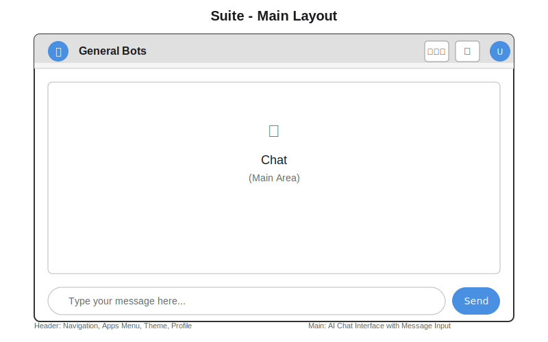
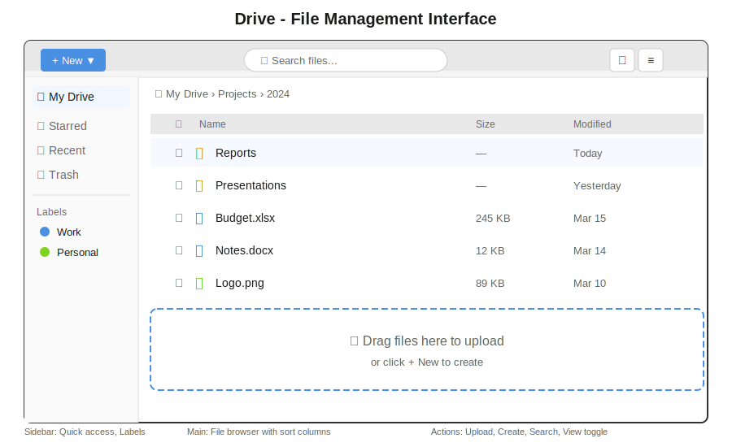
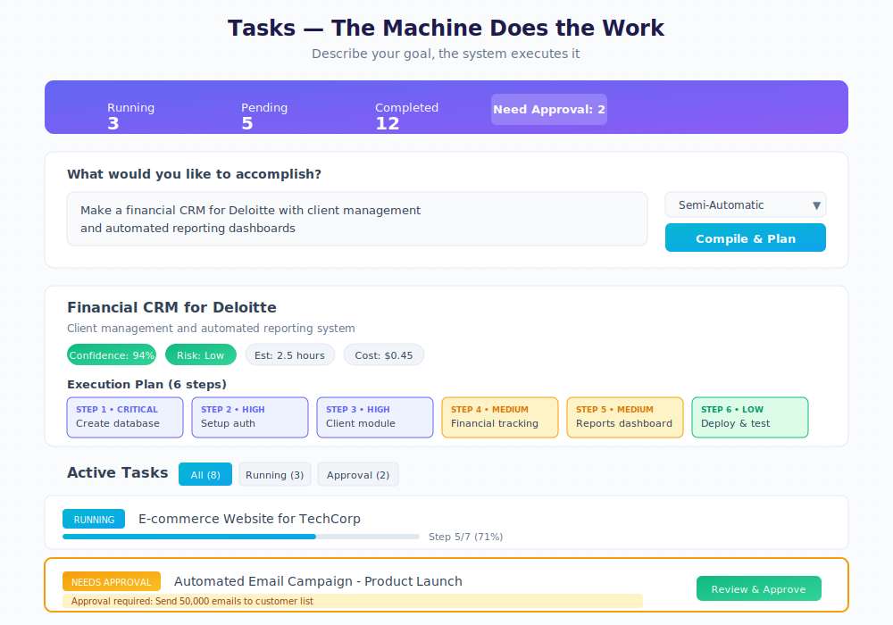
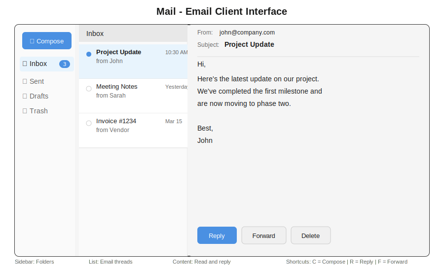
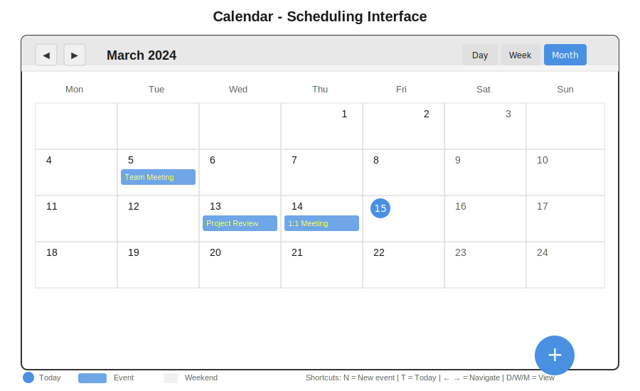
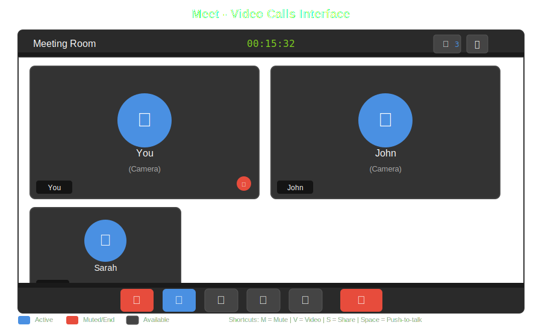
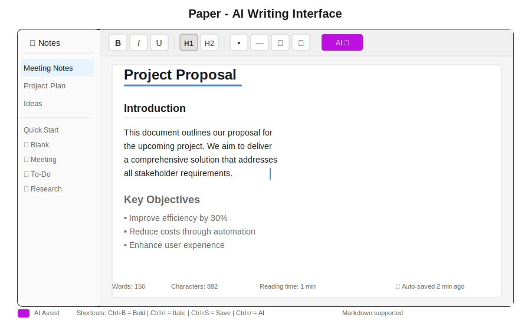
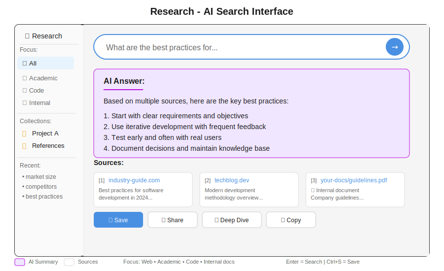
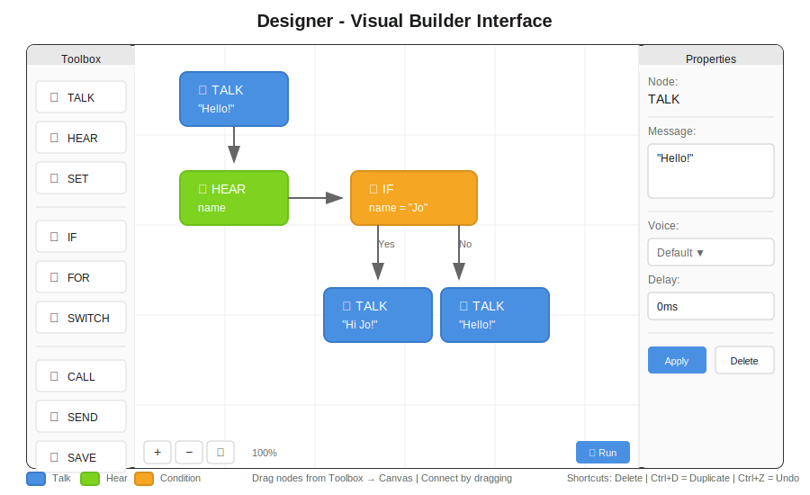
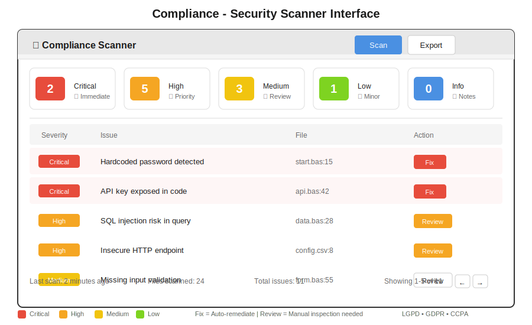

# General Bots Suite - User Manual

> **The Complete Productivity Workspace**
> 
> *AI-native productivity suite for modern teams*

---

## Welcome to General Bots Suite

General Bots Suite is your all-in-one workspace that combines communication, productivity, and AI assistance. All your productivity tools in one place - simple and powerful.

**What makes it special:**
- Everything works together seamlessly
- AI helps you with every task
- No complex setup required
- Works in your browser

---

## Part I: Getting Started

### Opening the Suite

1. **Open your web browser** (Chrome, Firefox, Safari, or Edge)
2. **Go to your General Bots address** (example: `http://your-company.bot:9000`)
3. **The Suite loads automatically** - you'll see the workspace in seconds

### Your First Look

When the Suite opens, you see:



### The Apps Menu

Click the **nine-dot grid** (⋮⋮⋮) in the top right to see all applications:

| Icon | App | What It Does |
|------|-----|--------------|
| 💬 | **Chat** | Talk with your AI assistant |
| 📁 | **Drive** | Store and manage your files |
| ⚡ | **Tasks** | LLM-powered intelligent task execution |
| ✉ | **Mail** | Send and receive emails |
| 📅 | **Calendar** | Schedule meetings and events |
| 🎥 | **Meet** | Video calls and meetings |
| 📝 | **Paper** | Write documents with AI help |
| 🔍 | **Research** | AI-powered search |
| 📊 | **Analytics** | View reports and statistics |

---

## Part II: Chat - Your AI Assistant

### What Chat Does

Chat is your personal AI assistant. Ask questions, get help with tasks, or have a conversation - just like talking to a helpful colleague.

### How to Use Chat

**Sending a Message:**
1. Click in the message box at the bottom
2. Type your question or request
3. Press **Enter** or click the **↑** button

**Example Conversations:**

```
You: What meetings do I have today?
Bot: You have 2 meetings scheduled:
     • 10:00 AM - Team Standup
     • 2:00 PM - Project Review

You: Remind me to call John tomorrow at 3pm
Bot: Done! I've created a reminder for tomorrow at 3:00 PM 
     to call John.

You: Write a professional email to decline a meeting
Bot: Here's a draft:

     Subject: Unable to Attend Meeting
     
     Dear [Name],
     
     Thank you for the invitation. Unfortunately, I have 
     a scheduling conflict and won't be able to attend.
     
     Would it be possible to reschedule or receive a 
     summary of the discussion?
     
     Best regards
```

### Voice Input

1. Click the **🎤 microphone** button
2. Speak your message
3. Click again to stop
4. Your words appear as text automatically

### Quick Suggestions

Below the message box, you'll see **suggestion chips** - common actions you can click:

```
[📊 Show my tasks] [📧 Check email] [📅 Today's schedule] [❓ Help]
```

### Keyboard Shortcuts for Chat

| Shortcut | Action |
|----------|--------|
| `Enter` | Send message |
| `Shift+Enter` | New line (without sending) |
| `↑` Arrow | Edit last message |
| `/` | Show command menu |

---

## Part III: Drive - File Management

### What Drive Does

Drive is your file storage - like Google Drive or OneDrive. Store documents, images, spreadsheets, and any file you need.

### The Drive Interface



### Creating and Uploading

**Upload Files:**
1. Click **+ New** button
2. Select **Upload Files**
3. Choose files from your computer
4. *Or:* Drag files directly into Drive

**Create New Folder:**
1. Click **+ New**
2. Select **New Folder**
3. Type the folder name
4. Press Enter

### Working with Files

**Open a file:** Double-click it

**Select files:** Click the checkbox beside the file name

**Multiple selection:** Hold `Ctrl` (or `Cmd` on Mac) and click files

**Right-click menu options:**
- 📂 Open
- ⬇️ Download
- ✏️ Rename
- 📋 Copy
- 📁 Move to...
- ⭐ Add to Starred
- 🔗 Share
- 🗑 Delete

### View Options

| Button | View | Best For |
|--------|------|----------|
| ⊞ | Grid view | Images and visual files |
| ≡ | List view | Documents and details |

### Keyboard Shortcuts for Drive

| Shortcut | Action |
|----------|--------|
| `Ctrl+U` | Upload files |
| `Ctrl+N` | New folder |
| `Delete` | Move to trash |
| `Ctrl+C` | Copy |
| `Ctrl+V` | Paste |
| `Enter` | Open selected |

---

## Part IV: Tasks - LLM-Powered Execution

### What Tasks Does

Tasks revolutionizes how you work. Instead of manually tracking to-do items, you describe what you want to accomplish in natural language, and the LLM compiles your intent into an executable plan with automatic step-by-step execution.

### The Tasks Interface



### Creating an Task

1. **Describe your intent** in the text area (e.g., "Build a CRM for Deloitte with client management")
2. **Choose execution mode:**
   - **Semi-Automatic** (recommended) - Runs automatically, pauses for high-risk steps
   - **Supervised** - Pauses before each step for your approval
   - **Fully Automatic** - Runs everything without stopping
   - **Dry Run** - Simulates execution without making changes
3. **Set priority:** Critical, High, Medium, Low, or Background
4. Click **🚀 Compile & Plan**

**Pro tip:** Be specific about outcomes! Instead of "make something", write "Create a sales dashboard with revenue charts by region and export to PDF"

### Understanding the Plan

After compilation, you'll see:

| Element | What It Shows |
|---------|---------------|
| **Confidence** | How confident the LLM is (aim for 80%+) |
| **Risk Level** | None / Low / Medium / High / Critical |
| **Duration** | Estimated execution time |
| **Cost** | API and compute costs |
| **Steps** | Ordered execution plan with keywords |

### Execution Modes

| Mode | Best For |
|------|----------|
| **Semi-Automatic** | Most tasks - automatic with safety pauses |
| **Supervised** | Learning or sensitive operations |
| **Fully Automatic** | Trusted, tested workflows |
| **Dry Run** | Testing before real execution |

### Monitoring Tasks

- **Running** - Currently executing (shows progress bar)
- **Pending Approval** - Waiting for you to approve a high-risk step
- **Waiting Decision** - Needs your input to continue
- **Completed** - Successfully finished

### Approvals & Decisions

High-impact actions pause for your approval:
- Sending mass emails
- Modifying databases
- Deploying to production
- Actions exceeding cost thresholds

Click **✅ Review & Approve** to see details and continue.

### Creating Tasks from Chat

In Chat, just say:
```
You: I need to build a customer portal for Acme Corp
Bot: I'll create an Task for that. Here's the plan:
     - 5 steps, estimated 3 hours
     - Risk: Low
     Should I execute this plan?
You: Yes, go ahead
Bot: 🚀 Task started!
```

---

## Part V: Mail - Email Management

### What Mail Does

Mail connects to your email accounts so you can read, write, and organize emails without leaving the Suite.

### The Mail Interface



### Reading Email

1. Click on **Mail** in the Apps menu
2. Click any email in the list to read it
3. The full email appears on the right

### Composing Email

1. Click **✏ Compose**
2. Fill in the fields:
   - **To:** recipient's email
   - **Subject:** what it's about
   - **Body:** your message
3. Click **Send**

**AI-Assisted Writing:**
```
You: Help me write an email to reschedule tomorrow's meeting
Bot: Here's a draft:

     To: [recipient]
     Subject: Request to Reschedule Meeting
     
     Hi [Name],
     
     I hope this message finds you well. Would it be 
     possible to reschedule our meeting tomorrow? 
     I have an unexpected conflict.
     
     Please let me know what times work for you 
     later this week.
     
     Thank you for understanding.
```

### Email Folders

| Folder | Purpose |
|--------|---------|
| **Inbox** | New and unread messages |
| **Sent** | Emails you've sent |
| **Drafts** | Unfinished emails |
| **Trash** | Deleted emails (emptied after 30 days) |

### Email Actions

| Button | Action |
|--------|--------|
| **Reply** | Respond to sender |
| **Reply All** | Respond to everyone |
| **Forward** | Send to someone else |
| **Delete** | Move to Trash |
| **Archive** | Remove from Inbox but keep |

---

## Part VI: Calendar - Scheduling

### What Calendar Does

Calendar shows your schedule, meetings, and events. Plan your day, week, or month at a glance.

### The Calendar Interface



### Creating an Event

**Method 1: Click and Create**
1. Click on a day/time slot
2. Enter event details
3. Click Save

**Method 2: Ask the AI**
```
You: Schedule a team meeting for next Tuesday at 2pm
Bot: Event created:
     📅 Team Meeting
     🕐 Tuesday, March 19 at 2:00 PM
     ⏱ Duration: 1 hour
```

### Event Details

When creating an event, you can set:
- **Title** - What the event is
- **Date & Time** - When it happens
- **Duration** - How long it lasts
- **Location** - Where (room or video link)
- **Attendees** - Who to invite
- **Reminder** - When to notify you
- **Repeat** - Daily, weekly, monthly

### Calendar Views

| View | Shows | Best For |
|------|-------|----------|
| **Day** | Hour by hour | Detailed daily planning |
| **Week** | 7 days | Seeing your week ahead |
| **Month** | Full month | Long-term planning |

### Keyboard Navigation

| Key | Action |
|-----|--------|
| `←` `→` | Previous/Next period |
| `T` | Jump to Today |
| `D` | Day view |
| `W` | Week view |
| `M` | Month view |

---

## Part VII: Meet - Video Calls

### What Meet Does

Meet lets you have video calls with one person or many. Share your screen, record meetings, and get AI transcriptions.

### Starting a Meeting

**Start Instant Meeting:**
1. Click **Meet** in Apps menu
2. Click **Start Meeting**
3. Share the link with others

**Schedule for Later:**
```
You: Schedule a video call with the team for tomorrow at 10am
Bot: Meeting scheduled:
     🎥 Team Video Call
     📅 Tomorrow at 10:00 AM
     🔗 Link: meet.bot/abc-defg-hij
     
     Shall I send invites to the team?
```

### The Meeting Interface



### Meeting Controls

| Button | Function |
|--------|----------|
| 🎤 **Mute** | Turn microphone on/off |
| 📹 **Video** | Turn camera on/off |
| 🖥 **Share** | Share your screen |
| 🔴 **Record** | Record the meeting |
| 📝 **Transcribe** | Get live captions |
| 💬 **Chat** | Open meeting chat |
| 👥 **Participants** | See who's in the call |
| 📞 **End** | Leave the meeting |

### Screen Sharing

1. Click **🖥 Share**
2. Choose what to share:
   - **Entire Screen** - Everything you see
   - **Window** - One application
   - **Tab** - One browser tab
3. Click **Share**
4. Click **Stop Sharing** when done

### AI Features in Meetings

**Live Transcription:**
- Enable with the **📝 Transcribe** button
- Words appear as people speak
- Great for accessibility and note-taking

**Meeting Summary:**
After the meeting, ask:
```
You: Summarize today's project meeting
Bot: Meeting Summary:
     
     Duration: 45 minutes
     Participants: You, John, Sarah
     
     Key Points:
     • Project deadline moved to April 15
     • John will handle client communication
     • Sarah completing design by Friday
     
     Action Items:
     • [You] Review budget proposal
     • [John] Send client update
     • [Sarah] Share design mockups
```

---

## Part VIII: Paper - AI Writing

### What Paper Does

Paper is your writing space with AI assistance. Write documents, notes, reports - and let AI help you write better.

### The Paper Interface



### Creating a Document

1. Click **+ New** in the sidebar
2. Choose a template:
   - **Blank** - Start fresh
   - **Meeting Notes** - Pre-formatted for meetings
   - **To-Do List** - Checkbox format
   - **Research** - Sections for sources

### Formatting Toolbar

| Button | Function | Shortcut |
|--------|----------|----------|
| **B** | Bold | `Ctrl+B` |
| **I** | Italic | `Ctrl+I` |
| **U** | Underline | `Ctrl+U` |
| **H1** | Heading 1 | `Ctrl+1` |
| **H2** | Heading 2 | `Ctrl+2` |
| **•** | Bullet list | `Ctrl+Shift+8` |
| **―** | Numbered list | `Ctrl+Shift+7` |
| **🔗** | Insert link | `Ctrl+K` |
| **📷** | Insert image | - |

### AI Writing Assistant ✨

Click the **AI ✨** button or type `/ai` for AI help:

**Commands:**
```
/ai improve     → Make the text better
/ai shorter     → Make it more concise  
/ai longer      → Expand with more detail
/ai formal      → Make it professional
/ai friendly    → Make it casual
/ai translate   → Translate to another language
/ai summarize   → Create a summary
```

**Example:**
```
You wrote: "The thing we need to do is make the stuff better"

/ai formal

AI suggests: "Our objective is to enhance the quality of 
             our deliverables to meet higher standards."
```

### Auto-Save

Paper saves automatically as you type. Look for:
- **"Saving..."** - Currently saving
- **"Saved"** - All changes saved
- **"Offline"** - Will save when connected

---

## Part IX: Research - AI Search

### What Research Does

Research is like having a research assistant. Search the web, your documents, and knowledge bases - then get AI-synthesized answers.

### The Research Interface



### Search Modes

| Mode | Icon | Searches |
|------|------|----------|
| **All** | 🌐 | Everything |
| **Academic** | 📚 | Research papers, journals |
| **Code** | 💻 | Documentation, code examples |
| **Internal** | 🏠 | Your company's knowledge base |

### Using Research

1. Type your question in the search box
2. Select a focus mode (optional)
3. Press Enter
4. Read the AI-synthesized answer
5. Click sources to see original content

### Collections

Save important searches and sources:

1. Click **+ New Collection**
2. Name it (e.g., "Q1 Project Research")
3. Add sources by clicking **Save to Collection**
4. Access anytime from the sidebar

### Pro Tips

**Be specific:**
- ❌ "marketing"
- ✅ "B2B SaaS marketing strategies for startups under 50 employees"

**Use follow-up questions:**
```
Search: What is machine learning?
Follow-up: How is it different from deep learning?
Follow-up: What are practical business applications?
```

---

## Part X: Analytics - Reports & Insights

### What Analytics Does

Analytics shows you reports about usage, conversations, and performance. Understand how the bot is being used and what's working.

### The Analytics Interface


### Key Metrics

| Metric | What It Means |
|--------|---------------|
| **Messages** | Total conversations |
| **Success Rate** | % of questions answered well |
| **Avg Response Time** | How fast the bot replies |
| **Users** | Number of people using the bot |
| **Popular Topics** | What people ask about most |

### Time Ranges

Select different periods to analyze:
- Last Hour
- Last 6 Hours
- Last 24 Hours
- Last 7 Days
- Last 30 Days
- Custom Range

### Exporting Data

Click **Export** to download reports as:
- **CSV** - For spreadsheets
- **PDF** - For sharing
- **JSON** - For developers

---

## Part XI: Designer - Visual Dialog Builder

### What Designer Does

Designer lets you create bot conversations visually. Drag and drop blocks to build dialogs without coding.

### The Designer Interface



### Building a Dialog

**Step 1: Drag Blocks**
- Drag from Toolbox to Canvas
- Blocks snap to grid

**Step 2: Connect Blocks**
- Drag from output port (●) to input port
- Lines show conversation flow

**Step 3: Configure Properties**
- Click a block
- Edit settings in Properties panel

**Step 4: Export**
- Click **Export to .bas**
- Save your dialog file

### Block Types

| Block | Icon | Purpose | Example |
|-------|------|---------|---------|
| **TALK** | 💬 | Bot speaks | "Welcome! How can I help?" |
| **HEAR** | 👂 | Wait for user input | Store response in `name` |
| **SET** | 📝 | Set a variable | `total = price * quantity` |
| **IF** | 🔀 | Make decisions | If age > 18 then... |
| **FOR** | 🔄 | Repeat for items | For each item in cart... |
| **SWITCH** | 🔃 | Multiple choices | Switch on category... |
| **CALL** | 📞 | Call another dialog | Call "checkout" |
| **SEND MAIL** | 📧 | Send email | Send confirmation |
| **SAVE** | 💾 | Save data | Save to database |
| **WAIT** | ⏱ | Pause | Wait 5 seconds |

### Example: Simple Greeting Dialog

The Designer canvas shows flow diagrams like the one in the interface above. A simple greeting dialog flows from a TALK node ("What's your name?") to a HEAR node (capturing the name as a string variable) to another TALK node ("Nice to meet you, {name}!").

**Generated Code:**
```basic
TALK "What's your name?"
HEAR name AS STRING
TALK "Nice to meet you, " + name + "!"
```

### Keyboard Shortcuts in Designer

| Shortcut | Action |
|----------|--------|
| `Ctrl+S` | Save |
| `Ctrl+O` | Open file |
| `Ctrl+Z` | Undo |
| `Ctrl+Y` | Redo |
| `Ctrl+C` | Copy block |
| `Ctrl+V` | Paste block |
| `Delete` | Delete selected |
| `Escape` | Deselect |

---

## Part XII: Sources - Prompts & Templates

### What Sources Does

Sources is your library of prompts, templates, tools, and AI models. Find and use pre-built components to extend your bot.

### The Sources Interface


### Tabs Explained

| Tab | Contains | Use For |
|-----|----------|---------|
| **Prompts** | Pre-written AI instructions | Starting conversations |
| **Templates** | Complete bot packages | Full solutions |
| **MCP Servers** | External tool connections | Integrations |
| **LLM Tools** | AI functions | Extending capabilities |
| **Models** | AI model options | Choosing AI provider |

### Using a Prompt

1. Browse or search prompts
2. Click on a prompt card
3. Click **Use** to apply it
4. Customize if needed

### Installing a Template

1. Go to **Templates** tab
2. Find a template (e.g., "CRM Contacts")
3. Click **Install**
4. Configure settings
5. Template is now active

### Available Models

| Model | Provider | Best For |
|-------|----------|----------|
| Claude Sonnet 4.5 | Anthropic | General tasks, coding |
| Claude Opus 4.5 | Anthropic | Complex analysis |
| Gemini Pro | Google | Long documents |
| Llama 3.3 | Meta | Open source, privacy |

---

## Part XIII: Tools - System Utilities

### Compliance Scanner



**What It Checks:**
- Hardcoded passwords
- Exposed API keys
- SQL injection risks
- Deprecated keywords
- Security best practices

---

## Part XIV: Settings

### Accessing Settings

1. Click your **avatar** (top right)
2. Select **Settings**

### Setting Categories

**Profile:**
- Display name
- Avatar image
- Email address
- Language preference

**Notifications:**
- Email notifications
- Desktop alerts
- Sound preferences

**Appearance:**
- Theme (Light/Dark/Auto)
- Accent color
- Font size

**Privacy:**
- Data retention
- Conversation history
- Usage analytics

**Connections:**
- Email accounts
- Calendar sync
- Cloud storage

---

## Part XV: Keyboard Shortcuts Reference

### Global Shortcuts

| Shortcut | Action |
|----------|--------|
| `Alt+1` | Open Chat |
| `Alt+2` | Open Drive |
| `Alt+3` | Open Tasks |
| `Alt+4` | Open Mail |
| `Alt+5` | Open Calendar |
| `Escape` | Close dialog/menu |
| `/` | Focus search |
| `Ctrl+K` | Command palette |

### Common Shortcuts

| Shortcut | Action |
|----------|--------|
| `Ctrl+S` | Save |
| `Ctrl+Z` | Undo |
| `Ctrl+Y` | Redo |
| `Ctrl+C` | Copy |
| `Ctrl+V` | Paste |
| `Ctrl+A` | Select all |
| `Ctrl+F` | Find |

---

## Part XVI: Tips & Best Practices

### Daily Workflow

**Morning:**
1. Open Suite
2. Check Chat for overnight messages
3. Review Tasks for the day
4. Check Calendar for meetings

**During Work:**
- Use Chat for quick questions
- Upload files to Drive
- Update Tasks as you complete them
- Take notes in Paper

**End of Day:**
- Mark completed tasks done
- Archive old emails
- Review tomorrow's calendar

### Productivity Tips

**In Chat:**
- Be specific in your questions
- Use follow-up questions
- Say "summarize" for long responses

**In Drive:**
- Use folders to organize
- Star important files
- Use search instead of browsing

**In Tasks:**
- Break big tasks into smaller ones
- Set realistic due dates
- Use categories to organize

**In Mail:**
- Process emails once
- Archive instead of delete
- Use AI for drafting

### Getting Help

**Ask the Bot:**
```
You: How do I upload a file?
You: What keyboard shortcuts are there?
You: Help me with tasks
```

**Resources:**
- This manual
- In-app help (click ?)
- Support team

---

## Appendix A: Troubleshooting

### Common Issues

**Suite won't load:**
- Refresh the page (`F5` or `Ctrl+R`)
- Clear browser cache
- Try a different browser

**Files won't upload:**
- Check file size (max 100MB)
- Check internet connection
- Try a smaller file first

**Bot not responding:**
- Wait a few seconds
- Refresh the page
- Check internet connection

**Video/audio not working:**
- Allow camera/microphone in browser
- Check device permissions
- Try different browser

### Error Messages

| Message | Solution |
|---------|----------|
| "Connection lost" | Check internet, refresh page |
| "File too large" | Reduce file size |
| "Permission denied" | Contact administrator |
| "Session expired" | Log in again |

---

## Appendix B: Glossary

| Term | Definition |
|------|------------|
| **Bot** | AI assistant that responds to your messages |
| **Dialog** | A conversation flow or script |
| **HTMX** | Technology that makes pages interactive |
| **KB** | Knowledge Base - stored information |
| **MCP** | Model Context Protocol - tool connections |
| **Suite** | The complete workspace application |
| **Template** | Pre-built bot configuration |

---

---

*© General Bots - Built with ❤️ and AI*

*For the latest documentation, visit the [online manual](../07-user-interface/README.md)*