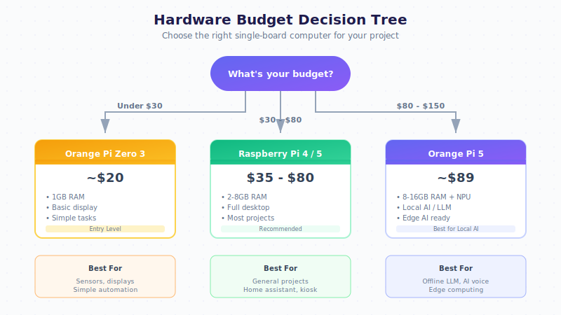

# Beginner's Guide: Buying Your First SBC

A complete guide for beginners who want to buy a Single Board Computer (SBC) and start automating their home or workplace with General Bots.

## What is an SBC?

A Single Board Computer (SBC) is a complete computer on a single circuit board. Unlike a desktop PC, it's:

- **Small** - Credit card to smartphone size
- **Low power** - 2-15 watts (vs 200W+ for a PC)
- **Affordable** - $15-150 depending on power
- **Quiet** - No fans on most models
- **GPIO equipped** - Can connect to sensors and actuators

## Which SBC Should I Buy?

### Decision Flowchart



### Recommended Starter Kits

#### 🌟 Best for Beginners: Raspberry Pi 4 Kit (~$80)

**What to buy:**
- Raspberry Pi 4 Model B (4GB RAM) - $55
- Official power supply (USB-C 5V 3A) - $8
- 32GB microSD card (Class 10) - $8
- Case with heatsink - $10

**Where to buy:**
- [The Pi Hut](https://thepihut.com) (UK)
- [Adafruit](https://adafruit.com) (US)
- [Amazon](https://amazon.com) (Worldwide)
- AliExpress (Budget option, slower shipping)

#### 💰 Budget Option: Orange Pi Zero 3 Kit (~$35)

**What to buy:**
- Orange Pi Zero 3 (1GB RAM) - $20
- 5V 2A power supply - $5
- 16GB microSD card - $5
- Acrylic case - $5

#### 🧠 Best for AI: Orange Pi 5 Kit (~$120)

**What to buy:**
- Orange Pi 5 (8GB RAM) - $89
- 12V 2A power supply - $10
- 64GB microSD or NVMe SSD - $15
- Cooling fan case - $10

This board has a 6 TOPS NPU for accelerated AI inference!

## What Else Do I Need?

### Essential Accessories

| Item | Purpose | Price Range |
|------|---------|-------------|
| microSD Card | Operating system storage | $8-15 |
| Power Supply | Power the board | $8-15 |
| Ethernet Cable | Wired network (faster) | $5 |
| HDMI Cable | Connect to monitor/TV | $5-10 |
| USB Keyboard | Initial setup | $10-20 |

### For Display Projects

| Item | Purpose | Price Range |
|------|---------|-------------|
| **3.5" TFT LCD** | Small color touchscreen | $15-25 |
| **7" HDMI LCD** | Larger display | $40-60 |
| **16x2 LCD** | Simple text display | $5-10 |
| **0.96" OLED** | Tiny status display | $5-8 |

### For Home Automation

| Item | Purpose | Price Range |
|------|---------|-------------|
| **Relay Module (4ch)** | Control lights, appliances | $5-10 |
| **DHT22 Sensor** | Temperature & humidity | $5-8 |
| **PIR Sensor** | Motion detection | $3-5 |
| **Buzzer** | Alerts and notifications | $2-3 |
| **Jumper Wires** | Connect components | $3-5 |
| **Breadboard** | Prototyping | $3-5 |

## Sample Shopping Lists

### Home Temperature Monitor ($45)

Perfect first project - monitor and log temperature!

| Item | Price |
|------|-------|
| Orange Pi Zero 3 (1GB) | $20 |
| 16GB microSD card | $5 |
| 5V 2A power supply | $5 |
| DHT22 temperature sensor | $6 |
| 0.96" OLED display (I2C) | $6 |
| Jumper wires (female-female) | $3 |
| **Total** | **$45** |

### Smart Doorbell ($70)

AI-powered doorbell with notifications!

| Item | Price |
|------|-------|
| Raspberry Pi Zero 2 W | $15 |
| Pi Camera Module | $25 |
| Push button | $1 |
| Piezo buzzer | $2 |
| LED (with resistor) | $1 |
| 16GB microSD card | $5 |
| 5V 2.5A power supply | $8 |
| Case | $5 |
| Jumper wires | $3 |
| **Total** | **$70** |

### Offline AI Assistant ($150)

Run AI completely offline - no internet needed!

| Item | Price |
|------|-------|
| Orange Pi 5 (8GB RAM) | $89 |
| 128GB NVMe SSD | $20 |
| 12V 3A power supply | $12 |
| 7" HDMI touchscreen | $45 |
| USB microphone | $10 |
| Case with fan | $15 |
| Jumper wires | $3 |
| **Total** | **~$195** |

### Voice-Controlled Lights ($55)

Control your lights by talking!

| Item | Price |
|------|-------|
| Raspberry Pi 4 (2GB) | $35 |
| 4-channel relay module | $6 |
| USB microphone | $8 |
| 16GB microSD card | $5 |
| 5V 3A power supply | $8 |
| Jumper wires | $3 |
| **Total** | **~$65** |

## Where to Buy (By Region)

### United States
- **Amazon** - Fast shipping, good returns
- **Adafruit** - Quality accessories, great tutorials
- **SparkFun** - Sensors and components
- **Micro Center** - If you have one nearby!

### Europe
- **The Pi Hut** (UK) - Official Pi reseller
- **Pimoroni** (UK) - Creative accessories
- **Amazon.de/.fr/.es** - Local shipping
- **Conrad** (Germany) - Electronics store

### Asia
- **AliExpress** - Cheapest, 2-4 week shipping
- **Taobao** (China) - Even cheaper if you read Chinese
- **Amazon.co.jp** (Japan)

### South America
- **MercadoLivre** (Brazil) - Local marketplace
- **FilipeFlop** (Brazil) - Arduino/Pi specialist
- **Amazon.com.br** - Limited selection

### Tips for AliExpress
- Check seller ratings (97%+ is good)
- Read reviews with photos
- Expect 2-4 weeks shipping
- Buy from China Direct for best prices
- Consider "Choice" items for faster shipping

## First-Time Setup Guide

### Step 1: Flash the OS

1. Download [Raspberry Pi Imager](https://www.raspberrypi.com/software/)
2. Insert your microSD card
3. Select:
   - **Device**: Your board
   - **OS**: Raspberry Pi OS Lite (64-bit)
   - **Storage**: Your microSD
4. Click **EDIT SETTINGS**:
   - Set hostname: `mybot`
   - Enable SSH
   - Set username/password
   - Configure WiFi
5. Click **WRITE**

### Step 2: First Boot

1. Insert microSD into your SBC
2. Connect power
3. Wait 2 minutes for first boot
4. Find your device:
   ```bash
   # On your computer
   ping mybot.local
   # or check your router's device list
   ```

### Step 3: Connect via SSH

```bash
ssh pi@mybot.local
# Enter your password
```

### Step 4: Install General Bots

```bash
# Quick install
curl -fsSL https://get.generalbots.com | bash

# Or use the deploy script
git clone https://github.com/GeneralBots/botserver.git
cd botserver
./scripts/deploy-embedded.sh --local --with-ui
```

### Step 5: Access the Interface

Open in your browser:
```
http://mybot.local:9000
```

## Common Beginner Mistakes

### ❌ Wrong Power Supply

**Problem**: Board keeps rebooting or won't start

**Solution**: 
- Raspberry Pi 4/5: Use **official** 5V 3A USB-C PSU
- Orange Pi 5: Use **12V** 2A, not 5V!
- Don't use phone chargers - they can't supply enough current

### ❌ Cheap/Slow microSD Card

**Problem**: Slow boot, random crashes, data corruption

**Solution**:
- Buy **Class 10** or **A1/A2** rated cards
- Good brands: SanDisk, Samsung, Kingston
- Avoid no-name cards from AliExpress

### ❌ No Heatsink/Cooling

**Problem**: Board throttles or overheats

**Solution**:
- Always use heatsinks on the CPU
- Consider a fan for Pi 4/5 or Orange Pi 5
- Use a case with ventilation

### ❌ Connecting to Wrong Voltage

**Problem**: Fried components, magic smoke

**Solution**:
- Raspberry Pi GPIO is **3.3V** only!
- Never connect 5V to GPIO pins
- Use level shifters for 5V sensors

## Getting Help

### Community Resources

- [Raspberry Pi Forums](https://forums.raspberrypi.com)
- [Orange Pi Forums](http://www.orangepi.org/orangepibbsen/)
- [General Bots Discord](https://discord.gg/generalbots)
- [r/raspberry_pi](https://reddit.com/r/raspberry_pi)

### Recommended YouTube Channels

- **ExplainingComputers** - Great SBC reviews
- **Jeff Geerling** - Deep Pi tutorials
- **Andreas Spiess** - IoT and sensors
- **DroneBot Workshop** - Beginner friendly

### Books

- "Getting Started with Raspberry Pi" - Matt Richardson
- "Make: Electronics" - Charles Platt

## Next Steps

Once you have your SBC:

1. **[Quick Start Guide](./quick-start.md)** - Get GB running in 5 minutes
2. **[GPIO Keywords](../06-gbdialog/keywords-gpio.md)** - Control hardware with BASIC
3. **[Templates](../02-templates/template-embedded.md)** - Ready-made automation projects
4. **[Local LLM](./local-llm.md)** - Add offline AI capabilities

Happy building! 🤖
