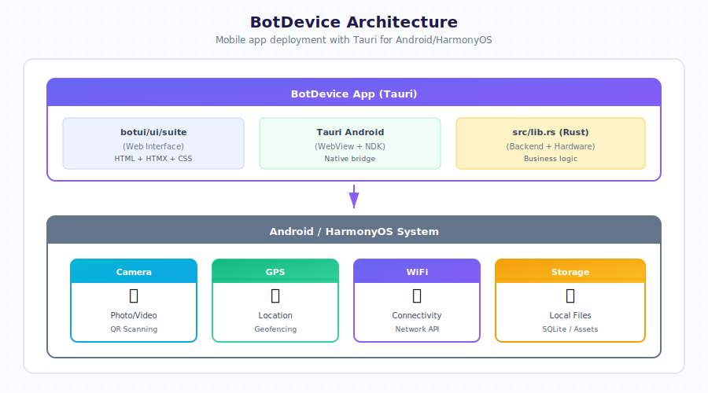

# Mobile Deployment - Android & HarmonyOS

Deploy General Bots as the primary interface on Android and HarmonyOS devices, transforming them into dedicated AI assistants.

## Overview

BotDevice transforms any Android or HarmonyOS device into a dedicated General Bots system, removing manufacturer bloatware and installing GB as the default launcher.



## Supported Platforms

### Android
- **AOSP** - Pure Android
- **Samsung One UI** - Galaxy devices
- **Xiaomi MIUI** - Mi, Redmi, Poco
- **OPPO ColorOS** - OPPO, OnePlus, Realme
- **Vivo Funtouch/OriginOS**
- **Google Pixel**

### HarmonyOS
- **Huawei** - P series, Mate series, Nova
- **Honor** - Magic series, X series

## Installation Levels

| Level | Requirements | What It Does |
|-------|-------------|--------------|
| **Level 1** | ADB only | Removes bloatware, installs BotDevice as app |
| **Level 2** | Root + Magisk | GB boot animation, BotDevice as system app |
| **Level 3** | Unlocked bootloader | Full Android replacement with BotDevice |

## Quick Installation

### Level 1: Debloat + App (No Root)

```bash
# Clone botdevice repository
git clone https://github.com/GeneralBots/botdevice.git
cd botdevice/rom

# Connect device via USB (enable USB debugging first)
./install.sh
```

The interactive installer will:
1. Detect your device and manufacturer
2. Remove bloatware automatically
3. Install BotDevice APK
4. Optionally set as default launcher

### Level 2: Magisk Module (Root Required)

```bash
# Generate Magisk module
cd botdevice/rom/scripts
./build-magisk-module.sh

# Copy to device
adb push botdevice-magisk-v1.0.zip /sdcard/

# Install via Magisk app
# Magisk → Modules → + → Select ZIP → Reboot
```

This adds:
- Custom boot animation
- BotDevice as system app (privileged permissions)
- Debloat via overlay

### Level 3: GSI (Full Replacement)

For advanced users with unlocked bootloader. See `botdevice/rom/gsi/README.md`.

## Bloatware Removed

### Samsung One UI
- Bixby, Samsung Pay, Samsung Pass
- Duplicate apps (Email, Calendar, Browser)
- AR Zone, Game Launcher
- Samsung Free, Samsung Global Goals

### Huawei EMUI/HarmonyOS
- AppGallery, HiCloud, HiCar
- Huawei Browser, Music, Video
- Petal Maps, Petal Search
- AI Life, HiSuite

### Honor MagicOS
- Honor Store, MagicRing
- Honor Browser, Music

### Xiaomi MIUI
- MSA (analytics), Mi Apps
- GetApps, Mi Cloud
- Mi Browser, Mi Music

### Universal (All Devices)
- Pre-installed Facebook, Instagram
- Pre-installed Netflix, Spotify
- Games like Candy Crush
- Carrier bloatware

## Building from Source

### Prerequisites

```bash
# Install Rust and Android targets
rustup target add aarch64-linux-android armv7-linux-androideabi

# Set up Android SDK/NDK
export ANDROID_HOME=$HOME/Android/Sdk
export NDK_HOME=$ANDROID_HOME/ndk/25.2.9519653

# Install Tauri CLI
cargo install tauri-cli

# For icons/boot animation
sudo apt install librsvg2-bin imagemagick
```

### Build APK

```bash
cd botdevice

# Generate icons from SVG
./scripts/generate-icons.sh

# Initialize Android project
cargo tauri android init

# Build release APK
cargo tauri android build --release
```

Output: `gen/android/app/build/outputs/apk/release/app-release.apk`

### Development Mode

```bash
# Connect device and run
cargo tauri android dev

# Watch logs
adb logcat -s BotDevice:*
```

## Configuration

### AndroidManifest.xml

BotDevice is configured as a launcher:

```xml
<intent-filter>
    <action android:name="android.intent.action.MAIN" />
    <category android:name="android.intent.category.HOME" />
    <category android:name="android.intent.category.DEFAULT" />
    <category android:name="android.intent.category.LAUNCHER" />
</intent-filter>
```

### Permissions

Default capabilities in `capabilities/default.json`:
- Internet access
- Camera (for QR codes, photos)
- Location (GPS)
- Storage (files)
- Notifications

### Connecting to Server

Edit the embedded URL in `tauri.conf.json`:

```json
{
  "build": {
    "frontendDist": "../botui/ui/suite"
  }
}
```

Or configure botserver URL at runtime:
```javascript
window.BOTSERVER_URL = "https://your-server.com";
```

## Boot Animation

Create custom boot animation with GB branding:

```bash
# Generate animation
cd botdevice/scripts
./create-bootanimation.sh

# Install (requires root)
adb root
adb remount
adb push bootanimation.zip /system/media/
adb reboot
```

## Project Structure

| Path | Description |
|------|-------------|
| `Cargo.toml` | Rust/Tauri dependencies |
| `tauri.conf.json` | Tauri config → botui/ui/suite |
| `build.rs` | Build script |
| `src/lib.rs` | Android entry point |
| `icons/gb-bot.svg` | Source icon |
| `icons/icon.png` | Main icon (512x512) |
| `icons/*/ic_launcher.png` | Icons by density |
| `scripts/generate-icons.sh` | Generate PNGs from SVG |
| `scripts/create-bootanimation.sh` | Boot animation generator |
| `capabilities/default.json` | Tauri permissions |
| `gen/android/` | Generated Android project |
| `rom/install.sh` | Interactive installer |
| `rom/scripts/debloat.sh` | Remove bloatware |
| `rom/scripts/build-magisk-module.sh` | Magisk module builder |
| `rom/gsi/README.md` | GSI instructions |

## Offline Mode

BotDevice can work offline with local LLM:

1. Install botserver on the device (see [Local LLM](./local-llm.md))
2. Configure to use localhost:
   ```javascript
   window.BOTSERVER_URL = "http://127.0.0.1:9000";
   ```
3. Run llama.cpp with small model (TinyLlama on 4GB+ devices)

## Use Cases

### Dedicated Kiosk
- Retail product information
- Hotel check-in
- Restaurant ordering
- Museum guides

### Enterprise Device
- Field service assistant
- Warehouse scanner with AI
- Delivery driver companion
- Healthcare bedside terminal

### Consumer Device
- Elder-friendly phone
- Child-safe device
- Single-purpose assistant
- Smart home controller

## Troubleshooting

### App Won't Install
```bash
# Enable installation from unknown sources
# Settings → Security → Unknown Sources

# Or use ADB
adb install -r botdevice.apk
```

### Debloat Not Working
```bash
# Some packages require root
# Use Level 2 (Magisk) for complete removal

# Check which packages failed
adb shell pm list packages | grep <manufacturer>
```

### Boot Loop After GSI
```bash
# Boot into recovery
# Wipe data/factory reset
# Reflash stock ROM
```

### WebView Crashes
```bash
# Update Android System WebView
adb shell pm enable com.google.android.webview
