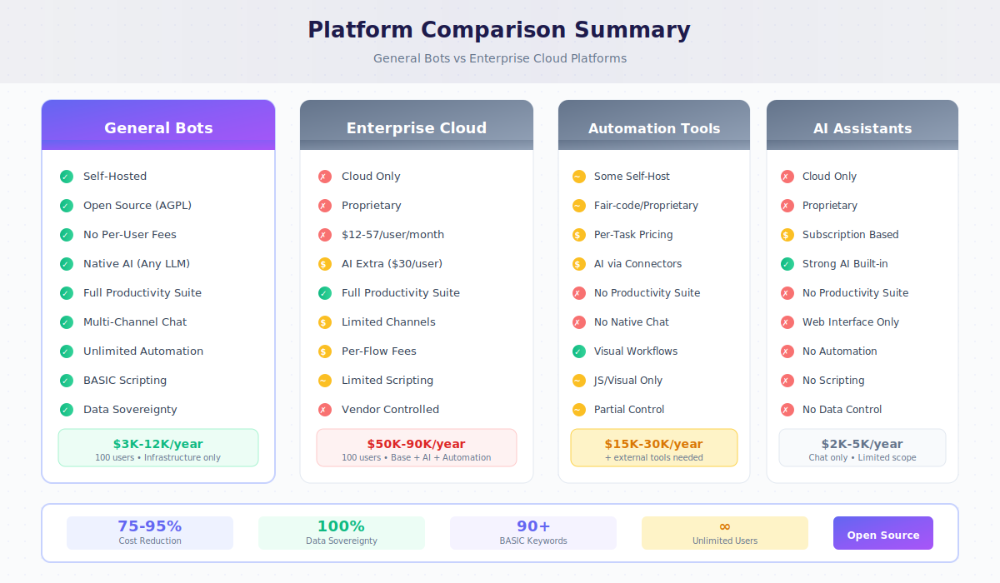

# Platform Comparison Matrix

This comprehensive comparison helps organizations evaluate General Bots against major productivity, automation, and AI platforms.

## Executive Summary

General Bots uniquely combines self-hosted deployment, open source licensing, native AI integration, and powerful BASIC scripting—capabilities that typically require multiple expensive subscriptions across competing platforms.

## Complete Platform Comparison

### Deployment & Licensing

| Capability | General Bots | Microsoft 365 | Google Workspace | n8n | Notion | Perplexity | Claude | Make/Zapier |
|------------|-------------|---------------|------------------|-----|--------|------------|--------|-------------|
| Self-hosted | ✅ Full | ❌ Cloud only | ❌ Cloud only | ✅ Available | ❌ Cloud only | ❌ Cloud only | ❌ Cloud only | ❌ Cloud only |
| Open source | ✅ AGPL | ❌ Proprietary | ❌ Proprietary | ✅ Fair-code | ❌ Proprietary | ❌ Proprietary | ❌ Proprietary | ❌ Proprietary |
| Data sovereignty | ✅ Your servers | ❌ Microsoft servers | ❌ Google servers | ✅ Self-host option | ❌ AWS/GCP | ❌ Their servers | ❌ Anthropic servers | ❌ Their servers |
| Per-user licensing | ✅ None | ❌ $12-57/user/mo | ❌ $6-18/user/mo | ⚠️ Cloud version | ❌ $10-15/user/mo | ❌ $20/mo | ❌ $20/mo | ❌ Per-task pricing |
| Source code access | ✅ Full | ❌ None | ❌ None | ✅ Available | ❌ None | ❌ None | ❌ None | ❌ None |
| Modify & extend | ✅ Unlimited | ❌ API only | ❌ API only | ✅ Possible | ❌ API only | ❌ None | ❌ None | ❌ None |

### Productivity Suite

| Capability | General Bots | Microsoft 365 | Google Workspace | n8n | Notion | Perplexity | Claude | Make/Zapier |
|------------|-------------|---------------|------------------|-----|--------|------------|--------|-------------|
| Email | ✅ Stalwart | ✅ Exchange | ✅ Gmail | ❌ None | ❌ None | ❌ None | ❌ None | ❌ None |
| Calendar | ✅ CalDAV | ✅ Outlook | ✅ Calendar | ❌ None | ❌ Basic | ❌ None | ❌ None | ❌ None |
| File storage | ✅ SeaweedFS | ✅ OneDrive | ✅ Drive | ❌ None | ⚠️ Limited | ❌ None | ❌ None | ❌ None |
| Tasks/Projects | ✅ Full | ✅ Planner | ✅ Tasks | ❌ None | ✅ Strong | ❌ None | ❌ None | ❌ None |
| Video meetings | ✅ LiveKit | ✅ Teams | ✅ Meet | ❌ None | ❌ None | ❌ None | ❌ None | ❌ None |
| Team chat | ✅ Multi-channel | ✅ Teams | ✅ Chat | ❌ None | ⚠️ Comments | ❌ None | ❌ None | ❌ None |
| Document editing | ✅ Available | ✅ Office apps | ✅ Docs/Sheets | ❌ None | ✅ Pages | ❌ None | ❌ None | ❌ None |
| Identity/SSO | ✅ Zitadel | ✅ Entra ID | ✅ Identity | ❌ None | ⚠️ Basic | ❌ None | ❌ None | ❌ None |

### AI & Intelligence

| Capability | General Bots | Microsoft 365 | Google Workspace | n8n | Notion | Perplexity | Claude | Make/Zapier |
|------------|-------------|---------------|------------------|-----|--------|------------|--------|-------------|
| LLM integration | ✅ Any provider | ⚠️ Copilot ($30/user) | ⚠️ Gemini (extra) | ⚠️ Via nodes | ⚠️ Limited | ✅ Built-in | ✅ Built-in | ⚠️ Via connectors |
| Custom prompts | ✅ Full control | ⚠️ Limited | ⚠️ Limited | ✅ Available | ⚠️ Basic | ⚠️ Limited | ✅ Available | ⚠️ Limited |
| RAG/Knowledge base | ✅ Built-in | ⚠️ Extra cost | ⚠️ Extra cost | ⚠️ Custom build | ⚠️ Page search | ⚠️ Pro only | ⚠️ Projects | ❌ None |
| Image generation | ✅ Local SD | ⚠️ Designer | ⚠️ Limited | ⚠️ Via API | ❌ None | ⚠️ Limited | ✅ Available | ⚠️ Via API |
| Video generation | ✅ Zeroscope | ❌ None | ❌ None | ⚠️ Via API | ❌ None | ❌ None | ❌ None | ⚠️ Via API |
| Speech-to-text | ✅ Whisper | ⚠️ Extra | ⚠️ Extra | ⚠️ Via API | ❌ None | ❌ None | ❌ None | ⚠️ Via API |
| Vision/OCR | ✅ BLIP2 | ⚠️ Extra | ⚠️ Extra | ⚠️ Via API | ❌ None | ❌ None | ✅ Available | ⚠️ Via API |
| Local/offline AI | ✅ Full support | ❌ None | ❌ None | ⚠️ Possible | ❌ None | ❌ None | ❌ None | ❌ None |
| AI cost | ✅ Bring your key | ❌ $30/user/mo | ❌ $20/user/mo | ⚠️ API costs | ❌ $10/user/mo | ❌ $20/mo | ❌ $20/mo | ⚠️ Per operation |

### Automation & Integration

| Capability | General Bots | Microsoft 365 | Google Workspace | n8n | Notion | Perplexity | Claude | Make/Zapier |
|------------|-------------|---------------|------------------|-----|--------|------------|--------|-------------|
| Workflow automation | ✅ BASIC scripts | ⚠️ Power Automate ($) | ⚠️ AppSheet ($) | ✅ Visual builder | ⚠️ Basic | ❌ None | ❌ None | ✅ Visual builder |
| Scheduled tasks | ✅ Cron + natural | ⚠️ Extra license | ⚠️ Limited | ✅ Available | ❌ None | ❌ None | ❌ None | ✅ Available |
| Webhooks | ✅ Instant creation | ⚠️ Complex setup | ⚠️ Limited | ✅ Available | ⚠️ Limited | ❌ None | ❌ None | ✅ Available |
| Custom APIs | ✅ One line | ❌ Azure required | ❌ GCP required | ✅ Possible | ❌ None | ❌ None | ✅ API available | ❌ None |
| Database access | ✅ Direct SQL | ⚠️ Dataverse ($) | ⚠️ BigQuery ($) | ✅ Multiple DBs | ⚠️ Notion DBs | ❌ None | ❌ None | ⚠️ Limited |
| REST API calls | ✅ GET/POST/etc | ⚠️ Premium connectors | ⚠️ Limited | ✅ HTTP nodes | ❌ None | ❌ None | ❌ None | ✅ HTTP module |
| GraphQL | ✅ Native | ❌ None | ❌ None | ✅ Available | ❌ None | ❌ None | ❌ None | ⚠️ Limited |
| SOAP/Legacy | ✅ Supported | ⚠️ Limited | ❌ None | ✅ Available | ❌ None | ❌ None | ❌ None | ⚠️ Limited |
| Automation pricing | ✅ Unlimited | ❌ Per-flow fees | ❌ Per-run fees | ⚠️ Execution limits | ❌ None | ❌ None | ❌ None | ❌ Per-task fees |

### Multi-Channel Communication

| Capability | General Bots | Microsoft 365 | Google Workspace | n8n | Notion | Perplexity | Claude | Make/Zapier |
|------------|-------------|---------------|------------------|-----|--------|------------|--------|-------------|
| Web chat | ✅ Built-in | ⚠️ Bot Framework | ❌ None | ❌ None | ❌ None | ✅ Web only | ✅ Web only | ❌ None |
| WhatsApp | ✅ Native | ⚠️ Extra setup | ❌ None | ⚠️ Via nodes | ❌ None | ❌ None | ❌ None | ⚠️ Connector |
| Teams | ✅ Native | ✅ Native | ❌ None | ⚠️ Via nodes | ❌ None | ❌ None | ❌ None | ⚠️ Connector |
| Slack | ✅ Native | ⚠️ Connector | ⚠️ Limited | ⚠️ Via nodes | ⚠️ Integration | ❌ None | ⚠️ Integration | ⚠️ Connector |
| Telegram | ✅ Native | ❌ None | ❌ None | ⚠️ Via nodes | ❌ None | ❌ None | ❌ None | ⚠️ Connector |
| SMS | ✅ Native | ⚠️ Extra | ❌ None | ⚠️ Via nodes | ❌ None | ❌ None | ❌ None | ⚠️ Connector |
| Email bot | ✅ Native | ⚠️ Complex | ⚠️ Limited | ⚠️ Via nodes | ❌ None | ❌ None | ❌ None | ⚠️ Connector |
| Voice | ✅ LiveKit | ⚠️ Extra | ⚠️ Extra | ❌ None | ❌ None | ❌ None | ❌ None | ❌ None |

### Developer Experience

| Capability | General Bots | Microsoft 365 | Google Workspace | n8n | Notion | Perplexity | Claude | Make/Zapier |
|------------|-------------|---------------|------------------|-----|--------|------------|--------|-------------|
| Scripting language | ✅ BASIC (simple) | ⚠️ Power Fx | ⚠️ Apps Script | ✅ JavaScript | ❌ None | ❌ None | ❌ None | ❌ Visual only |
| No-code option | ✅ Conversational | ⚠️ Power Apps | ⚠️ AppSheet | ✅ Visual builder | ✅ Pages | ✅ Chat | ✅ Chat | ✅ Visual builder |
| Custom keywords | ✅ Rust extensible | ❌ None | ❌ None | ✅ Custom nodes | ❌ None | ❌ None | ❌ None | ❌ None |
| API-first | ✅ Full REST | ✅ Graph API | ✅ Workspace API | ✅ REST API | ⚠️ Limited | ⚠️ Limited | ✅ Full API | ⚠️ Limited |
| Debugging | ✅ Console + logs | ⚠️ Complex | ⚠️ Complex | ✅ Execution logs | ❌ None | ❌ None | ❌ None | ⚠️ Limited |
| Version control | ✅ File-based | ⚠️ Limited | ⚠️ Limited | ✅ Git support | ⚠️ Page history | ❌ None | ❌ None | ⚠️ Limited |

### Security & Compliance

| Capability | General Bots | Microsoft 365 | Google Workspace | n8n | Notion | Perplexity | Claude | Make/Zapier |
|------------|-------------|---------------|------------------|-----|--------|------------|--------|-------------|
| Data residency control | ✅ Your choice | ⚠️ Limited regions | ⚠️ Limited regions | ✅ Self-host | ❌ US/EU only | ❌ No control | ❌ No control | ❌ No control |
| GDPR compliance | ✅ Self-managed | ✅ Available | ✅ Available | ✅ Self-host | ⚠️ Depends | ⚠️ Limited | ⚠️ Limited | ⚠️ Limited |
| HIPAA capable | ✅ Self-managed | ⚠️ Extra cost | ⚠️ Extra cost | ✅ Self-host | ❌ No | ❌ No | ❌ No | ❌ No |
| Audit logs | ✅ Full control | ✅ Available | ✅ Available | ✅ Available | ⚠️ Limited | ❌ Limited | ❌ Limited | ⚠️ Limited |
| Encryption at rest | ✅ Configurable | ✅ Standard | ✅ Standard | ✅ Configurable | ✅ Standard | ✅ Standard | ✅ Standard | ✅ Standard |
| SSO/OIDC | ✅ Zitadel | ✅ Entra | ✅ Identity | ⚠️ Enterprise | ⚠️ Business | ❌ Basic | ⚠️ Enterprise | ⚠️ Enterprise |
| MFA | ✅ Built-in | ✅ Built-in | ✅ Built-in | ⚠️ Configure | ⚠️ Basic | ⚠️ Basic | ⚠️ Basic | ⚠️ Basic |

## Cost Analysis (100 Users, Annual)

| Platform | Base License | AI Features | Automation | Storage | Total Annual |
|----------|-------------|-------------|------------|---------|--------------|
| **General Bots** | $0 | $0 (bring key) | $0 | Included | **$3,000-12,000*** |
| Microsoft 365 E3 + Copilot | $43,200 | $36,000 | $12,000+ | Included | **$91,200+** |
| Google Workspace Business + Gemini | $21,600 | $24,000 | $6,000+ | Included | **$51,600+** |
| n8n Cloud + separate tools | $0-6,000 | API costs | Included | None | **$20,000+** |
| Notion Team + AI | $12,000 | $12,000 | None | Limited | **$24,000** |
| Multiple point solutions | Varies | Varies | Varies | Varies | **$50,000+** |

*General Bots cost = infrastructure + optional LLM API usage

## Feature Availability by Use Case

### Customer Service Bot

| Requirement | General Bots | Microsoft | Google | n8n | Notion | AI Assistants |
|-------------|-------------|-----------|--------|-----|--------|---------------|
| Knowledge base | ✅ | ⚠️ Extra | ⚠️ Extra | ⚠️ Build | ⚠️ Limited | ⚠️ Limited |
| WhatsApp channel | ✅ | ⚠️ Complex | ❌ | ⚠️ Build | ❌ | ❌ |
| Web widget | ✅ | ⚠️ Complex | ❌ | ❌ | ❌ | ❌ |
| Ticket creation | ✅ | ⚠️ Extra | ⚠️ Extra | ✅ | ⚠️ Manual | ❌ |
| Human handoff | ✅ | ⚠️ Extra | ❌ | ⚠️ Build | ❌ | ❌ |
| Analytics | ✅ | ⚠️ Extra | ⚠️ Extra | ⚠️ Build | ❌ | ❌ |

### Internal Automation

| Requirement | General Bots | Microsoft | Google | n8n | Notion | AI Assistants |
|-------------|-------------|-----------|--------|-----|--------|---------------|
| Scheduled reports | ✅ | ⚠️ Extra | ⚠️ Extra | ✅ | ❌ | ❌ |
| Database sync | ✅ | ⚠️ Extra | ⚠️ Extra | ✅ | ❌ | ❌ |
| API orchestration | ✅ | ⚠️ Premium | ⚠️ Limited | ✅ | ❌ | ❌ |
| Document processing | ✅ | ⚠️ Extra | ⚠️ Extra | ⚠️ Build | ❌ | ⚠️ Limited |
| Email automation | ✅ | ✅ | ✅ | ✅ | ❌ | ❌ |
| Custom logic | ✅ | ⚠️ Limited | ⚠️ Limited | ✅ | ❌ | ❌ |

### Team Collaboration

| Requirement | General Bots | Microsoft | Google | n8n | Notion | AI Assistants |
|-------------|-------------|-----------|--------|-----|--------|---------------|
| Project management | ✅ | ✅ | ✅ | ❌ | ✅ | ❌ |
| Team chat | ✅ | ✅ | ✅ | ❌ | ⚠️ | ❌ |
| File sharing | ✅ | ✅ | ✅ | ❌ | ⚠️ | ❌ |
| Video meetings | ✅ | ✅ | ✅ | ❌ | ❌ | ❌ |
| AI assistant | ✅ | ⚠️ Extra | ⚠️ Extra | ⚠️ Build | ⚠️ Extra | ✅ |
| Self-hosted | ✅ | ❌ | ❌ | ✅ | ❌ | ❌ |

## Migration Complexity

| From Platform | To General Bots | Effort | Data Portability | Tool Support |
|---------------|-----------------|--------|------------------|--------------|
| Microsoft 365 | Full migration | Medium | Good (APIs) | Scripts provided |
| Google Workspace | Full migration | Medium | Good (APIs) | Scripts provided |
| n8n | Automation only | Low | Easy (JSON) | Direct import |
| Notion | Content migration | Low | Good (Export) | Scripts provided |
| Zapier/Make | Workflow rebuild | Medium | Manual | Templates available |
| Custom solution | Varies | Varies | Depends | API compatible |

## Decision Matrix

### Choose General Bots when you need:

- ✅ Complete data sovereignty and self-hosting
- ✅ No per-user licensing costs at scale
- ✅ Native AI without additional subscriptions
- ✅ Full productivity suite in one platform
- ✅ Multi-channel chatbot deployment
- ✅ Powerful automation without limits
- ✅ Open source transparency and extensibility
- ✅ Custom integrations and modifications

### Consider alternatives when:

- You require specific certifications only available from large vendors
- Your organization mandates a particular cloud provider
- You have no infrastructure or IT capacity for self-hosting
- You need only a single narrow feature (e.g., just document editing)

## Summary

General Bots provides the most comprehensive feature set for organizations seeking:

| Advantage | Impact |
|-----------|--------|
| **75-95% cost reduction** | Eliminate per-user fees, AI add-ons, automation limits |
| **Complete data control** | Self-hosted, your infrastructure, your rules |
| **Unified platform** | Email, files, chat, automation, AI in one system |
| **No artificial limits** | Unlimited users, workflows, API calls, storage |
| **Full transparency** | Open source code, audit everything |
| **Future-proof** | No vendor lock-in, standard formats, portable data |

The combination of enterprise productivity features, native AI, powerful automation, and self-hosted deployment makes General Bots unique in the market—delivering capabilities that would otherwise require subscriptions to multiple expensive platforms.

## See Also

- [Migration Overview](./overview.md) - Getting started
- [Migration Resources](./resources.md) - Tools and templates
- [Enterprise Platform Migration](./microsoft-365.md) - Detailed migration guide
- [Quick Start](../01-getting-started/quick-start.md) - Deploy in minutes