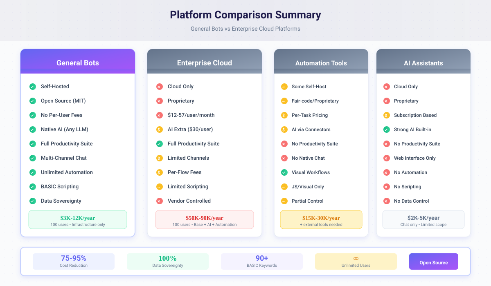

# Platform Comparison Matrix 🟡 BETA

This comprehensive comparison helps organizations evaluate General Bots against major productivity, automation, and AI platforms.

> **Legend:** ✅ provided · ⚠️ partial, integration-only or extra cost · ❌ not offered · — not applicable.
>
> **Competitor data verified 2026-09-13.** OpenClaw from `openclaw.ai` and `steipete.me/posts/2026/openclaw`; OpenAI Frontier from OpenAI's launch material and published coverage. OpenClaw became foundation-backed and OpenAI-affiliated in February 2026. Where a vendor has not published a capability, the cell reads — rather than a guess.

## Executive Summary

General Bots uniquely combines self-hosted deployment, open source licensing, native AI integration, and powerful BASIC scripting—capabilities that typically require multiple expensive subscriptions across competing platforms.

## Complete Platform Comparison

### Deployment & Licensing

| Capability | General Bots | Microsoft 365 | Google Workspace | n8n | Notion | Perplexity | Claude | Make/Zapier | OpenClaw | OpenAI Frontier |
|------------|-------------|---------------|------------------|-----|--------|------------|--------|------------- |--------------|----------------------|
| Self-hosted | ✅ Full | ❌ Cloud only | ❌ Cloud only | ✅ Available | ❌ Cloud only | ❌ Cloud only | ❌ Cloud only | ❌ Cloud only | ✅ Runs on your machine | ❌ Managed cloud |
| Open source | ✅ MIT | ❌ Proprietary | ❌ Proprietary | ✅ Fair-code | ❌ Proprietary | ❌ Proprietary | ❌ Proprietary | ❌ Proprietary | ✅ Foundation-backed | ❌ Proprietary |
| Data sovereignty | ✅ Your servers | ❌ Microsoft servers | ❌ Google servers | ✅ Self-host option | ❌ AWS/GCP | ❌ Their servers | ❌ Anthropic servers | ❌ Their servers | ✅ Your devices | ❌ OpenAI-hosted |
| Per-user licensing | ✅ None | ❌ $12-57/user/mo | ❌ $6-18/user/mo | ⚠️ Cloud version | ❌ $10-15/user/mo | ❌ $20/mo | ❌ $20/mo | ❌ Per-task pricing | ✅ None | ❌ Enterprise contract |
| Source code access | ✅ Full | ❌ None | ❌ None | ✅ Available | ❌ None | ❌ None | ❌ None | ❌ None | ✅ Full | ❌ None |
| Modify & extend | ✅ Unlimited | ❌ API only | ❌ API only | ✅ Possible | ❌ API only | ❌ None | ❌ None | ❌ None | ✅ Skills and plugins | ⚠️ APIs and SDKs |

### Productivity Suite

| Capability | General Bots | Microsoft 365 | Google Workspace | n8n | Notion | Perplexity | Claude | Make/Zapier | OpenClaw | OpenAI Frontier |
|------------|-------------|---------------|------------------|-----|--------|------------|--------|------------- |--------------|----------------------|
| Email | ✅ Stalwart | ✅ Exchange | ✅ Gmail | ❌ None | ❌ None | ❌ None | ❌ None | ❌ None | ⚠️ Acts on your inbox | ⚠️ Via integrations |
| Calendar | ✅ CalDAV | ✅ Outlook | ✅ Calendar | ❌ None | ❌ Basic | ❌ None | ❌ None | ❌ None | ⚠️ Acts on your calendar | ⚠️ Via integrations |
| File storage | ✅ MinIO | ✅ OneDrive | ✅ Drive | ❌ None | ⚠️ Limited | ❌ None | ❌ None | ❌ None | ⚠️ Local filesystem | ⚠️ Connects existing repositories |
| Tasks/Projects | ✅ Full | ✅ Planner | ✅ Tasks | ❌ None | ✅ Strong | ❌ None | ❌ None | ❌ None | ⚠️ Agent run history | ⚠️ Agent execution engine |
| Video meetings | ✅ LiveKit | ✅ Teams | ✅ Meet | ❌ None | ❌ None | ❌ None | ❌ None | ❌ None | ❌ None | ❌ None |
| Team chat | ✅ Multi-channel | ✅ Teams | ✅ Chat | ❌ None | ⚠️ Comments | ❌ None | ❌ None | ❌ None | ✅ WhatsApp, Telegram, Slack, Teams | ❌ None |
| Document editing | ✅ Available | ✅ Office apps | ✅ Docs/Sheets | ❌ None | ✅ Pages | ❌ None | ❌ None | ❌ None | ❌ None | ❌ None |
| Identity/SSO | ✅ Zitadel | ✅ Entra ID | ✅ Identity | ❌ None | ⚠️ Basic | ❌ None | ❌ None | ❌ None | ⚠️ Local accounts | ✅ Enterprise identity and governance |

### AI & Intelligence

| Capability | General Bots | Microsoft 365 | Google Workspace | n8n | Notion | Perplexity | Claude | Make/Zapier | OpenClaw | OpenAI Frontier |
|------------|-------------|---------------|------------------|-----|--------|------------|--------|------------- |--------------|----------------------|
| LLM integration | ✅ Any provider | ⚠️ Copilot ($30/user) | ⚠️ Gemini (extra) | ⚠️ Via nodes | ⚠️ Limited | ✅ Built-in | ✅ Built-in | ⚠️ Via connectors | ✅ Bring your own model | ✅ Multi-vendor agent management |
| Custom prompts | ✅ Full control | ⚠️ Limited | ⚠️ Limited | ✅ Available | ⚠️ Basic | ⚠️ Limited | ✅ Available | ⚠️ Limited | ✅ Full control | ⚠️ Agent configuration |
| RAG/Knowledge base | ✅ Built-in | ⚠️ Extra cost | ⚠️ Extra cost | ⚠️ Custom build | ⚠️ Page search | ⚠️ Pro only | ⚠️ Projects | ❌ None | ⚠️ Local files and context | ✅ Shared business context |
| Image generation | ✅ Local SD | ⚠️ Designer | ⚠️ Limited | ⚠️ Via API | ❌ None | ⚠️ Limited | ✅ Available | ⚠️ Via API | ⚠️ Via provider | ❌ None |
| Video generation | ✅ Zeroscope | ❌ None | ❌ None | ⚠️ Via API | ❌ None | ❌ None | ❌ None | ⚠️ Via API | ⚠️ Via provider | ❌ None |
| Speech-to-text | ✅ Whisper | ⚠️ Extra | ⚠️ Extra | ⚠️ Via API | ❌ None | ❌ None | ❌ None | ⚠️ Via API | ⚠️ Via provider | ❌ None |
| Vision/OCR | ✅ BLIP2 | ⚠️ Extra | ⚠️ Extra | ⚠️ Via API | ❌ None | ❌ None | ✅ Available | ⚠️ Via API | ✅ Via models | ⚠️ Via models |
| Local/offline AI | ✅ Full support | ❌ None | ❌ None | ⚠️ Possible | ❌ None | ❌ None | ❌ None | ❌ None | ⚠️ Local model setup | ❌ None |
| AI cost | ✅ Bring your key | ❌ $30/user/mo | ❌ $20/user/mo | ⚠️ API costs | ❌ $10/user/mo | ❌ $20/mo | ❌ $20/mo | ⚠️ Per operation | ✅ Your key or subscription | ❌ Enterprise contract |

### Automation & Integration

| Capability | General Bots | Microsoft 365 | Google Workspace | n8n | Notion | Perplexity | Claude | Make/Zapier | OpenClaw | OpenAI Frontier |
|------------|-------------|---------------|------------------|-----|--------|------------|--------|------------- |--------------|----------------------|
| Workflow automation | ✅ BASIC scripts | ⚠️ Power Automate ($) | ⚠️ AppSheet ($) | ✅ Visual builder | ⚠️ Basic | ❌ None | ❌ None | ✅ Visual builder | ✅ Skills and agent tasks | ✅ Multi-step agent execution |
| Scheduled tasks | ✅ Cron + natural | ⚠️ Extra license | ⚠️ Limited | ✅ Available | ❌ None | ❌ None | ❌ None | ✅ Available | ✅ Scheduled agents | ✅ Task queuing and state |
| Webhooks | ✅ Instant creation | ⚠️ Complex setup | ⚠️ Limited | ✅ Available | ⚠️ Limited | ❌ None | ❌ None | ✅ Available | ⚠️ Via plugins | ⚠️ Via APIs |
| Custom APIs | ✅ One line | ❌ Azure required | ❌ GCP required | ✅ Possible | ❌ None | ❌ None | ✅ API available | ❌ None | ⚠️ Plugins in TypeScript | ✅ APIs and SDKs |
| Database access | ✅ Direct SQL | ⚠️ Dataverse ($) | ⚠️ BigQuery ($) | ✅ Multiple DBs | ⚠️ Notion DBs | ❌ None | ❌ None | ⚠️ Limited | ⚠️ Via tools | ✅ Connects data warehouses |
| REST API calls | ✅ GET/POST/etc | ⚠️ Premium connectors | ⚠️ Limited | ✅ HTTP nodes | ❌ None | ❌ None | ❌ None | ✅ HTTP module | ✅ Via skills | ✅ Via SDKs |
| GraphQL | ✅ Native | ❌ None | ❌ None | ✅ Available | ❌ None | ❌ None | ❌ None | ⚠️ Limited | — | — |
| SOAP/Legacy | ✅ Supported | ⚠️ Limited | ❌ None | ✅ Available | ❌ None | ❌ None | ❌ None | ⚠️ Limited | — | — |
| Automation pricing | ✅ Unlimited | ❌ Per-flow fees | ❌ Per-run fees | ⚠️ Execution limits | ❌ None | ❌ None | ❌ None | ❌ Per-task fees | ✅ No platform fee | ❌ Enterprise contract |

### Multi-Channel Communication

| Capability | General Bots | Microsoft 365 | Google Workspace | n8n | Notion | Perplexity | Claude | Make/Zapier | OpenClaw | OpenAI Frontier |
|------------|-------------|---------------|------------------|-----|--------|------------|--------|------------- |--------------|----------------------|
| Web chat | ✅ Built-in | ⚠️ Bot Framework | ❌ None | ❌ None | ❌ None | ✅ Web only | ✅ Web only | ❌ None | ⚠️ Desktop and local UI | ❌ Not a chat product |
| WhatsApp | ✅ Native | ⚠️ Extra setup | ❌ None | ⚠️ Via nodes | ❌ None | ❌ None | ❌ None | ⚠️ Connector | ✅ Native | ❌ None |
| Teams | ✅ Native | ✅ Native | ❌ None | ⚠️ Via nodes | ❌ None | ❌ None | ❌ None | ⚠️ Connector | ✅ Native | ❌ None |
| Slack | ✅ Native | ⚠️ Connector | ⚠️ Limited | ⚠️ Via nodes | ⚠️ Integration | ❌ None | ⚠️ Integration | ⚠️ Connector | ✅ Native | ❌ None |
| Telegram | ✅ Native | ❌ None | ❌ None | ⚠️ Via nodes | ❌ None | ❌ None | ❌ None | ⚠️ Connector | ✅ Native | ❌ None |
| SMS | ✅ Native | ⚠️ Extra | ❌ None | ⚠️ Via nodes | ❌ None | ❌ None | ❌ None | ⚠️ Connector | ⚠️ Via Twilio or provider | ❌ None |
| Email bot | ✅ Native | ⚠️ Complex | ⚠️ Limited | ⚠️ Via nodes | ❌ None | ❌ None | ❌ None | ⚠️ Connector | ⚠️ Acts on your inbox | ❌ None |
| Voice | ✅ LiveKit | ⚠️ Extra | ⚠️ Extra | ❌ None | ❌ None | ❌ None | ❌ None | ❌ None | ✅ Realtime voice models | ❌ None |

### Developer Experience

| Capability | General Bots | Microsoft 365 | Google Workspace | n8n | Notion | Perplexity | Claude | Make/Zapier | OpenClaw | OpenAI Frontier |
|------------|-------------|---------------|------------------|-----|--------|------------|--------|------------- |--------------|----------------------|
| Scripting language | ✅ BASIC (simple) | ⚠️ Power Fx | ⚠️ Apps Script | ✅ JavaScript | ❌ None | ❌ None | ❌ None | ❌ Visual only | ✅ TypeScript skills | ❌ Not a low-code builder |
| No-code option | ✅ Conversational | ⚠️ Power Apps | ⚠️ AppSheet | ✅ Visual builder | ✅ Pages | ✅ Chat | ✅ Chat | ✅ Visual builder | ✅ Conversational setup | ⚠️ Agent onboarding flows |
| Custom keywords | ✅ Rust extensible | ❌ None | ❌ None | ✅ Custom nodes | ❌ None | ❌ None | ❌ None | ❌ None | ⚠️ Skills and plugins | ⚠️ SDKs |
| API-first | ✅ Full REST | ✅ Graph API | ✅ Workspace API | ✅ REST API | ⚠️ Limited | ⚠️ Limited | ✅ Full API | ⚠️ Limited | ⚠️ Local gateway | ✅ APIs and SDKs |
| Debugging | ✅ Console + logs | ⚠️ Complex | ⚠️ Complex | ✅ Execution logs | ❌ None | ❌ None | ❌ None | ⚠️ Limited | ⚠️ Local logs | ✅ Auditing and observability |
| Version control | ✅ File-based | ⚠️ Limited | ⚠️ Limited | ✅ Git support | ⚠️ Page history | ❌ None | ❌ None | ⚠️ Limited | ✅ Git source | — |

### Security & Compliance

| Capability | General Bots | Microsoft 365 | Google Workspace | n8n | Notion | Perplexity | Claude | Make/Zapier | OpenClaw | OpenAI Frontier |
|------------|-------------|---------------|------------------|-----|--------|------------|--------|------------- |--------------|----------------------|
| Data residency control | ✅ Your choice | ⚠️ Limited regions | ⚠️ Limited regions | ✅ Self-host | ❌ US/EU only | ❌ No control | ❌ No control | ❌ No control | ✅ Your devices | ⚠️ Region terms not published |
| GDPR compliance | ✅ Self-managed | ✅ Available | ✅ Available | ✅ Self-host | ⚠️ Depends | ⚠️ Limited | ⚠️ Limited | ⚠️ Limited | ⚠️ Self-managed | ✅ Enterprise program |
| HIPAA capable | ✅ Self-managed | ⚠️ Extra cost | ⚠️ Extra cost | ✅ Self-host | ❌ No | ❌ No | ❌ No | ❌ No | ⚠️ Self-managed | ⚠️ Enterprise agreement |
| Audit logs | ✅ Full control | ✅ Available | ✅ Available | ✅ Available | ⚠️ Limited | ❌ Limited | ❌ Limited | ⚠️ Limited | ⚠️ Local logs | ✅ Explicit permissions and auditing |
| Encryption at rest | ✅ Configurable | ✅ Standard | ✅ Standard | ✅ Configurable | ✅ Standard | ✅ Standard | ✅ Standard | ✅ Standard | ⚠️ Configurable | ✅ Standard |
| SSO/OIDC | ✅ Zitadel | ✅ Entra | ✅ Identity | ⚠️ Enterprise | ⚠️ Business | ❌ Basic | ⚠️ Enterprise | ⚠️ Enterprise | ❌ Personal use | ✅ Enterprise identity |
| MFA | ✅ Built-in | ✅ Built-in | ✅ Built-in | ⚠️ Configure | ⚠️ Basic | ⚠️ Basic | ⚠️ Basic | ⚠️ Basic | ⚠️ Device-level | ✅ Enterprise |

### Agent Platforms (2026)

The comparison above covers productivity suites and automation tools. The 2026 market also contains dedicated **agent platforms**, which compete with General Bots on different ground. Two matter most:

| Aspect | General Bots | OpenClaw | OpenAI Frontier |
|--------|--------------|----------|-----------------|
| What it is | Organisational agent + productivity suite | Personal agent on your own machine | Enterprise agent management layer |
| Deployment | Self-hosted | Self-hosted (your devices) | Managed cloud |
| Licence | MIT | Open source (foundation-backed) | Proprietary |
| Data location | Your servers | Your devices | OpenAI-hosted |
| Primary user | A team or organisation | An individual | A large enterprise |
| Channel reach | Web chat, WhatsApp, Teams, Slack, Telegram, SMS, email, voice | WhatsApp, Telegram, Discord, iMessage, Slack, Teams | None — not a chat product |
| Productivity suite | Included (mail, calendar, files, tasks, meetings, office apps) | Acts on your existing tools | Connects to your systems of record |
| Governance | RBAC, audit logs, admin console | Device-level, personal use | Permissions, auditing, explicit controls |
| Self-serve | Yes | Yes | No — enterprise contracts |
| Maturity | Early preview (Chat, Explorer, Vibe stable) | Widely deployed personal agent | Fortune 500 deployments |

Read the full positioning in [OpenClaw and General Bots](./openclaw.md) and [OpenAI Frontier and General Bots](./openai-frontier.md).

## Cost Analysis (100 Users, Annual)

| Platform | Base License | AI Features | Automation | Storage | Total Annual |
|----------|-------------|-------------|------------|---------|--------------|
| **General Bots** | $0 | $0 (bring key) | $0 | Included | **$3,000-12,000*** |
| Microsoft 365 E3 + Copilot | $43,200 | $36,000 | $12,000+ | Included | **$91,200+** |
| Google Workspace Business + Gemini | $21,600 | $24,000 | $6,000+ | Included | **$51,600+** |
| n8n Cloud + separate tools | $0-6,000 | API costs | Included | None | **$20,000+** |
| Notion Team + AI | $12,000 | $12,000 | None | Limited | **$24,000** |
| Multiple point solutions | Varies | Varies | Varies | Varies | **$50,000+** |
| **OpenClaw** | $0 | Your model spend | $0 | Your own disks | **Model spend only** |
| **OpenAI Frontier** | Enterprise contract | Included | Included | Enterprise agreement | **Not published** |

*General Bots cost = infrastructure + optional LLM API usage. OpenClaw has no platform fee but runs against a model you pay for, unless you host a local model. OpenAI Frontier is sold as an enterprise agreement and its pricing is not public.

## Feature Availability by Use Case

### Customer Service Bot

| Requirement | General Bots | Microsoft | Google | n8n | Notion | AI Assistants |
|-------------|-------------|-----------|--------|-----|--------|---------------|
| Knowledge base | ✅ | ⚠️ Extra | ⚠️ Extra | ⚠️ Build | ⚠️ Limited | ⚠️ Limited |
| WhatsApp channel | ✅ | ⚠️ Complex | ❌ | ⚠️ Build | ❌ | ❌ |
| Web widget | ✅ | ⚠️ Complex | ❌ | ❌ | ❌ | ❌ |
| Ticket creation | ✅ | ⚠️ Extra | ⚠️ Extra | ✅ | ⚠️ Manual | ❌ |
| Human handoff | ✅ | ⚠️ Extra | ❌ | ⚠️ Build | ❌ | ❌ |
| Analytics | ✅ | ⚠️ Extra | ⚠️ Extra | ⚠️ Build | ❌ | ❌ |

### Internal Automation

| Requirement | General Bots | Microsoft | Google | n8n | Notion | AI Assistants |
|-------------|-------------|-----------|--------|-----|--------|---------------|
| Scheduled reports | ✅ | ⚠️ Extra | ⚠️ Extra | ✅ | ❌ | ❌ |
| Database sync | ✅ | ⚠️ Extra | ⚠️ Extra | ✅ | ❌ | ❌ |
| API orchestration | ✅ | ⚠️ Premium | ⚠️ Limited | ✅ | ❌ | ❌ |
| Document processing | ✅ | ⚠️ Extra | ⚠️ Extra | ⚠️ Build | ❌ | ⚠️ Limited |
| Email automation | ✅ | ✅ | ✅ | ✅ | ❌ | ❌ |
| Custom logic | ✅ | ⚠️ Limited | ⚠️ Limited | ✅ | ❌ | ❌ |

### Team Collaboration

| Requirement | General Bots | Microsoft | Google | n8n | Notion | AI Assistants |
|-------------|-------------|-----------|--------|-----|--------|---------------|
| Project management | ✅ | ✅ | ✅ | ❌ | ✅ | ❌ |
| Team chat | ✅ | ✅ | ✅ | ❌ | ⚠️ | ❌ |
| File sharing | ✅ | ✅ | ✅ | ❌ | ⚠️ | ❌ |
| Video meetings | ✅ | ✅ | ✅ | ❌ | ❌ | ❌ |
| AI assistant | ✅ | ⚠️ Extra | ⚠️ Extra | ⚠️ Build | ⚠️ Extra | ✅ |
| Self-hosted | ✅ | ❌ | ❌ | ✅ | ❌ | ❌ |

## Migration Complexity

| From Platform | To General Bots | Effort | Data Portability | Tool Support |
|---------------|-----------------|--------|------------------|--------------|
| Microsoft 365 | Full migration | Medium | Good (APIs) | Scripts provided |
| Google Workspace | Full migration | Medium | Good (APIs) | Scripts provided |
| n8n | Automation only | Low | Easy (JSON) | Direct import |
| Notion | Content migration | Low | Good (Export) | Scripts provided |
| Zapier/Make | Workflow rebuild | Medium | Manual | Templates available |
| Custom solution | Varies | Varies | Depends | API compatible |

## Decision Matrix

### Choose General Bots when you need:

- ✅ Complete data sovereignty and self-hosting
- ✅ No per-user licensing costs at scale
- ✅ Native AI without additional subscriptions
- ✅ Full productivity suite in one platform
- ✅ Multi-channel chatbot deployment
- ✅ Powerful automation without limits
- ✅ Open source transparency and extensibility
- ✅ Custom integrations and modifications

### Consider alternatives when:

- You require specific certifications only available from large vendors
- Your organization mandates a particular cloud provider
- You have no infrastructure or IT capacity for self-hosting
- You need only a single narrow feature (e.g., just document editing)
- **A managed multi-channel personal assistant is the whole requirement** — [OpenClaw](./openclaw.md) is closer to that shape than a platform you operate yourself
- **You need agent governance across systems of record** — identity, permissions and audit across existing enterprise systems is what [OpenAI Frontier](./openai-frontier.md) is built for

## Summary

| Advantage | Impact |
|-----------|--------|
| **No per-user licence** | Users are not metered; the cost is infrastructure and model usage |
| **Complete data control** | Self-hosted, your infrastructure, your rules |
| **Unified platform** | Email, files, chat, automation and AI in one system |
| **High ceilings, honestly bounded** | Limits exist and are documented — see [System Limits](../10-configuration-deployment/system-limits.md) |
| **Full transparency** | Open source, auditable |
| **Portable data** | Standard formats, no vendor lock-in |

Cost depends entirely on the infrastructure and model you run; this page does not
quote a percentage saving, because the comparison depends on which subscriptions
are actually replaced. The per-platform figures above are the basis for your own
arithmetic.

The combination of productivity features, native AI, automation and self-hosted
deployment is what distinguishes General Bots from platforms that require
per-user subscriptions — but it is not the only shape that fits every
organisation, which is why the two comparisons above exist.

## See Also

- [OpenClaw and General Bots](./openclaw.md) - Personal-agent comparison
- [OpenAI Frontier and General Bots](./openai-frontier.md) - Enterprise agent-platform comparison
- [Migration Overview](./overview.md) - Getting started
- [Migration Resources](./resources.md) - Tools and templates
- [Enterprise Platform Migration](./microsoft-365.md) - Detailed migration guide
- [Quick Start](../01-getting-started/quick-start.md) - Deploy in minutes