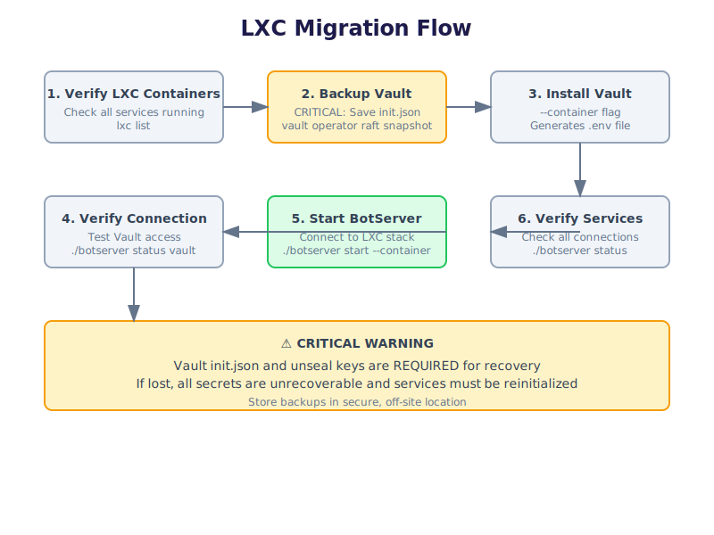

# Migrating BotServer to LXC Containers

This guide explains how to migrate botserver to connect with already-running LXC containers. This setup allows General Bots to control containers directly. This is useful when you need to reinstall or update botserver while keeping your existing services running.

---

## Overview

When working with LXC containerized deployments, you may need to:
- Migrate botserver to existing LXC containers
- Update botserver binary while LXC containers continue running
- Reconnect to an existing stack after a fresh botserver installation
- Recover from a corrupted botserver installation



## ⚠️ Critical Warning

**Vault data loss is permanent and unrecoverable!**

Before proceeding:

1. **Backup Vault init.json**
   ```bash
   # Copy to secure location
   cp botserver-stack/conf/vault/init.json /secure/backup/
   ```

2. **Backup Vault unseal keys**
   ```bash
   # Create raft snapshot
   vault operator raft snapshot save backup.snap
   ```

3. **Store backups securely**
   - Use encrypted storage
   - Keep multiple copies
   - Document backup locations
   - Test restoration process

**If Vault init.json or unseal keys are lost, all secrets are unrecoverable and services must be reinitialized from scratch.**

---

## Migration Process

The key is to install only Vault with the `--container` flag to generate the `.env` file and establish connection to existing LXC containers.

**Note:** This guide assumes LXC containers are already running on your host system. You only need to install the LXC CLI tools to control them by proxy.

---

## Installing LXC CLI Tools

Install only the LXC client tools to control remote LXC containers by proxy:

```bash
# Install LXC client tools
apt update
apt install -y lxd-client

# Verify installation
lxc --version
```

**Note:** The `lxd-client` package provides the `lxc` command. This installs only the CLI tools, not the full LXC/LXD server. The tools will connect to the host LXC daemon through the device proxy.

---

## Prerequisites

Before migrating, verify:
- All LXC containers are running and healthy
- You have access to the LXC container environment
- Network connectivity between botserver and LXC containers
- Vault LXC container is accessible
- **Vault init.json and unseal keys are backed up**

```bash
# Check LXC container status
lxc list

# Check specific containers
lxc info vault
lxc info postgres
lxc info minio
lxc info redis
lxc info zitadel
```

---

## Step 1: Verify Container Status

Ensure all required LXC containers are running:

```bash
# Check Vault
curl -k https://localhost:8200/v1/sys/health

# Check PostgreSQL
pg_isready -h localhost -p 5432

# Check MinIO
curl http://localhost:9000/minio/health/live

# Check Redis/Valkey
redis-cli -h localhost -p 6379 ping
```

---

## Step 2: Backup Vault Data

Before proceeding, create a complete Vault backup:

```bash
# Backup init.json
cp botserver-stack/conf/vault/init.json /secure/backup/vault-init.json

# Create raft snapshot
export VAULT_ADDR=https://localhost:8200
export VAULT_TOKEN=$(grep VAULT_TOKEN .env | cut -d= -f2)
vault operator raft snapshot save /secure/backup/vault-snapshot.snap

# Verify backup
ls -lh /secure/backup/
```

---

## Step 3: Install Vault with --container Flag

When other LXC containers are already running, install only Vault to generate the `.env` file:

```bash
# Navigate to botserver directory
cd /path/to/botserver

# Install Vault in container mode
./botserver bootstrap --container vault
```

This command will:
- Download and install Vault binary
- Generate TLS certificates
- Create Vault configuration
- Initialize Vault
- Generate the `.env` file with Vault credentials

**Important:** This only installs Vault and does not affect other running LXC containers.

---

## Step 4: Verify .env File Creation

After installation, verify the `.env` file was created:

```bash
# Check .env file exists
cat .env

# Expected content:
# VAULT_ADDR=https://localhost:8200
# VAULT_TOKEN=<root_token>
# VAULT_CACERT=./botserver-stack/conf/system/certificates/ca/ca.crt
# VAULT_CACHE_TTL=300
```

---

## Step 5: Verify Vault Connection

Test the connection to Vault:

```bash
# Test Vault connection
./botserver status vault

# Or manually test
export VAULT_ADDR=https://localhost:8200
export VAULT_TOKEN=$(grep VAULT_TOKEN .env | cut -d= -f2)
export VAULT_CACERT=./botserver-stack/conf/system/certificates/ca/ca.crt

vault status
```

---

## Step 6: Start BotServer

Now start botserver with the container flag:

```bash
# Start botserver in container mode
./botserver start --container
```

Botserver will:
- Read configuration from `.env` file
- Connect to running Vault
- Retrieve secrets for other services
- Establish connections to all running LXC containers

---

## Step 7: Verify All Connections

Check that botserver is properly connected to all services:

```bash
# Check overall status
./botserver status

# Check specific services
./botserver status vault
./botserver status tables
./botserver status drive
./botserver status cache
./botserver status directory
```

---

## Troubleshooting

### Vault Connection Failed

**Symptom:** Cannot connect to Vault after installation

**Solution:**
```bash
# Check Vault LXC container is running
lxc list | grep vault
lxc info vault

# Check Vault logs
lxc exec vault -- tail -100 /var/log/vault.log

# Verify .env file
cat .env

# Test connection manually
curl -k https://localhost:8200/v1/sys/health
```

### .env File Not Generated

**Symptom:** `.env` file missing after installation

**Solution:**
```bash
# Check installation logs
tail -100 botserver-stack/logs/vault.log

# Reinstall Vault
rm -rf botserver-stack/conf/vault/init.json
./botserver bootstrap --container vault
```

### Secrets Not Found

**Symptom:** Botserver cannot retrieve secrets from Vault

**Solution:**
```bash
# Verify Vault is unsealed
vault status

# Check secrets exist
vault kv list gbo/

# If missing, restore from backup
vault operator raft snapshot restore /secure/backup/vault-snapshot.snap
```

### Container Network Issues

**Symptom:** Cannot reach LXC containers from botserver

**Solution:**
```bash
# Check network configuration
lxc network list
lxc network show <network_name>

# Verify botserver can reach containers
lxc exec vault -- ping <botserver_ip>
lxc exec postgres -- ping <botserver_ip>

# Check DNS resolution
nslookup vault
nslookup postgres
nslookup minio

# Verify container IPs
lxc list --format json | jq -r '.[] | "\(.name): \(.state.network.eth0.addresses[0].address)"'
```

---

## Best Practices

1. **Always backup before migrating**
   ```bash
   # Backup Vault data
   vault operator raft snapshot save backup.snap

   # Backup PostgreSQL
   pg_dump $DATABASE_URL > backup.sql
   ```

2. **Document your LXC configuration**
   - Keep track of container names and networks
   - Document port mappings
   - Note any custom configurations

3. **Test in staging first**
   - Verify migration process in non-production environment
   - Test all service connections
   - Verify data integrity

4. **Monitor logs during migration**
   ```bash
   # Watch botserver logs
   tail -f botserver-stack/logs/botserver.log

   # Watch Vault logs
   tail -f botserver-stack/logs/vault.log
   ```

---

## Advanced Scenarios

### Migrating After Complete Reinstallation

If you've completely reinstalled botserver:

```bash
# 1. Stop botserver
./botserver stop

# 2. Remove botserver files (keep LXC containers running)
rm -rf botserver-stack/bin/botserver
rm -f .env

# 3. Reinstall botserver
./botserver install

# 4. Migrate to LXC containers
./botserver bootstrap --container vault
./botserver start --container
```

### Enabling Host Control (Brother Mode)

If you are running BotServer inside a container (e.g. `system`) and need it to control the host LXC daemon:

**1. Identify the Host Socket Path**
Check where the LXD socket is located on your host:
```bash
ls -la /var/snap/lxd/common/lxd/unix.socket 2>/dev/null || ls -la /var/lib/lxd/unix.socket
```

**2. Add the Proxy Device**
Use the path found above. For standard installations (`/var/lib/lxd/unix.socket`):
```bash
lxc config device add system lxd-sock proxy connect=unix:/var/lib/lxd/unix.socket listen=unix:/tmp/lxd.sock bind=container uid=0 gid=0 mode=0660
```

For Snap installations (`/var/snap/lxd/common/lxd/unix.socket`):
```bash
lxc config device add system lxd-sock proxy connect=unix:/var/snap/lxd/common/lxd/unix.socket listen=unix:/tmp/lxd.sock bind=container uid=0 gid=0 mode=0660
```

### Switching Between LXC and Native Mode

To switch between LXC containerized and native deployments:

```bash
# From LXC to native
./botserver stop
./botserver bootstrap
./botserver start

# From native to LXC
./botserver stop
./botserver bootstrap --container vault
./botserver start --container
```

### Managing LXC Containers

Useful LXC commands for managing your containers:

```bash
# List all containers with details
lxc list

# Start/stop/restart containers
lxc start <container_name>
lxc stop <container_name>
lxc restart <container_name>

# Execute commands in containers
lxc exec <container_name> -- <command>

# View container logs
lxc exec <container_name> -- journalctl -u <service_name>

# Monitor container resources
lxc info <container_name>
lxc list --format json | jq '.[] | {name: .name, cpu: .cpu, memory: .memory}'
```

---

## Summary

Migrating botserver to running LXC containers is straightforward when you:
1. Verify all LXC containers are healthy
2. **Backup Vault init.json and unseal keys**
3. Install only Vault with `--container` flag
4. Let botserver retrieve existing secrets
5. Start botserver with `--container` flag

This approach allows you to:
- Update botserver without downtime
- Recover from corrupted installations
- Maintain data integrity
- Minimize service disruption

**Remember: Vault data loss is permanent. Always backup before migrating!**

For more information, see:
- [LXC Deployment Guide](../deployment/lxc-deployment.md)
- [Vault Configuration](./component-reference.md#vault)
- [Troubleshooting](./troubleshooting.md)