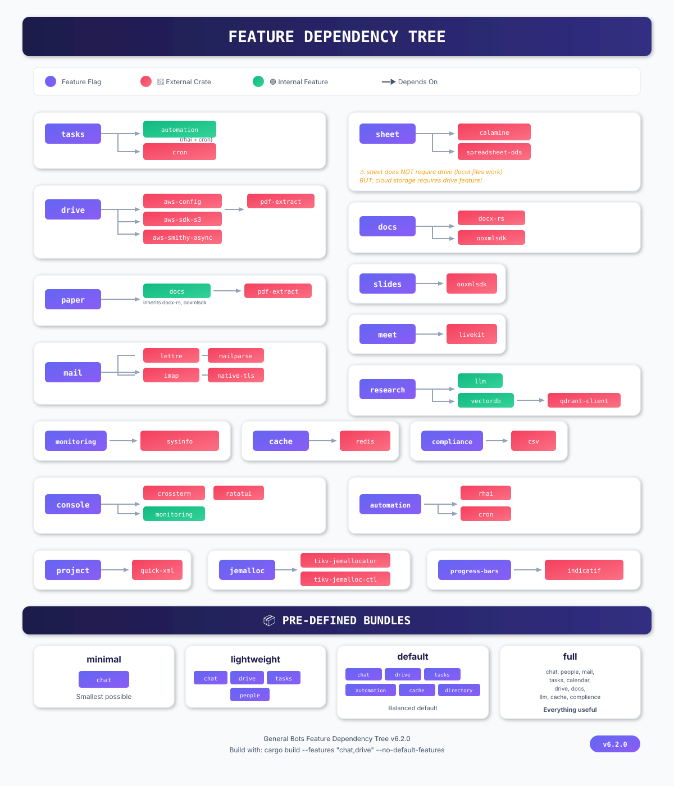

# Feature System 🟡 BETA

**Version:** 6.2.0

General Bots uses Cargo's feature flags to create modular, size-optimized builds. This allows you to include only the functionality you need.

---

## Feature Dependency Tree



---

## Quick Start

### Building with Specific Features

```bash
# Minimal build (chat only)
cargo build --features "chat" --no-default-features

# Chat + Cloud Storage
cargo build --features "chat,drive" --no-default-features

# Spreadsheet + Cloud Storage
cargo build --features "sheet,drive" --no-default-features

# Chat with Local LLM
cargo build --features "chat,llm" --no-default-features

# Full productivity suite
cargo build --features "full"
```

---

## Feature Categories

### 🗣️ Communication Apps

| Feature | Dependencies | Description |
|---------|--------------|-------------|
| `chat` | None | Basic chat functionality |
| `people` | None | Contact management |
| `mail` | lettre, mailparse, imap, native-tls | Email integration |
| `meet` | livekit | Video conferencing |
| `whatsapp` | None | WhatsApp integration |
| `telegram` | None | Telegram integration |
| `instagram` | None | Instagram integration |
| `msteams` | None | Microsoft Teams integration |
| `social` | None | Social media features |

### 📋 Productivity Apps

| Feature | Dependencies | Description |
|---------|--------------|-------------|
| `calendar` | None | Calendar functionality |
| `tasks` | cron, automation | Task management with scheduling |
| `project` | quick-xml | Project management (MS Project) |
| `goals` | None | Goals tracking |
| `workspace` | None | Single workspace |
| `tickets` | None | Ticket system |
| `billing` | None | Billing system |

### 📄 Document Apps

| Feature | Dependencies | Description |
|---------|--------------|-------------|
| `docs` | docx-rs, ooxmlsdk | Word document processing |
| `sheet` | calamine, spreadsheet-ods | Spreadsheet processing |
| `slides` | ooxmlsdk | Presentation processing |
| `paper` | docs, pdf-extract | PDF processing |
| `drive` | aws-config, aws-sdk-s3, aws-smithy-async, pdf-extract | Cloud storage (S3) |

### 🎥 Media Apps

| Feature | Dependencies | Description |
|---------|--------------|-------------|
| `video` | None | Video features |
| `player` | None | Media player |
| `canvas` | None | Drawing/canvas |

### 🧠 Learning & Research

| Feature | Dependencies | Description |
|---------|--------------|-------------|
| `learn` | None | Learning features |
| `research` | llm, vectordb | Research with AI |
| `sources` | None | Data sources |

### 📊 Analytics

| Feature | Dependencies | Description |
|---------|--------------|-------------|
| `analytics` | None | Analytics features |
| `dashboards` | None | Dashboard UI |
| `monitoring` | sysinfo | System monitoring |

### 🔧 Development Tools

| Feature | Dependencies | Description |
|---------|--------------|-------------|
| `designer` | None | UI designer |
| `editor` | None | Code/text editor |
| `automation` | rhai, cron | Scripting automation |

### ⚙️ Core Technologies

| Feature | Dependencies | Description |
|---------|--------------|-------------|
| `llm` | None | LLM integration flag |
| `vectordb` | qdrant-client | Vector database |
| `cache` | redis | Redis caching |
| `compliance` | csv | Compliance reporting |
| `console` | crossterm, ratatui, monitoring | Terminal UI |
| `jemalloc` | tikv-jemallocator, tikv-jemalloc-ctl | Memory allocator |
| `progress-bars` | indicatif | Progress indicators |

---

## Pre-Defined Bundles

### `minimal`
```toml
minimal = ["chat"]
```
Smallest possible build. Just chat functionality.

### `lightweight`
```toml
lightweight = ["chat", "drive", "tasks", "people"]
```
Small but useful for basic operations.

### `default`
```toml
default = ["chat", "drive", "tasks", "automation", "cache", "directory"]
```
Balanced default configuration.

### `full`
```toml
full = [
    "chat", "people", "mail",
    "tasks", "calendar",
    "drive", "docs",
    "llm", "cache", "compliance"
]
```
Everything useful for a complete deployment.

---

## Common Scenarios

### 📱 Chat + Drive (Minimum Cloud)

```bash
cargo build --features "chat,drive" --no-default-features
```

**Use case:** Basic chat with file storage capabilities.

### 📊 Sheets + Drive

```bash
cargo build --features "sheet,drive" --no-default-features
```

**Use case:** Spreadsheet processing with cloud storage.

> ⚠️ **Note:** `sheet` does NOT require `drive` for local file processing. Add `drive` only if you need cloud storage.

### 🤖 Chat + Local LLM

```bash
cargo build --features "chat,llm" --no-default-features
```

**Use case:** Chat with local LLM integration (limited resources).

### 🏢 Office Suite

```bash
cargo build --features "docs,sheet,slides,drive" --no-default-features
```

**Use case:** Full document processing suite.

### 📧 Email-Focused

```bash
cargo build --features "chat,mail,cache" --no-default-features
```

**Use case:** Chat with email integration.

---

## Feature Validation

Some features have implicit dependencies:

| If you enable... | You automatically get... |
|------------------|--------------------------|
| `tasks` | `automation` |
| `paper` | `docs` |
| `research` | `llm`, `vectordb` |
| `console` | `monitoring` |
| `communications` | All communication features + `cache` |
| `productivity` | All productivity features + `cache` |
| `documents` | All document features |

---

## Size Comparison

| Build Configuration | Approximate Size |
|--------------------|------------------|
| `minimal` | ~15 MB |
| `lightweight` | ~25 MB |
| `default` | ~35 MB |
| `full` | ~60 MB |

*Sizes are approximate and vary based on platform and optimization level.*

---

## v1 Suite App Completeness (2026-08)

All suite apps now have real, DB-backed backend contracts (no stubs/fake data).

### App Unifications

- **ITSM → Tickets:** The former `itsm` app is folded into **Tickets**. Tickets gained
  CMDB (`ticket_cis`), knowledge-base articles (`ticket_kb_articles`) and a
  `record_type` column (`ticket` | `problem` | `change`) on `support_tickets`.
  The dead in-memory ITSM duplicate in `botattendant` was removed.
- **ERP → Billing:** The former `erp` app is folded into **Billing**. Billing gained
  Inventory, GL and Procurement tabs backed by the ERP data tables
  (`erp_inventory`, `erp_procurement`, `gl_accounts`, `gl_journal_entries`).
- Both `itsm` and `erp` were removed from the catalog (`.product` + `registry.rs`).

### New Backend Endpoints

- **Tickets:** `/api/tickets/cis`, `/api/tickets/kb`, `/api/ui/tickets/cis|kb`, plus
  record-type filtering on `/api/ui/tickets`.
- **Research:** real RAG search (KB + LLM), `/api/ui/research/sources`,
  `/api/ui/research/collections/save`, `/api/ui/paper/import`, scoped to the bot.
- **Billing:** `/api/billing/subscription/upgrade|cancel`, `/api/billing/invoices/export|unpaid`,
  `/api/ui/billing/inventory|gl/*|procurement`.
- **Compliance:** `/api/compliance/dashboard/*`, `/api/compliance/scan`, `/api/compliance/export`.
- **Search:** `/api/search/settings|stats|reindex|entities|entity`.
- **Editor:** full `/api/editor/*` + `/api/files/*` file workspace.
- **Workspace:** `/api/pages/current`, `/api/ui/pages/current/blocks`, `/api/ui/workspaces/commands|current/invite`.
- **Directory:** group/user update/delete/members/roles/invites JSON endpoints.
- **Meet:** `/api/meet/join`, `/api/meet/mute-all`, `/api/voice/toggle`.
- **Chat:** `/api/chat`, `/api/chat/message`, `/api/chat/context`, `/api/chat/sessions/new`,
  `/api/sessions/current/message` (LLM-backed).
- **Misc:** calendar event save, goals objective form, autotask create, services summary,
  products pricelists, contacts search, DNS records CRUD (`dns_records` table),
  user organizations, sandbox connection details.

---

## Cloud Store — 3D Printing Section

The cloud store gained a dedicated **3D Printing** section (sidebar link under Cloud
Services, mirroring the Machines page). It showcases:

- **Online print-on-demand tiers** — FDM / SLA / SLS / MJF / Metal with per-cm³ pricing.
- **Vetted print services** — proto & production, resin detail, engineering plastics,
  metal additive, factory-direct, post-processing, fulfillment, certified printers.
- **Printer manufacturers** — Prusa, Bambu Lab, Formlabs, Creality, Anycubic, Elegoo,
  Raise3D / UltiMaker.
- **Materials library** — PLA, PETG, ABS/ASA, TPU, resin, PA12, stainless steel, aluminum.

**Files:** `botui/ui/cloud/print3d.html` · sidebar link in
`botui/ui/cloud/partials/sidebar.html` (`/store/print3d` → redirects to `/print3d`).

## o365 — Unified Office App

The former **m365** and **office365** apps are unified into a single **o365** app
(`/suite/o365/`), backed by the real `botm365` crate. Terms are vendor-neutral:
**SP** instead of SharePoint, **Drive** instead of OneDrive, **o365** instead of
Microsoft 365. The `/api/o365/*` namespace aliases `/api/m365/*`.

## Sample Data

`sample.sql` at the repo root populates every major app with realistic demo data
scoped to the default branch + a dedicated sample user — CRM, People, Tickets,
Billing (invoices/quotes/payments/subscriptions), Products, Tasks, Calendar,
Research, Compliance, OKRs, Workspace, Social, Drive. Fully idempotent (safe to re-run).
