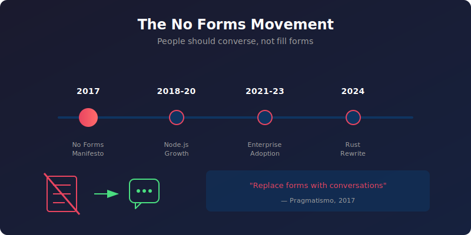

# Introduction to General Bots

> **⚡ Want to skip ahead?** [Quick Start →](./01-getting-started/quick-start.md) gets you running in 5 minutes.

**Build conversational AI bots in minutes, not months.** General Bots lets you create intelligent chatbots by writing simple [BASIC scripts](./04-basic-scripting/basics.md) and dropping in your [documents](./02-architecture-packages/gbkb.md). No complex frameworks, no cloud dependencies, no AI expertise required.

| Your Goal | Go To |
|-----------|-------|
| Run a bot NOW | [Quick Start](./01-getting-started/quick-start.md) |
| Understand the vision | Keep reading below |
| Write your first script | [Chapter 06: BASIC Dialogs](./04-basic-scripting/README.md) |
| Add documents to bot | [Chapter 02: Packages](./02-architecture-packages/README.md) |

## The No Forms Movement



Since 2017, Pragmatismo has championed the **No Forms** philosophy. The idea is simple but revolutionary:

> **People should converse, not fill forms.**

Traditional software forces users into rigid forms with dropdowns, checkboxes, and validation errors. But humans don't communicate that way. We talk. We explain. We ask questions.

General Bots was born from this vision: **replace forms with conversations**.

### Before: The Form Experience

```
┌─────────────────────────────────────────┐
│ Customer Support Form                    │
├─────────────────────────────────────────┤
│ Name: [_______________]                  │
│ Email: [_______________]                 │
│ Department: [Select ▼]                   │
│ Priority: ○ Low ○ Medium ○ High         │
│ Subject: [_______________]               │
│ Description:                             │
│ [                                    ]   │
│ [                                    ]   │
│                                          │
│ Attachments: [Choose File]               │
│                                          │
│ [Submit]                                 │
│                                          │
│ ⚠️ Error: Email format invalid           │
│ ⚠️ Error: Description required           │
└─────────────────────────────────────────┘
```

**Problems:**
- Intimidating for users
- Requires learning the interface
- Validation errors frustrate
- No guidance or context
- One-size-fits-all approach

### After: The Conversation Experience

<div class="wa-chat">
  <div class="wa-message user">
    <div class="wa-bubble">
      <p>I need help with my order</p>
      <div class="wa-time">10:30</div>
    </div>
  </div>
  <div class="wa-message bot">
    <div class="wa-bubble">
      <p>I'd be happy to help! What's your order number?</p>
      <div class="wa-time">10:30</div>
    </div>
  </div>
  <div class="wa-message user">
    <div class="wa-bubble">
      <p>It's 12345</p>
      <div class="wa-time">10:30</div>
    </div>
  </div>
  <div class="wa-message bot">
    <div class="wa-bubble">
      <p>Found it - your laptop order from last week. What's the issue?</p>
      <div class="wa-time">10:30</div>
    </div>
  </div>
  <div class="wa-message user">
    <div class="wa-bubble">
      <p>It arrived damaged</p>
      <div class="wa-time">10:31</div>
    </div>
  </div>
  <div class="wa-message bot">
    <div class="wa-bubble">
      <p>I'm sorry to hear that. I'll create a return label for you.</p>
      <p>Should I send it to your email on file?</p>
      <div class="wa-time">10:31</div>
    </div>
  </div>
  <div class="wa-message user">
    <div class="wa-bubble">
      <p>Yes please</p>
      <div class="wa-time">10:31</div>
    </div>
  </div>
  <div class="wa-message bot">
    <div class="wa-bubble">
      <p>✅ Done! Check your inbox. Is there anything else?</p>
      <div class="wa-time">10:31</div>
    </div>
  </div>
</div>

**Benefits:**
- Natural and intuitive
- Guides users step by step
- Adapts to each situation
- No errors, just clarifications
- Feels like talking to a human

### Projections, Not Screens

The No Forms philosophy extends beyond chat. In General Bots:

- **Visualizations replace dashboards** - Data is projected contextually, not displayed in static grids
- **Conversations replace menus** - Ask for what you need, don't hunt through options
- **AI handles complexity** - The system adapts, users don't configure
- **Voice-first design** - Everything works without a screen

This is why General Bots focuses on:
1. **Conversational interfaces** - Chat, voice, messaging
2. **Contextual projections** - Show relevant info when needed
3. **Minimal UI** - The less interface, the better
4. **AI interpretation** - Understand intent, not just input

## Quick Example

Want a student enrollment bot? Here's all you need:

1. **Drop your documents** in a [`.gbkb` folder](./02-architecture-packages/gbkb.md):
```
edu.gbkb/
  enrollment-policy.pdf
  course-catalog.pdf
```

2. **Write a simple [tool](./03-knowledge-ai/kb-and-tools.md)** (optional):
```basic
' enrollment.bas
PARAM name, email, course
SAVE "enrollments.csv", name, email, course
TALK "Welcome to " + course + "!"
```

3. **Chat naturally**:
```
User: I want to enroll in computer science
Bot: I'll help you enroll! What's your name?
User: Sarah Chen
Bot: Welcome to Computer Science, Sarah!
```

No form. No UI. Just conversation.

## What Makes General Bots Different

### Just Run It
```bash
./botserver
```
That's it. No Kubernetes, no cloud accounts. The [bootstrap process](./01-getting-started/installation.md) installs everything locally in 2-5 minutes. PostgreSQL, vector database, object storage, cache - all configured automatically with secure credentials stored in Vault.

### Real BASIC, Real Simple
We brought BASIC back for conversational AI. See our [complete keyword reference](./04-basic-scripting/keywords.md):
```basic
' save-note.bas - A simple tool
PARAM topic, content
SAVE "notes.csv", topic, content, NOW()
TALK "Note saved!"
```

Four lines. That's a working tool the AI can call automatically.

### Documents = Knowledge
Drop PDFs, Word docs, or text files into `.gbkb/` folders. They're instantly searchable. No preprocessing, no configuration, no pipelines. The bot answers questions from your documents automatically.

### Tools = Functions
Create `.bas` files that the AI discovers and calls automatically. Need to save data? Send emails? Call APIs? Just write a tool. The AI figures out when and how to use it.

## Architecture at a Glance

General Bots is a single binary that includes everything:


One process, one port, one command to run. Deploy anywhere - laptop, server, LXC container.

## Real-World Use Cases

### Customer Support Bot
```
documents: FAQs, policies, procedures
tools: ticket creation, status lookup
result: 24/7 support that actually helps
```

### Employee Assistant
```
documents: HR policies, IT guides, company info
tools: leave requests, equipment orders
result: Instant answers, automated workflows
```

### Sales Catalog Bot
```
documents: product specs, pricing sheets
tools: quote generation, order placement
result: Interactive product discovery
```

### Meeting Assistant
```
documents: agenda, previous minutes
tools: action item tracking, scheduling
result: AI-powered meeting facilitator
```

## The Package System

Bots are organized as packages - just folders with a naming convention:

```
my-bot.gbai/                    # Package root
├── my-bot.gbdialog/            # BASIC scripts
│   └── start.bas               # Entry point
├── my-bot.gbkb/                # Knowledge base
│   ├── policies/               # Document collection
│   └── procedures/             # Another collection
└── my-bot.gbot/                # Configuration
    └── config.csv              # Bot settings
```

Copy the folder to deploy. That's it. No XML, no JSON schemas, no build process.

## Getting Started in 3 Steps

### 1. Install (2 minutes)
```bash
wget https://github.com/GeneralBots/botserver/releases/latest/botserver
chmod +x botserver
./botserver
```

### 2. Open Browser
```
http://localhost:8080
```

### 3. Start Chatting
The default bot is ready. Ask it anything. Modify `templates/default.gbai/` to customize.

## Core Philosophy

1. **No Forms** - Conversations replace forms everywhere
2. **Simplicity First** - If it needs documentation, it's too complex
3. **Everything Included** - No external dependencies to manage
4. **Production Ready** - Secure, scalable, enterprise-grade from day one
5. **AI Does the Work** - Don't write logic the LLM can handle
6. **Projections Over Screens** - Show data contextually, not in dashboards

## Technical Highlights

- **Language**: Written in Rust for performance and safety
- **Database**: PostgreSQL with Diesel ORM
- **Cache**: Redis-compatible cache for sessions
- **Storage**: S3-compatible object store (MinIO)
- **Vectors**: Qdrant for semantic search
- **Security**: Vault for secrets, Argon2 passwords, AES encryption
- **Identity**: Zitadel for authentication and MFA
- **LLM**: OpenAI API, Anthropic, Groq, or local models
- **Scripting**: Rhai-powered BASIC interpreter

## A Brief History

**2017** - Pragmatismo launches General Bots with the No Forms manifesto. The vision: conversational interfaces should replace traditional forms in enterprise software.

**2018-2020** - Node.js implementation gains traction. Hundreds of bots deployed across banking, healthcare, education, and government sectors in Brazil and beyond.

**2021-2023** - Major enterprises adopt General Bots for customer service automation. The platform handles millions of conversations.

**2024** - Complete rewrite in Rust for performance, security, and reliability. Version 6.0 introduces the new architecture with integrated services.

**Today** - General Bots powers conversational AI for organizations worldwide, staying true to the original vision: **people should converse, not fill forms**.

## What's Next?

- **[Chapter 01](./01-getting-started/README.md)** - Install and run your first bot
- **[Chapter 02](./02-architecture-packages/README.md)** - Understanding packages
- **[Chapter 06](./04-basic-scripting/README.md)** - Writing BASIC dialogs
- **[Templates](./02-architecture-packages/templates.md)** - Explore example bots

## Community

General Bots is open source (AGPL-3.0) developed by Pragmatismo.com.br and contributors worldwide.

- **GitHub**: https://github.com/GeneralBots/botserver
- **Version**: 6.1.0
- **Status**: Production Ready

Ready to build your bot? Turn to [Chapter 01](./01-getting-started/README.md) and let's go!

---

<div align="center">
  
  <br>
  <em>Built with ❤️ from Brazil since 2017</em>
</div>