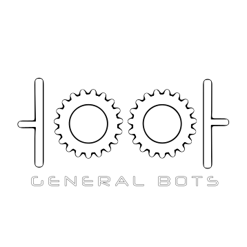
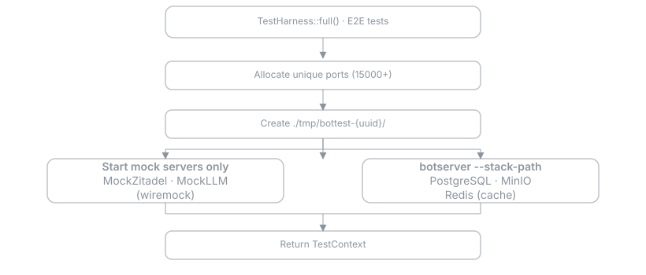

# Bottest - General Bots Test Infrastructure

<p align="center"></p>

**Version:** 6.3.1  
**Purpose:** Test infrastructure for General Bots ecosystem

[](./LICENSE)
[](https://www.rust-lang.org/)
[](https://github.com/generalbots/generalbots/releases)
[](./tests)
[](https://github.com/generalbots/generalbots/graphs/contributors)
[](https://github.com/generalbots/generalbots/issues)
[](https://github.com/generalbots/generalbots/pulls)
[](https://generalbots.org)
<a href="https://github.com/generalbots/generalbots/graphs/contributors">
  
</a>

---

## Overview

Bottest provides the comprehensive testing infrastructure for the General Bots ecosystem, including unit tests, integration tests, and end-to-end (E2E) tests. It ensures code quality, reliability, and correct behavior across all components of the platform.

The test harness handles service orchestration, mock servers, fixtures, and browser automation, making it easy to write comprehensive tests that cover the entire system from database operations to full user flows.

For comprehensive documentation, see **[docs.generalbots.org](https://docs.generalbots.org)** or the **[BotBook](../botbook/src/17-testing)** for detailed guides and testing best practices.

---

## Testing Architecture

E2E tests use `USE_BOTSERVER_BOOTSTRAP=1` mode. The botserver handles all service installation during bootstrap.

<a href="../.github/svg/diagram-bottest-bootstrap.svg"></a>

---

## Test Categories

### Unit Tests (no services)

```rust
#[test]
fn test_pure_logic() {
    // No TestHarness needed
    assert_eq!(add(2, 3), 5);
}
```

### Integration Tests (with services)

```rust
#[tokio::test]
async fn test_with_database() {
    let ctx = TestHarness::quick().await?;
    let pool = ctx.db_pool().await?;
    
    // Use real database
    let user = fixtures::admin_user();
    ctx.insert(&user).await;
    
    // Test database operations
}
```

### E2E Tests (with browser)

```rust
#[tokio::test]
async fn test_user_flow() {
    let ctx = TestHarness::full().await?;
    let server = ctx.start_botserver().await?;
    let browser = Browser::new().await?;
    
    // Automate browser
    browser.goto(server.url()).await?;
    browser.click("#login-button").await?;
    
    // Verify user flow
    assert!(browser.is_visible("#dashboard").await?);
}
```

---

## Mock Server Patterns

### Expect specific calls

```rust
ctx.mock_llm().expect_completion("hello", "Hi there!");
```

### Verify calls were made

```rust
ctx.mock_llm().assert_called_times(2);
```

### Simulate errors

```rust
ctx.mock_llm().next_call_fails(500, "Internal error");
```

### Mock authentication

```rust
ctx.mock_zitadel().expect_login_success("user@example.com", "password");
```

---

## Fixture Patterns

### Factory functions

```rust
let user = fixtures::admin_user();
let bot = fixtures::bot_with_kb();
let session = fixtures::active_session(&user, &bot);
```

### Insert into database

```rust
ctx.insert(&user).await;
ctx.insert(&bot).await;
ctx.insert(&session).await;
```

### Custom fixtures

```rust
fn custom_bot() -> Bot {
    Bot {
        name: "Test Bot".to_string(),
        enabled: true,
        ..fixtures::base_bot()
    }
}
```

---

## Parallel Safety

- Each test gets unique ports via PortAllocator
- Each test gets unique temp directory
- No shared state between tests
- Safe to run with `cargo test -j 8`

---

## ZERO TOLERANCE POLICY

**EVERY SINGLE WARNING MUST BE FIXED. NO EXCEPTIONS.**

### Absolute Prohibitions

```
❌ NEVER use #![allow()] or #[allow()] in source code
❌ NEVER use _ prefix for unused variables - DELETE or USE them
❌ NEVER use .unwrap() - use ? or proper error handling
❌ NEVER use .expect() - use ? or proper error handling  
❌ NEVER use panic!() or unreachable!()
❌ NEVER use todo!() or unimplemented!()
❌ NEVER leave unused imports or dead code
❌ NEVER add comments - code must be self-documenting
```

### Code Patterns

```rust
// ❌ WRONG
let value = something.unwrap();

// ✅ CORRECT
let value = something?;
let value = something.ok_or_else(|| Error::NotFound)?;

// Use Self in Impl Blocks
impl TestStruct {
    fn new() -> Self { Self { } }  // ✅ Not TestStruct
}

// Derive Eq with PartialEq
#[derive(PartialEq, Eq)]  // ✅ Always both
struct TestStruct { }

// Inline Format Args
format!("Hello {name}")  // ✅ Not format!("{}", name)
```

---

## Running Tests

### Run all tests

```bash
cargo test -p bottest
```

### Run specific test category

```bash
# Unit tests only
cargo test -p bottest --lib

# Integration tests
cargo test -p bottest --test '*'

# E2E tests only
cargo test -p bottest --test '*' -- --ignored
```

### Run tests with output

```bash
cargo test -p bottest -- --nocapture
```

### Run tests in parallel

```bash
cargo test -p bottest -j 8
```

---

## Project Structure

```
bottest/
├── src/
│   ├── lib.rs              # Test harness exports
│   ├── harness.rs          # TestHarness implementation
│   ├── context.rs          # TestContext for resource access
│   ├── mocks/              # Mock server implementations
│   │   ├── zitadel.rs
│   │   └── llm.rs
│   ├── fixtures.rs         # Factory functions
│   └── utils.rs            # Testing utilities
├── tests/                  # Integration and E2E tests
│   ├── integration/
│   │   ├── database_tests.rs
│   │   └── api_tests.rs
│   └── e2e/
│       └── user_flows.rs
└── Cargo.toml
```

---

## Platform applications

The integration suite exercises the applications below end to end. Icons match the menu on [generalbots.org](https://generalbots.org).

| | Application | What it does |
|---|-------------|--------------|
|  | **Server**<br><sub>Core Platform</sub> | Web server, WebSocket messaging, REST API and request routing. Serves both the API and the web interface. |
|  | **Auth / Identity**<br><sub>Core Platform</sub> | OAuth 2.0, OpenID Connect, JWT validation and session management, with role-based access control on every endpoint. SSO-ready. |
|  | **Shared / Database**<br><sub>Core Platform</sub> | PostgreSQL with managed schema definitions, shared models and common utilities used across every application. |
|  | **AI Engine**<br><sub>Core Platform</sub> | LLM provider orchestration across DeepSeek, Qwen, GLM, Kimi, MiniMax, Yi or any OpenAI-compatible API. Automatic failover, token counting, streaming and cost tracking. |
|  | **Drive / Storage**<br><sub>Core Platform</sub> | S3-compatible object storage with upload, download, versioning and automatic indexing for search and RAG. Works with MinIO, AWS S3 and Wasabi. |
|  | **Dashboards / Analytics**<br><sub>Core Platform</sub> | Real-time dashboards covering system health, business KPIs and custom visualisations. Exportable and embeddable. |
|  | **AI Search**<br><sub>Capabilities</sub> | Retrieval-augmented generation over PDFs, Word and Excel with sub-second semantic retrieval and cited answers. |
|  | **Bot Factory**<br><sub>Capabilities</sub> | Rapid prototyping and multi-bot orchestration. Run many bots with distinct personalities from one dashboard. |
|  | **Broadcast**<br><sub>Capabilities</sub> | Omnichannel outbound messaging with AI-driven personalisation across WhatsApp, Telegram and SMS. |
|  | **Content Generation**<br><sub>Capabilities</sub> | Generate on-brand, SEO-optimised content in a consistent brand voice. |
|  | **APIs in BASIC**<br><sub>Capabilities</sub> | Build REST endpoints using simplified BASIC syntax, for legacy integration and rapid delivery. |
|  | **LLM Tools**<br><sub>Capabilities</sub> | Give the model real capabilities: web search, calculation and custom API calls. |
|  | **Talk to Data**<br><sub>Capabilities</sub> | Query SQL databases, Excel files and CSVs in plain language. |
|  | **Training**<br><sub>Capabilities</sub> | Ingest institutional knowledge from Word, Excel and PDF documents with no coding. |
|  | **Advanced RAG**<br><sub>Capabilities</sub> | Agentic RAG, Graph RAG, persistent memory and multi-modal retrieval over the knowledge base. |
|  | **Calendar**<br><sub>Business & Productivity</sub> | CalDAV integration with event creation, conflict detection and automated reminder workflows. Syncs with Google, Outlook and Apple Calendar. |
|  | **Email**<br><sub>Business & Productivity</sub> | IMAP/SMTP integration with automatic templating, attachment handling and trigger-based workflows across inbox, starred, sent and scheduled folders. |
|  | **Meet / Video**<br><sub>Business & Productivity</sub> | Video conferencing with screen sharing, recording, transcription and auto-generated meeting notes. |
|  | **Documents, Sheets & Slides**<br><sub>Business & Productivity</sub> | Office-compatible document processing. Read and generate Word, Excel and PowerPoint files from templates. |
|  | **WhatsApp & Teams**<br><sub>Business & Productivity</sub> | WhatsApp Business API and the MS Teams bot framework, with template messages, proactive notifications and rich media. |
|  | **People / CRM**<br><sub>Business & Productivity</sub> | Contact management with CRM-style relationship tracking, tagging, deal pipelines and automated follow-up reminders. |
|  | **Knowledge Base**<br><sub>AI & Intelligence</sub> | Automatic document ingestion with chunking, embedding and semantic search. PDFs, Word files and web pages all become queryable. |
|  | **Web Automation**<br><sub>AI & Intelligence</sub> | Headless browser automation. Scrape sites, fill forms, capture screenshots and trigger workflows when a page changes. |
|  | **Search**<br><sub>AI & Intelligence</sub> | Full-text and semantic search across everything indexed, combining keyword and vector matching with faceted filtering. |
|  | **Security**<br><sub>Operations</sub> | Encryption, threat detection, audit logging and compliance reporting, built to LGPD, GDPR and HIPAA expectations. |
|  | **Monitoring**<br><sub>Operations</sub> | System health monitoring for CPU, memory, disk and network, with alert thresholds, escalation and uptime tracking. |
|  | **Analytics**<br><sub>Operations</sub> | Event tracking, funnel analysis and conversion metrics across every channel. |
|  | **RBAC & Multi-Tenancy**<br><sub>Enterprise</sub> | Fine-grained role-based access control and multi-tenant workspaces with complete data isolation between organisations. |
|  | **On-Premise Deployment**<br><sub>Enterprise</sub> | Runs entirely inside your own infrastructure with no cloud dependency and no data leaving the network. Air-gapped deployments supported. |
|  | **Compliance (LGPD, GDPR)**<br><sub>Enterprise</sub> | Data subject requests, right to erasure, audit trails, retention policies and anonymisation tooling. |

---

## Documentation

### Testing Documentation

All testing documentation is located in `botbook/src/17-testing/`:

- **README.md** - Testing overview and philosophy
- **e2e-testing.md** - E2E test guide with examples
- **architecture.md** - Testing architecture and design
- **best-practices.md** - Best practices and patterns
- **mock-servers.md** - Mock server configuration
- **fixtures.md** - Fixture usage and creation

### Additional Resources

- **[docs.generalbots.org](https://docs.generalbots.org)** - Full online documentation
- **[BotBook](../botbook)** - Local comprehensive guide
- **[Testing Best Practices](../botbook/src/17-testing/best-practices.md)** - Detailed testing guidelines

---

## Related Projects

| Project | Description |
|---------|-------------|
| [botserver](https://github.com/GeneralBots/botserver) | Main API server (tested) |
| [botui](https://github.com/GeneralBots/botui) | Web UI (E2E tested) |
| [botlib](https://github.com/GeneralBots/botlib) | Shared library |
| [botbook](https://github.com/GeneralBots/botbook) | Documentation |

---

## Remember

- **ZERO WARNINGS** - Every clippy warning must be fixed
- **NO ALLOW ATTRIBUTES** - Never silence warnings
- **NO DEAD CODE** - Delete unused code
- **NO UNWRAP/EXPECT** - Use ? operator
- **INLINE FORMAT ARGS** - `format!("{name}")` not `format!("{}", name)`
- **USE SELF** - In impl blocks, use Self not type name
- **Reuse bootstrap** - Don't duplicate botserver installation logic
- **Parallel safe** - Each test gets unique ports and directories
- **Version 6.2.0** - Do not change without approval
- **GIT WORKFLOW** - ALWAYS push to ALL repositories (github, pragmatismo)

---

## License

MIT - See [LICENSE](LICENSE) for details.